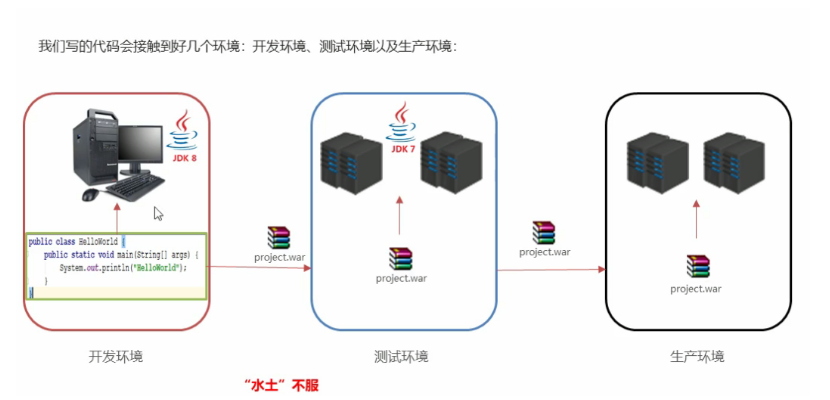
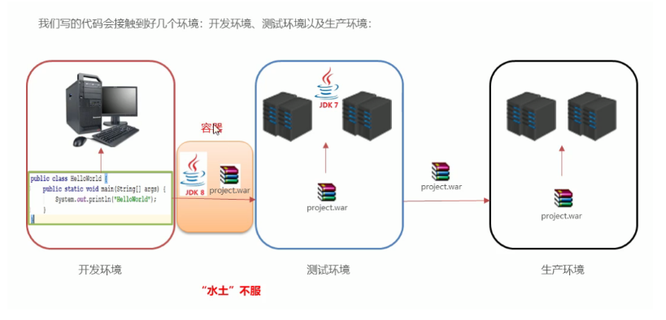
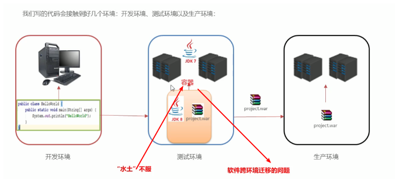

### 一、引言

----

1

2

3

4

#### 1.1 环境不一致

> 我本地运行没问题啊：由于环境不一致，导致相同的程序，运行结果却不一致。

#### 1.2 隔离性

> 哪个哥们又写死循环了，怎么这么卡：在多用户的操作系统下，会因为其他用户的操作失误影响到你自己编写的程序。

#### 1.3 弹性伸缩

> 淘宝在双11的时候，用户量暴增：需要很多很多的运维人员去增加部署的服务器，运维成本过高的问题。

#### 1.4 学习成本

> 学习一门技术，得先安装啊：学习每一门技术都要先安装相应的软件，但是还有他所依赖的各种环境，安装软件成本快高过学习成本啦。

### 二、Docker介绍

---

#### 2.1 Docker的由来

> 有一帮年轻人创业，创办了一家公司，2010年专门做PAAS平台(平台即服务，**把应用服务的运行和开发环境作为一种服务提供** )。
>
> 但是到了2013年的时候，像亚马逊，微软，Google都开始做PAAS平台。到了2013年，公司资金链断裂，不得不倒闭，于是将公司内的核心技术对外开源，核心技术就是Docker。由于开源了Docker，到了2014年的时候，得到了C轮的融资 $4000W，2015年的时候，得到了D轮的融资.$9500W。于是公司开始全神贯注的维护Docker。

|            Docker主要作者-所罗门             |
| :------------------------------------------: |
|  |

|    Docker的作者已经离开了维护Docker的团队    |
| :------------------------------------------: |
|  |

#### 2.2 Docker的思想

> - 集装箱：会将所有需要的内容放到不同的集装箱中，谁需要这些环境就直接拿到这个集装箱就可以了。
>
> - 标准化：
>
>   - 运输的标准化：Docker有一个码头，所有上传的集装箱都放在了这个码头上，当谁需要某一个环境，就去搬运这个集装箱就可以了。
>   - 命令的标准化：Docker提供了一些列的命令，帮助我们去获取集装箱等等操作。
>   - 提供了REST的API：衍生出了很多的图形化界面，Rancher。
>
> - 隔离性：Docker运行集装箱内的内容，会在Linux的内核，单独开辟一片空间，这片空间不会影响到其他程序的运行。
>
> - 中央仓库|注册中心：超级码头，上面放的就是集装箱
>
> - 镜像：就是集装箱
>
> - 容器：运行起来的镜像
>
>   