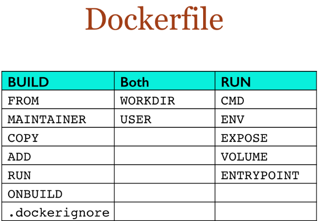

### 一、是什么？

Dockerfile是用来构建Docker镜像的文本文件，是由一条条构建镜像所需的指令和参数构成的脚本。


### 二、DockerFile构建过程解析

#### 1.Dockerfile内容基础知识

- 每条保留字指令都必须为大写字母且后面要跟随至少一个参数

- 指令按照从上到下，顺序执行

- #表示注释

- 每条指令都会创建一个新的镜像层并对镜像进行提交

  

#### 2.Docker执行Dockerfile的大致流程

（1）docker从基础镜像运行一个容器

（2）执行一条指令并对容器作出修改

（3）执行类似docker commit的操作提交一个新的镜像层

（4）docker再基于刚提交的镜像运行一个新容器

（5）执行dockerfile中的下一条指令直到所有指令都执行完成

#### 3.小总结

从应用软件的角度来看，Dockerfile、Docker镜像与Docker容器分别代表软件的三个不同阶段，
*  Dockerfile是软件的原材料
*  Docker镜像是软件的交付品
*  Docker容器则可以认为是软件镜像的运行态，也即依照镜像运行的容器实例
Dockerfile面向开发，Docker镜像成为交付标准，Docker容器则涉及部署与运维，三者缺一不可，合力充当Docker体系的基石。


1.  Dockerfile，需要定义一个Dockerfile，Dockerfile定义了进程需要的一切东西。Dockerfile涉及的内容包括执行代码或者是文件、环境变量、依赖包、运行时环境、动态链接库、操作系统的发行版、服务进程和内核进程(当应用进程需要和系统服务和内核进程打交道，这时需要考虑如何设计namespace的权限控制)等等;

2. Docker镜像，在用Dockerfile定义一个文件之后，docker build时会产生一个Docker镜像，当运行 Docker镜像时会真正开始提供服务;

3. Docker容器，容器是直接提供服务的。

   

### 三、DockerFile常用保留字指令

#### 参考tomcat8的dockerfile入门

https://github.com/docker-library/tomcat

#### 1.FROM

基础镜像，当前新镜像是基于哪个镜像的，指定一个已经存在的镜像作为模板，第一条必须是from


#### 2.MAINTAINER

镜像维护者的姓名和邮箱地址


#### 3.RUN

容器构建时需要运行的命令,RUN是在 docker build时运行

两种格式： 

- **shell**

 

```shell
RUN yum -y install vim
```

- **exec格式**

  


#### 4.EXPOSE

当前容器对外暴露出的端口


#### 5.WORKDIR

指定在创建容器后，终端默认登陆的进来工作目录，一个落脚点


#### 6.USER

指定该镜像以什么样的用户去执行，如果都不指定，默认是root


#### 7.ENV

用来在构建镜像过程中设置环境变量

```yml
ENV MY_PATH /usr/mytest
```

这个环境变量可以在后续的任何RUN指令中使用，这就如同在命令前面指定了环境变量前缀一样；
也可以在其它指令中直接使用这些环境变量，

比如：WORKDIR $MY_PATH


#### 8.ADD

将宿主机目录下的文件拷贝进镜像且会自动处理URL和解压tar压缩包


#### 9.COPY

类似ADD，拷贝文件和目录到镜像中。
将从构建上下文目录中 <源路径> 的文件/目录复制到新的一层的镜像内的 <目标路径> 位置

```yml
COPY src dest
```

- <src源路径>：源文件或者源目录
- <dest目标路径>：容器内的指定路径，该路径不用事先建好，路径不存在的话，会自动创建。


#### 10.VOLUME

容器数据卷，用于数据保存和持久化工作


#### 11.CMD

指定容器启动后的要干的事情


**注意**

Dockerfile 中可以有多个 CMD 指令，但只有最后一个生效，CMD 会被 docker run 之后的参数替换

**它和前面RUN命令的区别**

- CMD是在docker run 时运行。
- RUN是在 docker build时运行。


#### 12.ENTRYPOINT 

也是用来指定一个容器启动时要运行的命令,类似于 CMD 指令，但是ENTRYPOINT不会被docker run后面的命令覆盖，
而且这些命令行参数会被当作参数送给 ENTRYPOINT 指令指定的程序

命令格式：
ENTRYPOINT可以和CMD一起用，一般是变参才会使用 CMD ，这里的 CMD 等于是在给 ENTRYPOINT 传参。
当指定了ENTRYPOINT后，CMD的含义就发生了变化，不再是直接运行其命令而是将CMD的内容作为参数传递给ENTRYPOINT指令，他两个组合会变成

案例如下：假设已通过 Dockerfile 构建了 nginx:test 镜像：


- **优点**：在执行docker run的时候可以指定 ENTRYPOINT 运行所需的参数
- **注意：**如果 Dockerfile 中如果存在多个 ENTRYPOINT 指令，仅最后一个生效。


#### 13.总结




### 四、案例

#### 1.自定义镜像mycentosjava8

##### **1.1 要求**

- Centos7镜像具备vim+ifconfig+jdk8
- JDK的下载镜像地址

 下载地址：
https://www.oracle.com/java/technologies/downloads/#java8


https://mirrors.yangxingzhen.com/jdk/


##### **1.2 编写**

准备编写Dockerfile文件


```
FROM centos
MAINTAINER zzyy<zzyybs@126.com>
 
ENV MYPATH /usr/local
WORKDIR $MYPATH
 
#安装vim编辑器
RUN yum -y install vim
#安装ifconfig命令查看网络IP
RUN yum -y install net-tools
#安装java8及lib库
RUN yum -y install glibc.i686
RUN mkdir /usr/local/java
#ADD 是相对路径jar,把jdk-8u171-linux-x64.tar.gz添加到容器中,安装包必须要和Dockerfile文件在同一位置
ADD jdk-8u171-linux-x64.tar.gz /usr/local/java/
#配置java环境变量
ENV JAVA_HOME /usr/local/java/jdk1.8.0_171
ENV JRE_HOME $JAVA_HOME/jre
ENV CLASSPATH $JAVA_HOME/lib/dt.jar:$JAVA_HOME/lib/tools.jar:$JRE_HOME/lib:$CLASSPATH
ENV PATH $JAVA_HOME/bin:$PATH
 
EXPOSE 80
 
CMD echo $MYPATH
CMD echo "success--------------ok"
CMD /bin/bash
```


##### **1.3 构建**

docker build -t 新镜像名字:TAG .

==注意，上面TAG后面有个空格，有个点==


##### 1.4 运行

docker run -it 新镜像名字:TAG 

```shell
 docker run -it centosjava8:1.5 /bin/bash
```


##### 1.5 再体会下UnionFS（联合文件系统）

UnionFS（联合文件系统）：Union文件系统（UnionFS）是一种分层、轻量级并且高性能的文件系统，它支持对文件系统的修改作为一次提交来一层层的叠加，同时可以将不同目录挂载到同一个虚拟文件系统下(unite several directories into a single virtual filesystem)。Union 文件系统是 Docker 镜像的基础。镜像可以通过分层来进行继承，基于基础镜像（没有父镜像），可以制作各种具体的应用镜像。


特性：一次同时加载多个文件系统，但从外面看起来，只能看到一个文件系统，联合加载会把各层文件系统叠加起来，这样最终的文件系统会包含所有底层的文件和目录

### 五、虚悬镜像

#### 1.是什么

仓库名、标签都是<none>的镜像，俗称dangling image

Dockerfile写一个


#### 2.查看

```shell
docker image ls -f dangling=true
```


#### 3.删除

```shell
docker image prune
```

虚悬镜像已经失去存在价值，可以删除

