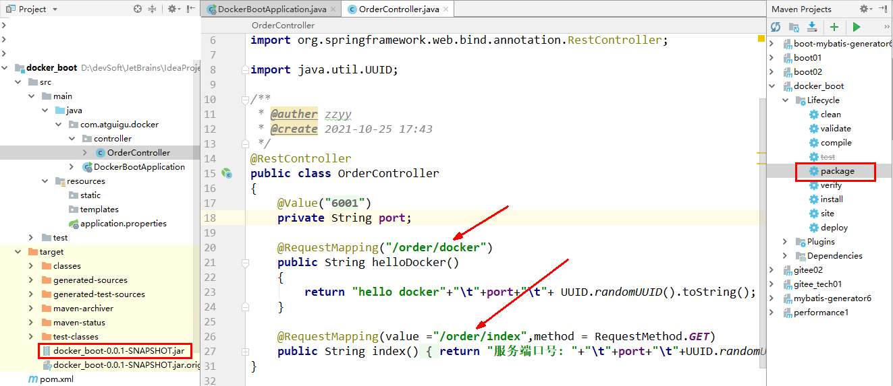
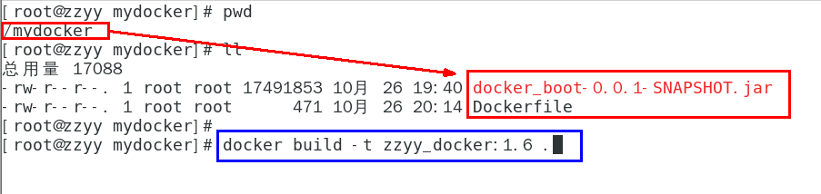
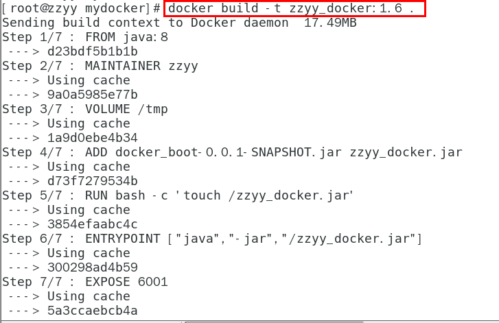
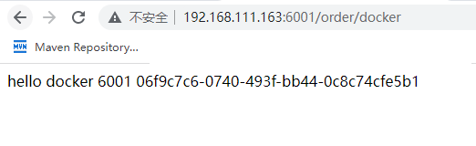

### 一、通过IDEA新建一个普通微服务模块

#### 1.建Module

docker_boot


#### 2.改POM

```pom
<?xml version="1.0" encoding="UTF-8"?>
<project xmlns="http://maven.apache.org/POM/4.0.0" xmlns:xsi="http://www.w3.org/2001/XMLSchema-instance"
         xsi:schemaLocation="http://maven.apache.org/POM/4.0.0 https://maven.apache.org/xsd/maven-4.0.0.xsd">
    <modelVersion>4.0.0</modelVersion>
    <parent>
        <groupId>org.springframework.boot</groupId>
        <artifactId>spring-boot-starter-parent</artifactId>
        <version>2.5.6</version>
        <relativePath/>
    </parent>

    <groupId>com.atguigu.docker</groupId>
    <artifactId>docker_boot</artifactId>
    <version>0.0.1-SNAPSHOT</version>

    <properties>
        <project.build.sourceEncoding>UTF-8</project.build.sourceEncoding>
        <maven.compiler.source>1.8</maven.compiler.source>
        <maven.compiler.target>1.8</maven.compiler.target>
        <junit.version>4.12</junit.version>
        <log4j.version>1.2.17</log4j.version>
        <lombok.version>1.16.18</lombok.version>
        <mysql.version>5.1.47</mysql.version>
        <druid.version>1.1.16</druid.version>
        <mapper.version>4.1.5</mapper.version>
        <mybatis.spring.boot.version>1.3.0</mybatis.spring.boot.version>
    </properties>

    <dependencies>
        <!--SpringBoot通用依赖模块-->
        <dependency>
            <groupId>org.springframework.boot</groupId>
            <artifactId>spring-boot-starter-web</artifactId>
        </dependency>
        <dependency>
            <groupId>org.springframework.boot</groupId>
            <artifactId>spring-boot-starter-actuator</artifactId>
        </dependency>
        <!--test-->
        <dependency>
            <groupId>org.springframework.boot</groupId>
            <artifactId>spring-boot-starter-test</artifactId>
            <scope>test</scope>
        </dependency>
    </dependencies>

    <build>
        <plugins>
            <plugin>
                <groupId>org.springframework.boot</groupId>
                <artifactId>spring-boot-maven-plugin</artifactId>
            </plugin>
            <plugin>
                <groupId>org.apache.maven.plugins</groupId>
                <artifactId>maven-resources-plugin</artifactId>
                <version>3.1.0</version>
            </plugin>
        </plugins>
    </build>

</project>
```

#### 3.写YML

```yml
server.port=6001
```

#### 4.主启动

```java
package com.atguigu.docker;

import org.springframework.boot.SpringApplication;
import org.springframework.boot.autoconfigure.SpringBootApplication;

@SpringBootApplication
public class DockerBootApplication
{
    public static void main(String[] args)
    {
        SpringApplication.run(DockerBootApplication.class, args);
    }

}
```

#### 5.业务类

```java
package com.atguigu.docker.controller;

import org.springframework.beans.factory.annotation.Value;
import org.springframework.web.bind.annotation.RequestMapping;
import org.springframework.web.bind.annotation.RequestMethod;
import org.springframework.web.bind.annotation.RestController;

import java.util.UUID;

/**
 * @auther zzyy
 * @create 2021-10-25 17:43
 */
@RestController
public class OrderController
{
    @Value("${server.port}")
    private String port;

    @RequestMapping("/order/docker")
    public String helloDocker()
    {
        return "hello docker"+"\t"+port+"\t"+ UUID.randomUUID().toString();
    }

    @RequestMapping(value ="/order/index",method = RequestMethod.GET)
    public String index()
    {
        return "服务端口号: "+"\t"+port+"\t"+UUID.randomUUID().toString();
    }
}
```


### 二、通过dockerfile发布微服务部署到docker容器

#### 1.IDEA工具里面搞定微服务jar包



#### 2.编写Dockerfile

**Dockerfile内容**

```yml
# 基础镜像使用java
FROM java:8
# 作者
MAINTAINER zzyy
# VOLUME 指定临时文件目录为/tmp，在主机/var/lib/docker目录下创建了一个临时文件并链接到容器的/tmp
VOLUME /tmp
# 将jar包添加到容器中并更名为zzyy_docker.jar
ADD docker_boot-0.0.1-SNAPSHOT.jar zzyy_docker.jar
# 运行jar包
RUN bash -c 'touch /zzyy_docker.jar'
ENTRYPOINT ["java","-jar","/zzyy_docker.jar"]
#暴露6001端口作为微服务
EXPOSE 6001
```

**将微服务jar包和Dockerfile文件上传到同一个目录下/mydocker**



#### 3.构建镜像



#### 4.运行容器

```shell
 docker run -d -p 6001:6001 zzyy_docker:1.6
```


#### 5.访问测试

