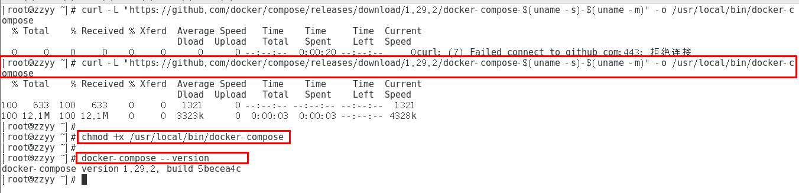
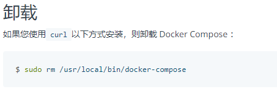
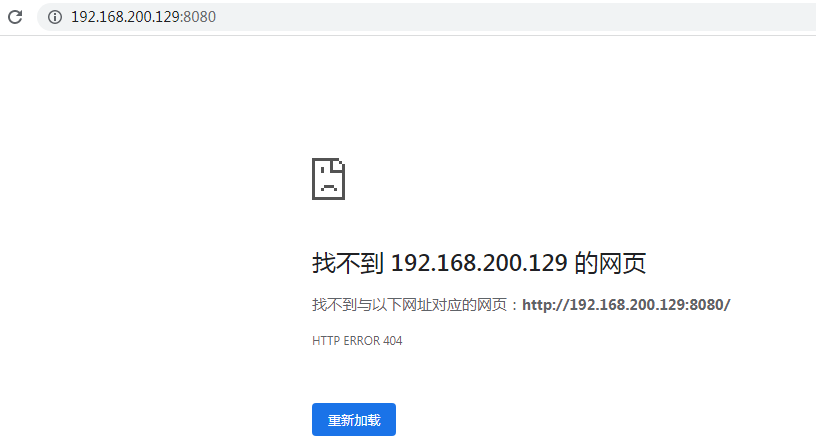
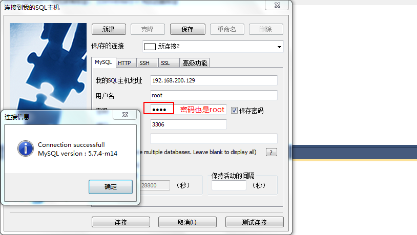
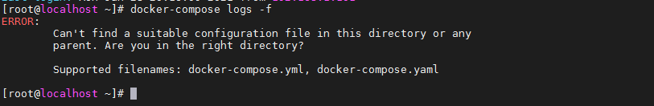
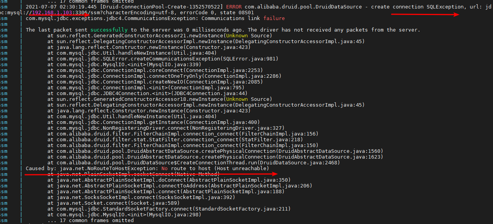

### 一、Dockerfile

#### 1、是什么

Compose 是 Docker 公司推出的一个工具软件，可以管理多个 Docker 容器组成一个应用。你需要定义一个 YAML 格式的配置文件docker-compose.yml，写好多个容器之间的调用关系。然后，只要一个命令，就能同时启动/关闭这些容器

Docker-Compose是Docker官方的开源项目，负责实现对Docker容器集群的快速编排。

#### 2、能干嘛

docker建议我们每一个容器中只运行一个服务,因为docker容器本身占用资源极少,所以最好是将每个服务单独的分割开来但是这样我们又面临了一个问题？

如果我需要同时部署好多个服务,难道要每个服务单独写Dockerfile然后在构建镜像,构建容器,这样累都累死了,所以docker官方给我们提供了docker-compose多服务部署的工具

例如要实现一个Web微服务项目，除了Web服务容器本身，往往还需要再加上后端的数据库mysql服务容器，redis服务器，注册中心eureka，甚至还包括负载均衡容器等等。。。。。。

Compose允许用户通过**一个单独的docker-compose.yml模板文件**（YAML 格式）来==定义一组相关联的应用容器为一个项目（project）。==

可以很容易地用一个配置文件定义一个多容器的应用，然后使用一条指令安装这个应用的所有依赖，完成构建。Docker-Compose 解决了容器与容器之间如何管理编排的问题。

#### 3、安装与卸载步骤

**安装**

```shell
curl -L "https://github.com/docker/compose/releases/download/1.29.2/docker-compose-$(uname -s)-$(uname -m)" -o /usr/local/bin/docker-compose
chmod +x /usr/local/bin/docker-compose
docker-compose --version
```



**卸载**



#### 4、Compose核心概念

##### 1.一文件

docker-compose.yml

##### 2.两要素

- 服务（service）

  一个个应用容器实例，比如订单微服务、库存微服务、mysql容器、nginx容器或者redis容器

- 工程（project）

  由一组关联的应用容器组成的一个完整业务单元，在 docker-compose.yml 文件中定义。

  

#### 5.Compose使用的三个步骤

- [ ] 编写Dockerfile定义各个微服务应用并构建出对应的镜像文件
- [ ] 使用 docker-compose.yml 定义一个完整业务单元，安排好整体应用中的各个容器服务。
- [ ] 最后，执行docker-compose up命令 来启动并运行整个应用程序，完成一键部署上线


#### 6.Compose常用命令

```shell
Compose常用命令
docker-compose -h                           # 查看帮助
docker-compose up                           # 启动所有docker-compose服务
docker-compose up -d                        # 启动所有docker-compose服务并后台运行
docker-compose down                         # 停止并删除容器、网络、卷、镜像。
docker-compose exec  yml里面的服务id                 # 进入容器实例内部  docker-compose exec docker-compose.yml文件中写的服务id /bin/bash
docker-compose ps                      # 展示当前docker-compose编排过的运行的所有容器
docker-compose top                     # 展示当前docker-compose编排过的容器进程
 
docker-compose logs  yml里面的服务id     # 查看容器输出日志
docker-compose config     # 检查配置
docker-compose config -q  # 检查配置，有问题才有输出
docker-compose restart   # 重启服务
docker-compose start     # 启动服务
docker-compose stop      # 停止服务
```


### 二、Docker-Compose管理MySQL和Tomcat容器

> yml文件以key: value方式来指定配置信息
>
> 多个配置信息以换行+缩进的方式来区分
>
> 在docker-compose.yml文件中，不要使用制表符!
>
> 创建下面配置文件中缺少的目录↓
>
> ```shell
> cd /opt/
> mkdir docker_mysql_tomcat
> cd docker_mysql_tomcat
> vi docker-compose.yml
> #抄下面的保存退出
> ```

```yml
version: '3.1'
services:
  mysql:           # 服务的名称
    restart: always   # 代表只要docker启动，那么这个容器就跟着一起启动
    image: daocloud.io/library/mysql:5.7.4  # 指定镜像路径
    container_name: mysql  # 指定容器名称
    ports:
      - 3306:3306   #  指定端口号的映射
    environment:
      MYSQL_ROOT_PASSWORD: root   # 指定MySQL的ROOT用户登录密码
      TZ: Asia/Shanghai        # 指定时区
    volumes:
     - /opt/docker_mysql_tomcat/mysql_data:/var/lib/mysql   # 映射数据卷var/lib/mysql不知抄镜像网
  tomcat:
    restart: always
    image: daocloud.io/library/tomcat:8.5.15-jre8
    container_name: tomcat
    ports:
      - 8080:8080
    environment:
      TZ: Asia/Shanghai
    volumes:
      - /opt/docker_mysql_tomcat/tomcat_webapps:/usr/local/tomcat/webapps
      - /opt/docker_mysql_tomcat/tomcat_logs:/usr/local/tomcat/logs
```

```yml
version: '3.1'
services:
  mysql:          
    restart: always   
    image: daocloud.io/library/mysql:5.7.4  
    container_name: mysql  
    ports:
      - 3306:3306   
    environment:
      MYSQL_ROOT_PASSWORD: root   
      TZ: Asia/Shanghai        
    volumes:
     - /opt/docker_mysql_tomcat/mysql_data:/var/lib/mysql   
  tomcat:
    restart: always
    image: daocloud.io/library/tomcat:8.5.15-jre8
    container_name: tomcat
    ports:
      - 8080:8080
    environment:
      TZ: Asia/Shanghai
    volumes:
      - /opt/docker_mysql_tomcat/tomcat_webapps:/usr/local/tomcat/webapps
      - /opt/docker_mysql_tomcat/tomcat_logs:/usr/local/tomcat/logs
```

>version 字段是表明使用那个版本的compose ，compose 有如下的版本，目前的最新版是 3.7
>
>- 1
>- 2
>- 2.x
>- 3.x
>
>不同版本的 compose 支持了不同的 docker 版本

#### 1. 使用docker-compose命令管理容器

> **在使用docker-compose的命令时 ，默认会在当前目录下找docker-compose.yml文件**
>
> 执行命令之前,为了避免冲突,停止所有的容器,然后移除所有的容器↓
>
> ```shell
> docker stop $(docker ps -qa)
> docker rm $(docker ps -qa)
> 
> # 1. 基于docker-compose.yml启动管理的容器
> docker-compose up -d
> ```
>
> 由于上面配置文件用的数据卷是/绝对路径,故访问首页找不到文件,这个数据卷映射方式二已经说过↓
>
> http://192.168.200.129:8080/
>
> 
>
> 另通过sqlyog访问数据库服务器成功↓
>
> 
>
> 其他命令↓

```sh
# 1. 基于docker-compose.yml启动管理的容器,重要
docker-compose up -d
# 2. 停止并删除容器,重要
docker-compose down

# 3. 停止|开启|重启已经存在的由docker-compose维护的容器,如果上面用down删除容器了,这几个命令用不了
docker-compose stop|start|restart

# 4. 查看由docker-compose管理的容器
docker-compose ps

# 5. 查看容器的日志
docker-compose logs -f
```

 以上这些命令要注意在带有docker-compose.yml所在的目录运行,因为默认找的是这个文件,否则报错找不到目录↓




#### 2. docker-compose配合Dockerfile使用

> 使用docker-compose.yml文件以及Dockerfile文件在生成自定义镜像的同时启动当前镜像，
>
> 并且由docker-compose去管理容器

##### 2.1 docker-compose文件

> 编写docker-compose.yml文件

```yml
# yml文件
version: '3.1'
services:
  ssm:
    restart: always
    build:            # 构建自定义镜像
      context: ../      # 指定dockerfile文件的所在路径
      dockerfile: Dockerfile   # 指定Dockerfile文件名称
    image: ssm:1.0.1
    container_name: ssm
    ports:
      - 8081:8080
    environment:
      TZ: Asia/Shanghai
```

##### 2.2 Dockerfile文件

> 编写Dockerfile文件

```
from daocloud.io/library/tomcat:8.5.15-jre8
copy ssm.war /usr/local/tomcat/webapps

```

##### 2.3 运行

> 测试效果

```sh
# 先启动mysql容器并建立好ssm数据库,然后修改ssm.war包里面连接数据库的配置,
# 拷贝资料文件夹里面的东西到Linux服务器,
# 进入到docker-compose.yml文件所在目录,执行下面的up命令即可↓

# 可以直接启动基于docker-compose.yml以及Dockerfile文件构建的自定义镜像!!!开干即可!!!
docker-compose up -d
# 如果自定义镜像不存在，会帮助我们构建出自定义镜像，如果自定义镜像已经存在,会直接运行这个之前的镜像,坑↑
# 测试访问tomcat,浏览器输入地址http://192.168.1.103:8081可以
# 测试访问项目,浏览器输入地址http://192.168.1.103:8081/ssm可以
# 如果还是无法访问成功,要注意两个问题,一是mysql容器是否启动,而是运行的镜像是不是之前的旧ip的war包镜像!

# 另外,如果想重新构建新镜像用下面的,这个是运行上面的命令,显示出来下面的提示,这里无影响略过↓
# 重新构建自定义镜像
docker-compose build
# 运行当前内容，并重新构建
docker-compose up -d --build

# 上面的构建可以理解为先把旧镜像删掉,构建新镜像,我们也可以不用上面的命令自己来实现这个功能
```

> 如果自定义镜像不存在，会帮助我们构建出自定义镜像，如果自定义镜像已经存在,会直接运行这个之前的镜像,这个有点坑,要引起注意↓
>
> 运行的镜像如果是之前的旧ip的war包镜像,旧的ip是103,现在的ip是129,ip不对就访问不了Linux虚拟机上的mysql服务器,可以在docker-compose.yml文件所在目录,执行docker-compose logs -f来查看容器的日志来找到报错原因↓



