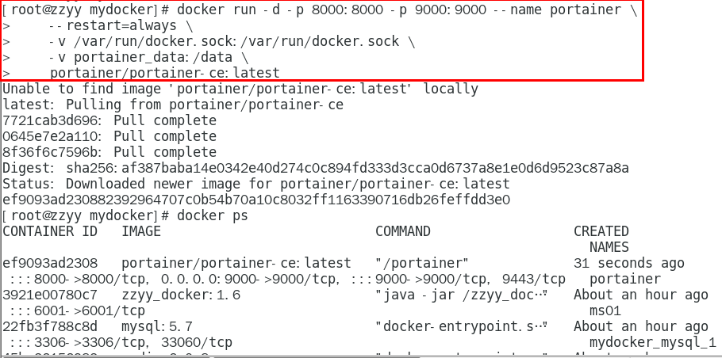
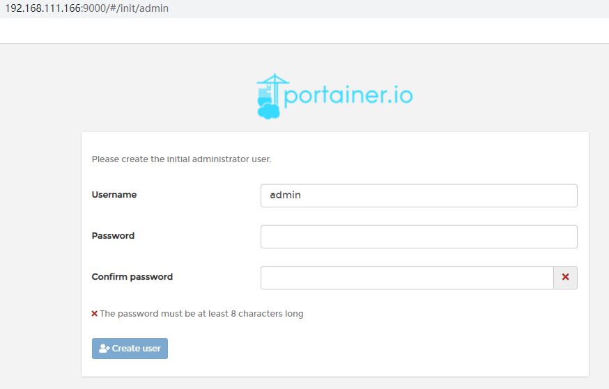
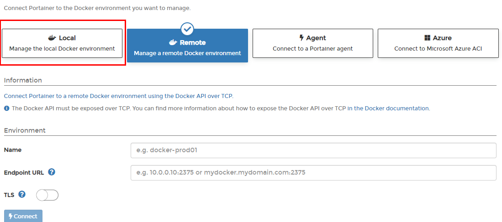
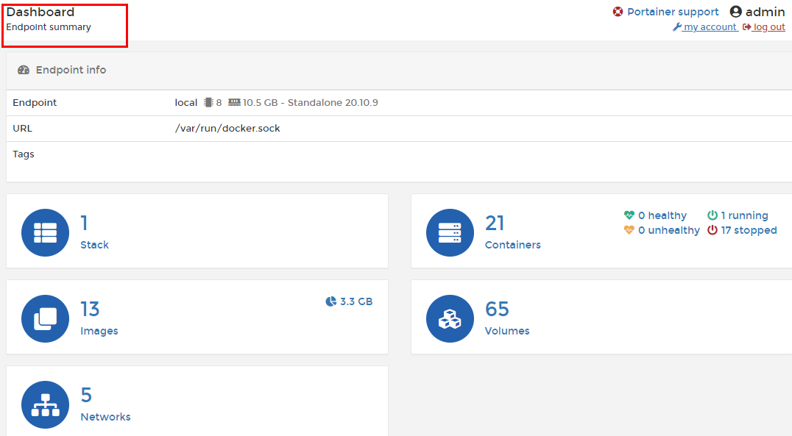
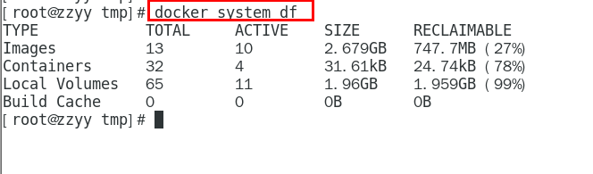

### 一、Portainer

#### 1.是什么

Portainer 是一款轻量级的应用，它提供了图形化界面，用于方便地管理Docker环境，包括单机环境和集群环境。

#### 2.安装步骤

**1.docker命令安装**

```shell
docker run -d -p 8000:8000 -p 9000:9000 --name portainer     --restart=always     -v /var/run/docker.sock:/var/run/docker.sock     -v portainer_data:/data     portainer/portainer
```




**2.第一次登录需创建admin，访问地址：xxx.xxx.xxx.xxx:9000**

用户名，直接用默认admin

密码记得8位，随便你写




**3.设置admin用户和密码后首次登陆**




**4.选择local选项卡后本地docker详细信息展示**




**5.上一步的图形展示，能想得起对应命令吗？**




