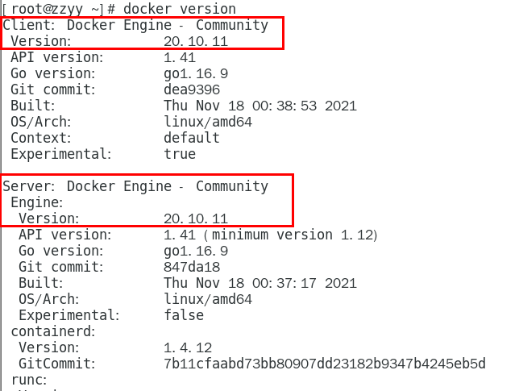
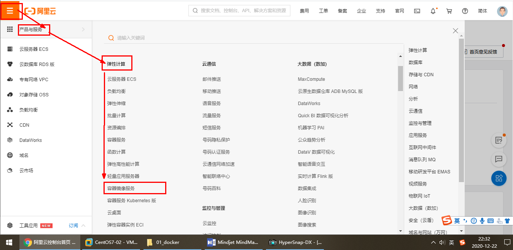

### 一、前提说明

CentOS Docker 安装


前提条件
目前，CentOS 仅发行版本中的内核支持 Docker。Docker 运行在CentOS 7 (64-bit)上，
要求系统为64位、Linux系统内核版本为 3.8以上，这里选用Centos7.x

查看自己的内核
uname命令用于打印当前系统相关信息（内核版本号、硬件架构、主机名称和操作系统类型等）。


### 二、Docker的基本组成

#### 1.**Docker 镜像**（Image）

​	就是一个**只读**的模板。镜像可以用来创建 Docker 容器，**一个镜像可以创建很多容器**。
它也相当于是一个root文件系统。比如官方镜像 centos:7 就包含了完整的一套 centos:7 最小系统的 root 文件系统。
相当于容器的“源代码”，docker镜像文件类似于Java的类模板，而docker容器实例类似于java中new出来的实例对象。

 

####  2.容器

​	1 **从面向对象角度**
​	Docker 利用容器（Container）独立运行的一个或一组应用，应用程序或服务运行在容器里面，容器就类似于一个虚拟化的运行环境，**容器是用镜像创建的运行实例**。就像是Java中的类和实例对象一样，镜像是静态的定义，容器是镜像运行时的实体。容器为镜像提供了一个标准的和隔离的运行环境，它可以被启动、开始、停止、删除。每个容器都是相互隔离的、保证安全的平台

​	2 **从镜像容器角度**
​	**可以把容器看做是一个简易版的 Linux 环境**（包括root用户权限、进程空间、用户空间和网络空间等）和运行在其中的应用程序。

#### 3.仓库


仓库（Repository）是集中存放镜像文件的场所。

类似于
Maven仓库，存放各种jar包的地方；
github仓库，存放各种git项目的地方；
Docker公司提供的官方registry被称为Docker Hub，存放各种镜像模板的地方。

仓库分为公开仓库（Public）和私有仓库（Private）两种形式。
最大的公开仓库是 Docker Hub(https://hub.docker.com/)，
存放了数量庞大的镜像供用户下载。国内的公开仓库包括阿里云 、网易云等

#### 4.小总结

需要正确的理解仓库/镜像/容器这几个概念:
Docker 本身是一个容器运行载体或称之为管理引擎。我们把应用程序和配置依赖打包好形成一个可交付的运行环境，这个打包好的运行环境就是image镜像文件。只有通过这个镜像文件才能生成Docker容器实例(类似Java中new出来一个对象)。

image文件可以看作是容器的模板。Docker 根据 image 文件生成容器的实例。同一个 image 文件，可以生成多个同时运行的容器实例。

镜像文件
*  image 文件生成的容器实例，本身也是一个文件，称为镜像文件。
容器实例
*  一个容器运行一种服务，当我们需要的时候，就可以通过docker客户端创建一个对应的运行实例，也就是我们的容器
仓库
* 就是放一堆镜像的地方，我们可以把镜像发布到仓库中，需要的时候再从仓库中拉下来就可以了。

#### 5.Docker平台架构图解(入门版)


<u>工作原理</u>****

Docker是一个Client-Server结构的系统，Docker守护进程运行在主机上， 然后通过Socket连接从客户端访问，守护进程从客户端接受命令并管理运行在主机上的容器。 <u>容器，是一个运行时环境，就是我们前面说到的集装箱。可以对比mysql演示对比讲解</u>


### 三、安装步骤

##### 1.确定你是CentOS7及以上版本

```xml
cat /etc/redhat-release
```

##### 2.卸载旧版本

```xml
https://docs.docker.com/engine/install/centos/
```


##### 3.yum安装gcc相关

```xml
yum -y install gcc
yum -y install gcc-c++
```

##### 4.安装需要的软件包

```xml
yum install -y yum-utils
```

##### 5.设置stable镜像仓库

```xml
yum-config-manager --add-repo http://mirrors.aliyun.com/docker-ce/linux/centos/docker-ce.repo
```

##### 6.更新yum软件包索引

```xml
yum makecache fast
```

##### 7.安装DOCKER CE

```xml
yum -y install docker-ce docker-ce-cli containerd.io
```


##### 8.启动docker

```xml
systemctl start docker
```

##### 9.测试

```xml
docker version
```



```xml
docker run hello-world
```


##### 10.卸载

```xm
systemctl stop docker 
yum remove docker-ce docker-ce-cli containerd.io
rm -rf /var/lib/docker
rm -rf /var/lib/containerd
```

### 四.阿里云镜像加速

##### 1.注册一个属于自己的阿里云账户(可复用淘宝账号)

##### 2.获得加速器地址连接

-  登陆阿里云开发者平台

  

- 点击控制台

  

- 选择容器镜像服务

  

- 获取加速器地址（是Ubuntu选择这个，是Centos则选择这个）

  

  

##### 3.粘贴脚本直接执行


##### 4.重启服务器

```xml
systemctl daemon-reload
systemctl restart docker
```

### 五、为什么Docker会比VM虚拟机快

**(1)docker有着比虚拟机更少的抽象层**
   由于docker不需要Hypervisor(虚拟机)实现硬件资源虚拟化,运行在docker容器上的程序直接使用的都是实际物理机的硬件资源。因此在CPU、内存利用率上docker将会在效率上有明显优势。
**(2)docker利用的是宿主机的内核,而不需要加载操作系统OS内核**
   当新建一个容器时,docker不需要和虚拟机一样重新加载一个操作系统内核。进而避免引寻、加载操作系统内核返回等比较费时费资源的过程,当新建一个虚拟机时,虚拟机软件需要加载OS,返回新建过程是分钟级别的。而docker由于直接利用宿主机的操作系统,则省略了返回过程,因此新建一个docker容器只需要几秒钟。


### 六、Docker平台架构图解(架构版)

**整体架构及底层通信原理简述**

Docker 是一个 C/S 模式的架构，后端是一个松耦合架构，众多模块各司其职。 


