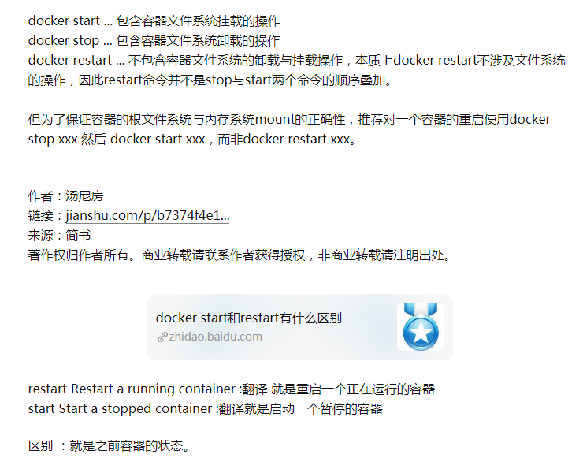

### 六、容器操作【`重点`】

----

#### 6.1 运行容器

> 运行容器需要指定具体的镜像，如果该镜像不存在，会直接下载

```sh
# 简单操作
docker run 镜像的标识|镜像名称[:tag]

# 常用的参数
docker run -d -p 宿主机端口:容器端口 --name 容器名称 镜像的标识id或者镜像名称[:tag]
# -d：代表后台运行容器
# -p 宿主机端口:容器端口：为了映射当前Linux的端口和容器的端口
# --name 容器名称：指定容器的名称
docker run -d -p 8080:8080 --name tomcat b8
docker run -d -p 8080:8080 --name tomcat daocloud.io/library/tomcat:8.5.15-jre8
docker run -d -p 8081:8080 --name tomcat2 b8
```


#### 6.2 查看正在运行的容器

> 查看全部正在运行的容器信息

```sh
docker ps [-qa]
# -a：查看全部的容器，包括没有运行的
# -q：只查看容器的标识,id
```


#### 6.3 查看容器的日志

> 查看容器日志，以查看容器运行的信息

```sh
docker logs -f 容器id,比如tomcat运行时的容器id等,来查看tomcat容器的日志
# -f：可以滚动查看日志的最后几行
```


#### 6.4 进入容器内部

> 可以进入容器内部进行操作

```sh
docker ps
docker exec -it 容器id bash,退出容器用exit即可
```

#### 6.5 拷贝某个东西到某个标识容器的内部

> 将宿主机的文件或者文件等复制到容器内部的指定目录

```sh
docker cp 文件名称 容器id:容器内部路径 容器id:容器内部路径不会写,打开新窗口进入容器内部抄即可
docker cp LY 08f164eeec15:/usr/local/tomcat/webapps
```


#### ==6.6 重启&启动&停止&删除容器==

> 容器的启动，停止，删除等操作，后续经常会使用到

```sh
# 重新启动容器
docker restart 容器id

# 启动停止运行的容器
docker start 容器id

# 停止指定的容器（删除容器前，需要先停止容器）
docker stop 容器id
# 停止全部容器
docker stop $(docker ps -qa)

# 删除指定容器,不停止强制删除容器可以加一个-f参数,比如docker rm -f 容器id
docker rm 容器id
# 删除全部容器
docker rm $(docker ps -qa)
```

|     docker start与docker restart的区别     |
| :----------------------------------------: |
|  |

https://www.jianshu.com/p/b7374f4e1e8f
