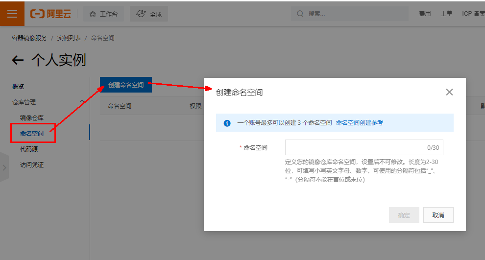
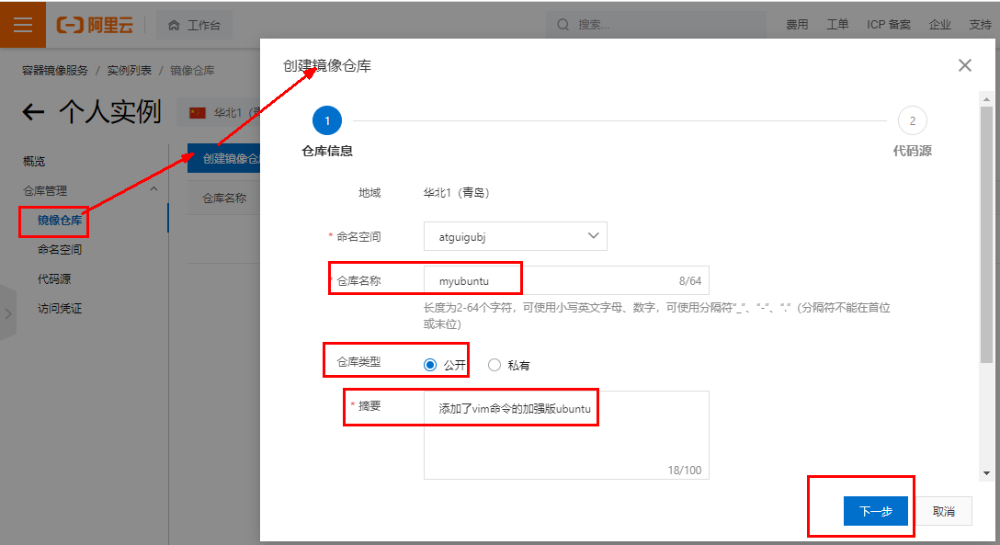
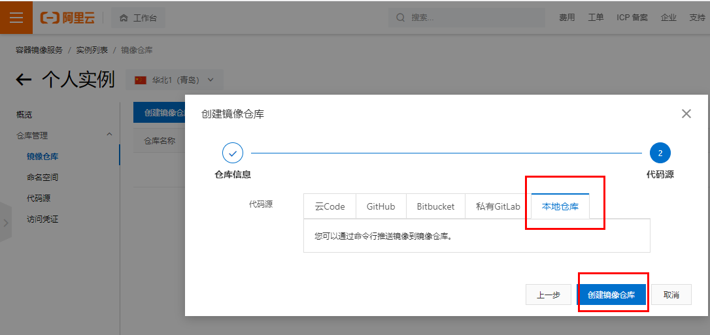
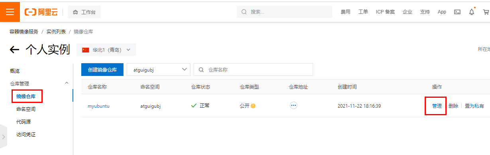
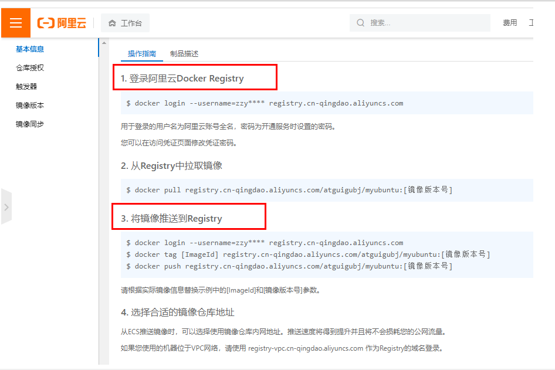
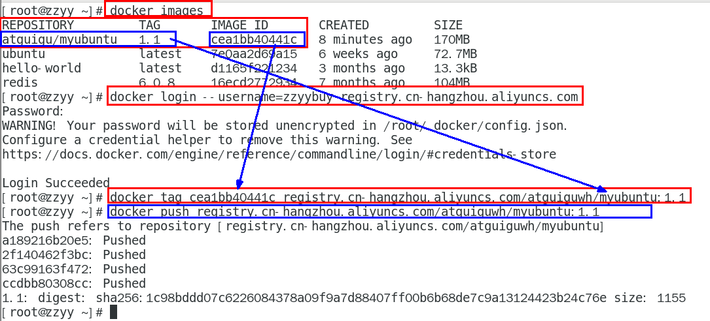
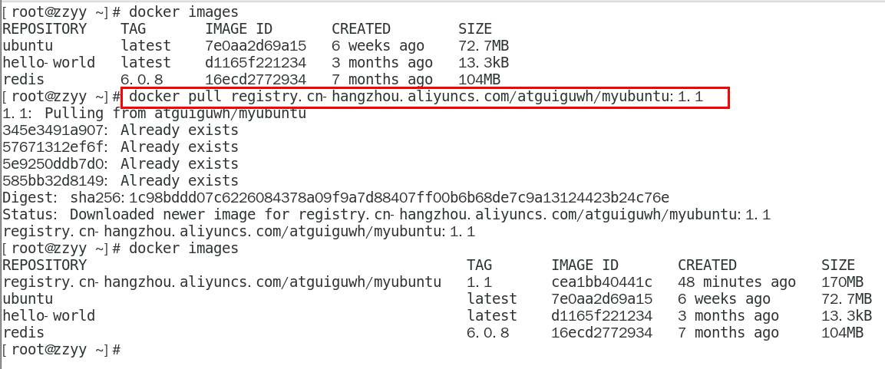

### 一、本地镜像发布到阿里云流程


### 二、将本地镜像推送到阿里云

#### 1.创建仓库镜像

**1.1选择控制台，进入容器镜像服务**


**1.2选择个人实例**


**1.3命名空间**



**1.4仓库名称**





**1.5进入管理界面获得脚本**



#### 2.将镜像推送到阿里云

将镜像推送到阿里云registry



**脚本实例**



### 三、将阿里云上的镜像下载到本地



```sh
docker pull registry.cn-hangzhou.aliyuncs.com/atguiguwh/myubuntu:1.1
```

