### 一、本地镜像发布到私有库流程

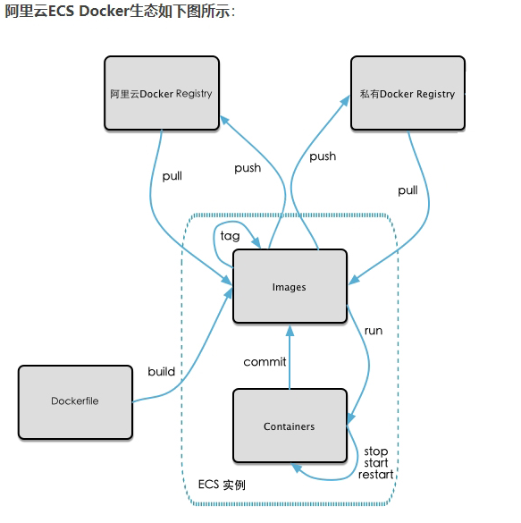

### 二、将本地镜像推送到私有库

#### 1.下载镜像Docker Registry

```shell
docker pull registry 
```

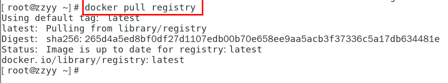

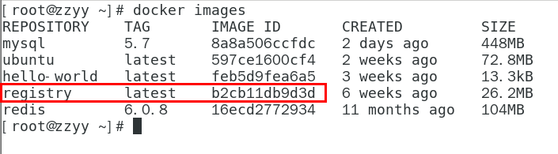


#### 2.运行私有库Registry，相当于本地有个私有Docker hub

```shell
docker run -d -p 5000:5000  -v /zzyyuse/myregistry/:/tmp/registry --privileged=true registry
```

默认情况，仓库被创建在容器的/var/lib/registry目录下，建议自行用容器卷映射，方便于宿主机联调

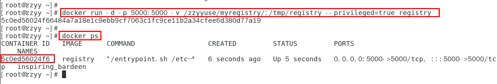

#### 3.案例演示创建一个新镜像，ubuntu安装ifconfig命令


**1.从Hub上下载ubuntu镜像到本地并成功运行**


**2.原始的Ubuntu镜像是不带着ifconfig命令的**

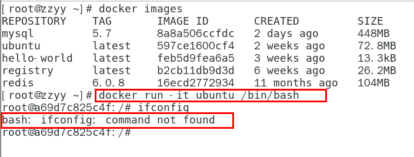


**3.外网连通的情况下，安装ifconfig命令并测试通过**

docker容器内执行上述两条命令：
```shell
apt-get update
apt-get install net-tools
```

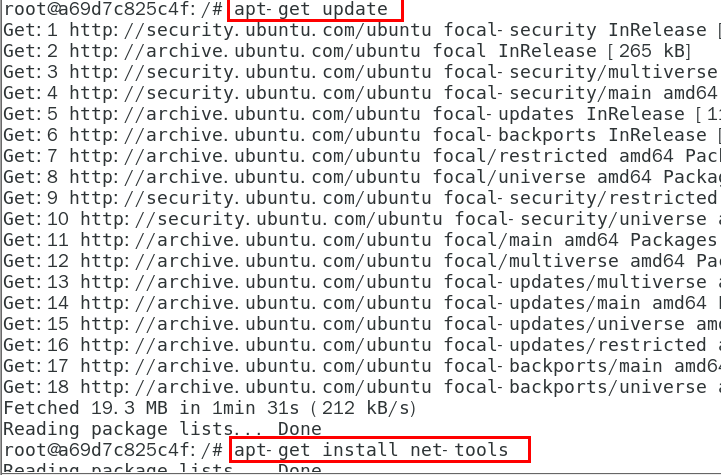


**4.安装完成后，commit我们自己的新镜像**

公式：
==docker commit -m="提交的描述信息" -a="作者" 容器ID 要创建的目标镜像名:[标签名]==
命令：在容器外执行，记得

```shell
docker commit -m="ifconfig cmd add" -a="zzyy" a69d7c825c4f zzyyubuntu:1.2
```

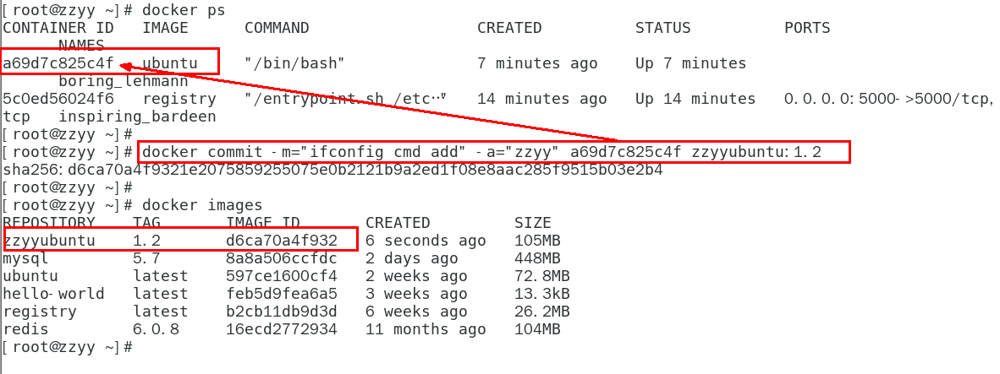


**5.启动我们的新镜像并和原来的对比**

1 官网是默认下载的Ubuntu没有ifconfig命令
2我们自己commit构建的新镜像，新增加了ifconfig功能，可以成功使用。

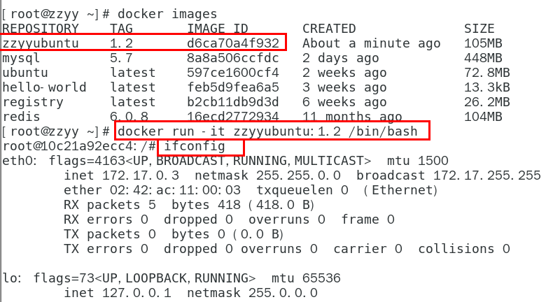


#### 4.curl验证私服库上有什么镜像

```shell
 curl -XGET http://192.168.111.162:5000/v2/_catalog
```

可以看到，目前私服库没有任何镜像上传过。。。。。。

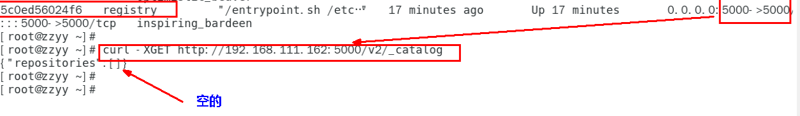

#### 5.将新镜像zzyyubuntu:1.2修改符合私服规范的Tag

按照公式： docker   tag   镜像:Tag   Host:Port/Repository:Tag
自己host主机IP地址，填写同学你们自己的，不要粘贴错误，O(∩_∩)O
使用命令 docker tag 将zzyyubuntu:1.2 这个镜像修改为192.168.111.162:5000/zzyyubuntu:1.2

```shell
docker tag  zzyyubuntu:1.2  192.168.111.162:5000/zzyyubuntu:1.2
```

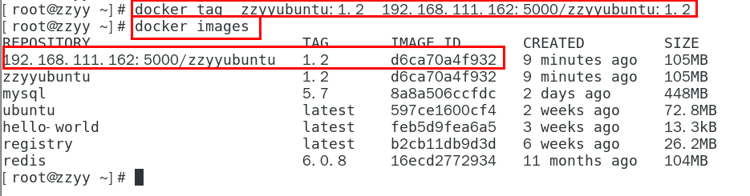


#### 6.修改配置文件使之支持http

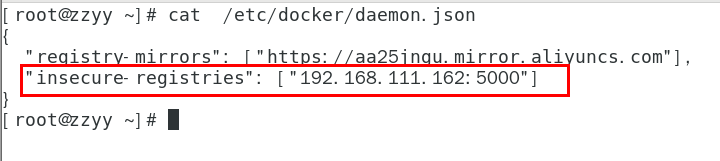

```tex
别无脑照着复制，registry-mirrors 配置的是国内阿里提供的镜像加速地址，不用加速的话访问官网的会很慢。
2个配置中间有个逗号 ','别漏了，这个配置是json格式的。
2个配置中间有个逗号 ','别漏了，这个配置是json格式的。
2个配置中间有个逗号 ','别漏了，这个配置是json格式的。
```

vim命令新增如下红色内容：vim /etc/docker/daemon.json

```js
{
  "registry-mirrors": ["https://aa25jngu.mirror.aliyuncs.com"],
  "insecure-registries": ["192.168.111.162:5000"]
}
```

上述理由：docker默认不允许http方式推送镜像，通过配置选项来取消这个限制。====> 修改完后如果不生效，建议重启docker


#### 7.push推送到私服库

```shell
docker push 192.168.111.162:5000/zzyyubuntu:1.2
```

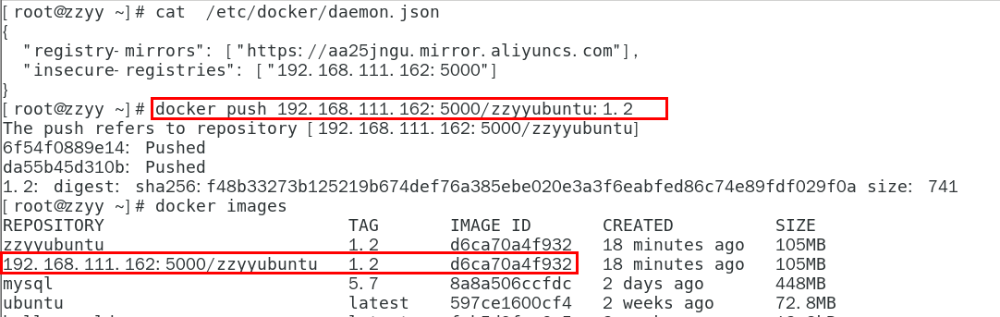


#### 8.curl验证私服库上有什么镜像2

```shell
curl -XGET http://192.168.111.162:5000/v2/_catalog
```

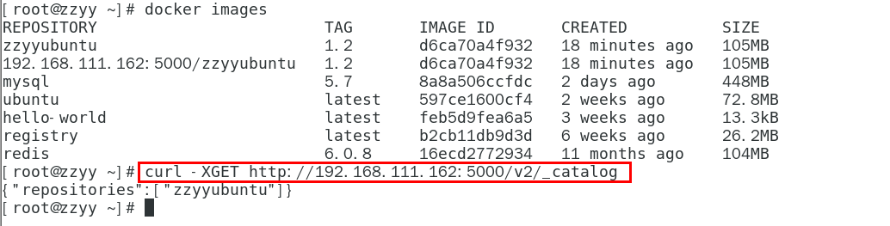


#### 9.pull到本地并运行

```shell
docker pull 192.168.111.162:5000/zzyyubuntu:1.2
```

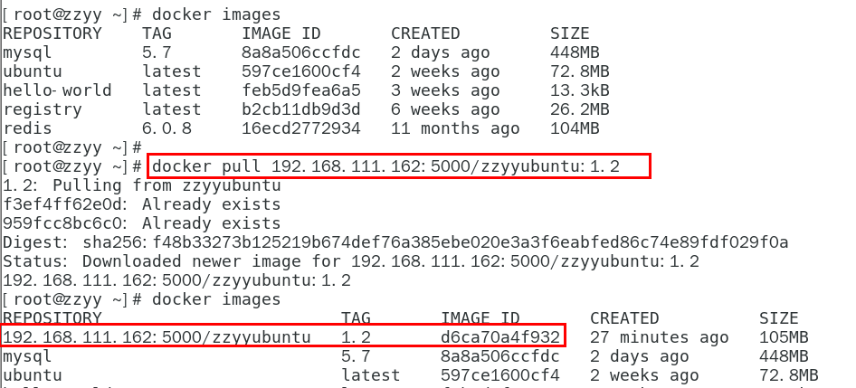


**docker run -it 镜像ID /bin/bash**

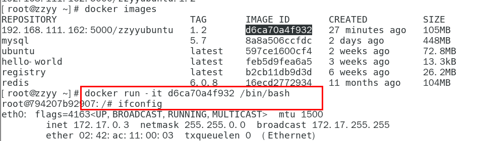