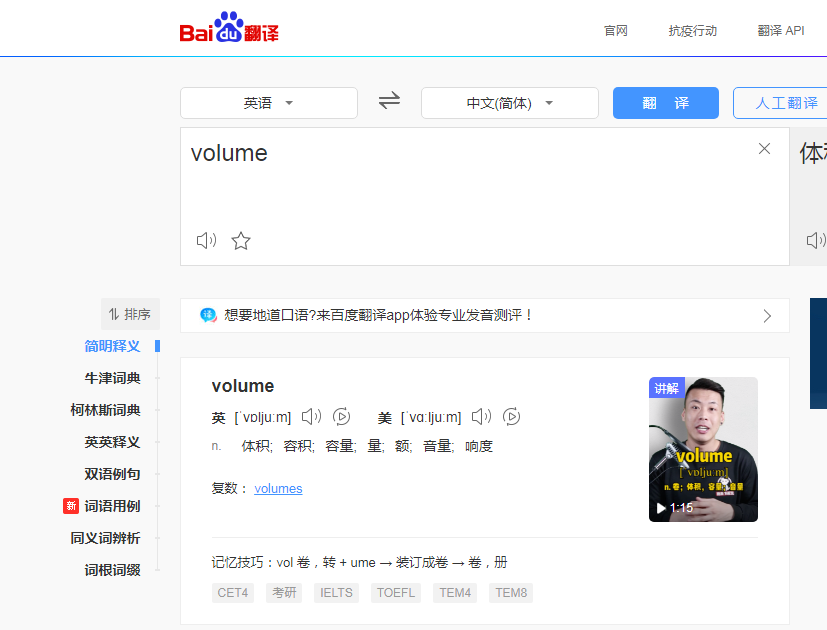
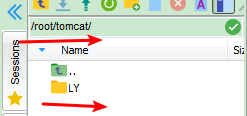

### 八、数据卷【`重点`】

---------

> 为了部署SSM的工程，需要使用到cp的命令将宿主机内的ssm.war文件复制到容器内部,还是感觉有一点麻烦
>
> 数据卷：将宿主机的一个目录映射到容器的一个目录中。
>
> 可以在宿主机中操作目录中的内容，那么容器内部映射的文件，也会跟着一起改变。



#### 8.1 数据卷创建

> 创建数据卷之后，默认会存放在一个目录下 /var/lib/docker/volumes/数据卷名称/_data

```sh
docker volume create 数据卷名称
```

#### 8.2 数据卷观察查看详情

> 查看数据卷的详细信息，可以查询到**存放路径**，创建时间等等

```sh
docker volume inspect 数据卷名称
```

#### 8.3 数据卷列出

> 查看全部数据卷信息

```sh
docker volume ls
```

#### 8.4 数据卷移除删除

> 删除指定数据卷

```sh
docker volume rm 数据卷名称
```


#### 8.5 数据卷容器映射,重点

> 映射有两种方式：
>
> - 方式一,通过数据卷名称映射，如果数据卷不存在Docker会帮你自动创建,且会将容器内部自带的文件，存储在默认的存放路径/var/lib/docker/volumes/数据卷名称/_data中↓(巧记,我带给你,你有我也有)
>
> - 如执行docker run -d -p 8082:8080 --name tomcat2 -v vname:/usr/local/tomcat/webapps b8
>
>    
>
> 
>
> - 方式二通过路径映射数据卷，直接指定一个路径作为数据卷的存放位置。但是这个路径下是空的,无法访问tomcat首页↓(巧记,我不带给你,你没有,我也没有,实现了一一对应的映射,等你有了,我也有了,你没了,我也没了)
>
>   如执行docker run -d -p 8083:8080 --name tomcat3 -v /root/tomcat:/usr/local/tomcat/webapps b8
>
>   
>
>   这个时候可以在路径的存放位置,自己写项目,因为对应的是webapps文件夹,然后项目文件夹里面写一个首页index.hmtl来访问,这里为了方便,我直接拷贝我们的LY旅游项目文件夹过来即可↓
>
>    
>
>   然后浏览器地址http://192.168.200.129:8083/LY/访问如下↓
>
>   

```sh
# 通过数据卷名称映射
docker run -v 数据卷名称:容器内部的路径 镜像id
docker run -d -p 8082:8080 --name tomcat2 -v vname:/usr/local/tomcat/webapps b8

# 通过路径映射数据卷
docker run -v 路径:容器内部的路径 镜像id
docker run -d -p 8083:8080 --name tomcat3 -v /root/tomcat:/usr/local/tomcat/webapps b8
```

