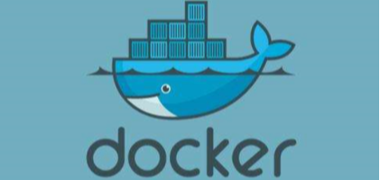
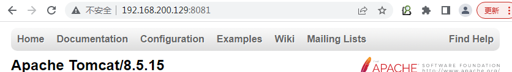

|                    docker                    |
| :------------------------------------------: |
|  |


### 一、引言

----

1


2


3


4


#### 1.1 环境不一致

> 我本地运行没问题啊：由于环境不一致，导致相同的程序，运行结果却不一致。

#### 1.2 隔离性

> 哪个哥们又写死循环了，怎么这么卡：在多用户的操作系统下，会因为其他用户的操作失误影响到你自己编写的程序。

#### 1.3 弹性伸缩

> 淘宝在双11的时候，用户量暴增：需要很多很多的运维人员去增加部署的服务器，运维成本过高的问题。

#### 1.4 学习成本

> 学习一门技术，得先安装啊：学习每一门技术都要先安装相应的软件，但是还有他所依赖的各种环境，安装软件成本快高过学习成本啦。


### 二、Docker介绍

---

#### 2.1 Docker的由来

> 有一帮年轻人创业，创办了一家公司，2010年专门做PAAS平台(平台即服务，**把应用服务的运行和开发环境作为一种服务提供** )。
>
> 但是到了2013年的时候，像亚马逊，微软，Google都开始做PAAS平台。到了2013年，公司资金链断裂，不得不倒闭，于是将公司内的核心技术对外开源，核心技术就是Docker。由于开源了Docker，到了2014年的时候，得到了C轮的融资 $4000W，2015年的时候，得到了D轮的融资.$9500W。于是公司开始全神贯注的维护Docker。

|            Docker主要作者-所罗门             |
| :------------------------------------------: |
|  |

|    Docker的作者已经离开了维护Docker的团队    |
| :------------------------------------------: |
|  |


#### 2.2 Docker的思想


> - 集装箱：会将所有需要的内容放到不同的集装箱中，谁需要这些环境就直接拿到这个集装箱就可以了。
>
> - 标准化：
>   - 运输的标准化：Docker有一个码头，所有上传的集装箱都放在了这个码头上，当谁需要某一个环境，就去搬运这个集装箱就可以了。
>   - 命令的标准化：Docker提供了一些列的命令，帮助我们去获取集装箱等等操作。
>   - 提供了REST的API：衍生出了很多的图形化界面，Rancher。
>
> - 隔离性：Docker运行集装箱内的内容，会在Linux的内核，单独开辟一片空间，这片空间不会影响到其他程序的运行。
>
> - 中央仓库|注册中心：超级码头，上面放的就是集装箱
>
> - 镜像：就是集装箱
>
> - 容器：运行起来的镜像
>
>   


### 三、Docker的安装

----

#### 3.1 下载Docker依赖的环境

> 想安装Docker，需要先将依赖的环境全部下载，就像Maven依赖JDK一样

```sh
yum -y install yum-utils device-mapper-persistent-data lvm2
```

#### 3.2 指定Docker镜像源

> 默认下载Docker回去国外服务器下载，速度较慢，我们可以设置为阿里云镜像源，速度更快

```sh
yum-config-manager --add-repo http://mirrors.aliyun.com/docker-ce/linux/centos/docker-ce.repo
```

#### 3.3 安装Docker

> 依然采用yum的方式安装

```sh
yum makecache fast
yum -y install docker-ce
```

#### 3.4 启动Docker并测试

> 安装成功后，需要手动启动，设置为开机自启，并测试一下Docker

```sh
# 启动Docker服务
systemctl start docker
# 设置开机自动启动
systemctl enable docker
# 查看docker的版本,测试是否安装成功
docker -v
```


### 四、Docker的中央仓库【`重点`】

----

> - Docker官方的中央仓库：这个仓库是镜像最全的，但是下载速度较慢。
>
>      https://hub.docker.com/
>
> - 国内的镜像网站：网易蜂巢，daoCloud等，下载速度快，但是镜像相对不全。
>
>      https://c.163yun.com/hub#/home
>
>      http://hub.daocloud.io/     （推荐使用）
>
> - 在公司内部会采用私服的方式拉取镜像，需要添加配置，如下↓
>
> - docker search mysql,了解

```json
# 需要创建/etc/docker/daemon.json，并添加如下内容
{
  "registry-mirrors": ["https://4p6hldmh.mirror.aliyuncs.com"]
}
# 重启两个服务
systemctl daemon-reload
systemctl restart docker
```


### 五、镜像的操作【`重点`】

----

#### 5.1 拉取镜像

> 从中央仓库拉取镜像到本地

```sh
docker pull 镜像名称[:tag],如果不写tag标签版本拉取的是最新版latest
# 举个栗子：docker pull daocloud.io/library/tomcat:8.5.15-jre8
```

#### 5.2 查看本地全部镜像

> 查看本地已经安装过的镜像信息,包含标识,名称,版本,更新时间,大小

```sh
docker images 相对有用
```

#### 5.3 删除本地镜像

> 镜像会占用磁盘空间,可以直接手动删除,标识可以通过查看镜像们获取,这里搜索hello镜像下载演示更加方便

```sh
docker rmi 镜像的标识(镜像id或名字:版本),如果版本是最新的latest可以不加:版本
```


#### 5.4 镜像的保存导出,加载导入,标签id起名字,可选的

> 如果因为网络原因,可以通过硬盘的方式传输镜像,虽然不规范,但是有效,但是这种方式导出的镜像名称和版本都是null,需要手动修改

```sh
# 将本地的镜像导出
docker save -o 导出的路径即哪个目录下的哪个文件 镜像id
# 加载本地的镜像文件
docker load -i 导入的路径即哪个目录下的哪个文件
# 修改镜像名称
docker tag 镜像id 新镜像名称:版本
```

```shell
[root@localhost ~]# docker images
REPOSITORY   TAG       IMAGE ID       CREATED      SIZE
hello-go     latest    aec43d10ed3b   4 days ago   98.4MB
[root@localhost ~]# docker save -o ./myhello 镜像id

[root@localhost ~]# docker rmi 镜像id
[root@localhost ~]# docker images

[root@localhost ~]# docker load -i ./myhello

[root@localhost ~]# docker images
REPOSITORY   TAG       IMAGE ID       CREATED      SIZE
<none>       <none>    aec43d10ed3b   4 days ago   98.4MB

[root@localhost ~]# docker tag 镜像id myhello:1.1.1
[root@localhost ~]# docker images
REPOSITORY   TAG       IMAGE ID       CREATED      SIZE
myhello      1.1.1     aec43d10ed3b   4 days ago   98.4MB
```


### 六、容器操作【`重点`】

----

#### 6.1 运行容器

> 运行容器需要指定具体的镜像，如果该镜像不存在，会直接下载

```sh
# 简单操作
docker run 镜像的标识|镜像名称[:tag]

# 常用的参数
docker run -d -p 宿主机端口:容器端口 --name 容器名称 镜像的标识id或者镜像名称[:tag]
# -d：代表后台运行容器
# -p 宿主机端口:容器端口：为了映射当前Linux的端口和容器的端口
# --name 容器名称：指定容器的名称
docker run -d -p 8080:8080 --name tomcat b8
docker run -d -p 8080:8080 --name tomcat daocloud.io/library/tomcat:8.5.15-jre8
docker run -d -p 8081:8080 --name tomcat2 b8
```


#### 6.2 查看正在运行的容器

> 查看全部正在运行的容器信息

```sh
docker ps [-qa]
# -a：查看全部的容器，包括没有运行的
# -q：只查看容器的标识,id
```


#### 6.3 查看容器的日志

> 查看容器日志，以查看容器运行的信息

```sh
docker logs -f 容器id,比如tomcat运行时的容器id等,来查看tomcat容器的日志
# -f：可以滚动查看日志的最后几行
```


#### 6.4 进入容器内部

> 可以进入容器内部进行操作

```sh
docker ps
docker exec -it 容器id bash,退出容器用exit即可
```

#### 6.5 拷贝某个东西到某个标识容器的内部

> 将宿主机的文件或者文件等复制到容器内部的指定目录

```sh
docker cp 文件名称 容器id:容器内部路径 容器id:容器内部路径不会写,打开新窗口进入容器内部抄即可
docker cp LY 08f164eeec15:/usr/local/tomcat/webapps
```


#### ==6.6 重启&启动&停止&删除容器==

> 容器的启动，停止，删除等操作，后续经常会使用到

```sh
# 重新启动容器
docker restart 容器id

# 启动停止运行的容器
docker start 容器id

# 停止指定的容器（删除容器前，需要先停止容器）
docker stop 容器id
# 停止全部容器
docker stop $(docker ps -qa)

# 删除指定容器,不停止强制删除容器可以加一个-f参数,比如docker rm -f 容器id
docker rm 容器id
# 删除全部容器
docker rm $(docker ps -qa)
```

|     docker start与docker restart的区别     |
| :----------------------------------------: |
|  |

https://www.jianshu.com/p/b7374f4e1e8f


### 七、Docker应用

----

#### 7.1 Docker安装Tomcat

> 运行Tomcat容器，为部署SSM工程做准备

```sh
注意,如果上面停止并删除了容器,用下面的命令容器的是一个新的容器,看新的容器id就知道了
docker run -d -p 8081:8080 --name tomcat daocloud.io/library/tomcat:8.5.15-jre8
```


#### ==7.2 Docker安装MySQL==

> 运行MySQL容器，为部署SSM工程做准备,还要把数据库里面插入我等会部署项目用的ssm数据库和里面的表

```sh
docker run -d -p 3306:3306 --name mysql -e MYSQL_ROOT_PASSWORD=root daocloud.io/library/mysql:5.7.4
```


上图报错是端口被占用,因为之前用linux服务器安装的mysql开机自启占用了,

要么把之前的mysqld服务停止并且禁用开启启动(推荐)↓

systemctl stop mysqld

systemctl disable mysqld

如果还报容器被占用,可以停止占用容器,和移除容器↓

docker stop 占用容器id

docker rm 占用容器id


要么杀进程↓

```shell
# 查看当前占用端口命令
netstat -tanlp

# 杀死进程(注意不是杀死端口，而是pid的端口)，如下图参考
kill 1443
```


https://blog.csdn.net/qq_41157588/article/details/108889620


#### 7.3 部署SSM工程核心步骤

> - 先准备好mysql容器,和创建好对应的ssm数据库和表
> - 修改ssm工程配置文件db.properties,特别注意修改要访问的Linux的ip和mysql的账户和密码
> - 通过Maven的package重新打成war包
> - 将Windows下的war包复制到Linux中
> - 通过docker命令将宿主机的war包复制到tomcat容器内部
> - 稍等片刻,然后输入地址去测试访问tomcat里面部署好的ssm工程

课堂步骤如下↓

运行tomcat和mysql容器↓

```shell
docker run -d -p 8081:8080 --name tomcat daocloud.io/library/tomcat:8.5.15-jre8
```



```shell
docker run -d -p 3306:3306 --name mysql -e MYSQL_ROOT_PASSWORD=root daocloud.io/library/mysql:5.7.4
```


部署ssm项目拷贝到虚拟机之前,修改数据库配置文件访问参数,注意修改的是ip↓


把ssm.war包上传到虚拟机的/root目录↓


拷贝ssm.war包到tomcat容器的内部之前,知道tomcat容器内部的路径↓


http://192.168.200.129:8081/ssm


### 八、数据卷【`重点`】

---------

> 为了部署SSM的工程，需要使用到cp的命令将宿主机内的ssm.war文件复制到容器内部,还是感觉有一点麻烦
>
> 数据卷：将宿主机的一个目录映射到容器的一个目录中。
>
> 可以在宿主机中操作目录中的内容，那么容器内部映射的文件，也会跟着一起改变。


#### 8.1 数据卷创建

> 创建数据卷之后，默认会存放在一个目录下 /var/lib/docker/volumes/数据卷名称/_data

```sh
docker volume create 数据卷名称
```

#### 8.2 数据卷观察查看详情

> 查看数据卷的详细信息，可以查询到**存放路径**，创建时间等等

```sh
docker volume inspect 数据卷名称
```

#### 8.3 数据卷列出

> 查看全部数据卷信息

```sh
docker volume ls
```

#### 8.4 数据卷移除删除

> 删除指定数据卷

```sh
docker volume rm 数据卷名称
```


#### 8.5 数据卷容器映射,重点

> 映射有两种方式：
>
> - 方式一,通过数据卷名称映射，如果数据卷不存在Docker会帮你自动创建,且会将容器内部自带的文件，存储在默认的存放路径/var/lib/docker/volumes/数据卷名称/_data中↓(巧记,我带给你,你有我也有)
>
> - 如执行docker run -d -p 8082:8080 --name tomcat2 -v vname:/usr/local/tomcat/webapps b8
>
>    
>
>   
>
> - 方式二通过路径映射数据卷，直接指定一个路径作为数据卷的存放位置。但是这个路径下是空的,无法访问tomcat首页↓(巧记,我不带给你,你没有,我也没有,实现了一一对应的映射,等你有了,我也有了,你没了,我也没了)
>
>   如执行docker run -d -p 8083:8080 --name tomcat3 -v /root/tomcat:/usr/local/tomcat/webapps b8
>
>   
>
>   这个时候可以在路径的存放位置,自己写项目,因为对应的是webapps文件夹,然后项目文件夹里面写一个首页index.hmtl来访问,这里为了方便,我直接拷贝我们的LY旅游项目文件夹过来即可↓
>
>    
>
>   然后浏览器地址http://192.168.200.129:8083/LY/访问如下↓
>
>   

```sh
# 通过数据卷名称映射
docker run -v 数据卷名称:容器内部的路径 镜像id
docker run -d -p 8082:8080 --name tomcat2 -v vname:/usr/local/tomcat/webapps b8

# 通过路径映射数据卷
docker run -v 路径:容器内部的路径 镜像id
docker run -d -p 8083:8080 --name tomcat3 -v /root/tomcat:/usr/local/tomcat/webapps b8
```


### 九、Dockerfile自定义镜像【`重点`】

---

> 我们可以从中央仓库下载一个镜像，
>
> 也可以自己手动去制作一个镜像，需要通过Dockerfile去指定自定义镜像的信息

#### 9.1 Dockerfile文件和文件里面需要用到的东西

> 创建自定义镜像就需要创建一个Dockerfile，如下为Dockerfile的语言↓
>
> from: 指定当前自定义镜像依赖的环境
> copy: 将相对路径下的内容复制到自定义镜像中
> workdir: 声明镜像的默认工作目录
> run: 执行的命令，可以编写多个
> cmd: 需要执行的命令（在workdir下执行的，cmd可以写多个，只以最后一个为准）

```sh
# 简单点,举个例子,制作SSM容器镜像,准备ssm.war要放在Dockerfile的同级目录下,因为下面用的是相对路径↓
# 制作一个镜像把ssm.war包拷贝到tomcat的webapps目录里↓,一旦运行这个镜像里面有tomcat并且部署好了ssm项目↓
from daocloud.io/library/tomcat:8.5.15-jre8
copy ssm.war /usr/local/tomcat/webapps
```

**注意,上面是ssm项目,别忘了先运行mysql容器,并确保mysql服务器里面创建好了ssm数据库和里面的表↑**


#### 9.2 构建镜像-t标签起镜像名字和版本

> 编写完Dockerfile后需要通过命令将其制作为镜像，并且要在Dockerfile的当前目录下，之后即可在镜像中查看到指定的镜像信息，注意最后的空格和点 [.]() 表示要知道的Dockerfile文件在哪里才知道要做什么事情↓

```sh
# 先启动mysql服务器和准备好对应的ssm数据库,然后拷贝文件和项目到Linux的一个目录,
# 进入文件所在目录即Dockerfile文件夹,执行下面的命令来构建镜像即可
docker build -t 镜像名称[:tag] .

docker build -t ssm-tomcat:1.0.0 .

docker images
docker run -d -p 8081:8080 --name myssm 镜像id
```

>.指的dockerfile的路径，一般都在dockerfile所在目录制作镜像，所以设置.会在当前目录找dockerfile文件。

查看是否有构建的镜像,如果有,运行这个镜像,并且通过浏览器访问测试镜像打包部署的项目是否能够访问↓


开干,ssm项目并忘了先准备好mysql容器,创建好ssm数据库和表,再进行下面的操作↓

拷贝资料提供好的文件夹到Linux,然后进入这个Dockerfile文件夹,下面进行的命令,并测试访问即可↓

```shell
docker build -t ssm-tomcat:1.0.0 .

docker images
docker run -d -p 8081:8080 --name myssm 镜像id
```

http://192.168.200.129:8081/ssm


### ==十. Docker-Compose【`重点`】

---------

> ====之前运行一个镜像，需要添加大量的参数,可以通过Docker-Compose编写这些参数。而且Docker-Compose可以帮助我们批量的管理容器。这些信息只需要通过一个docker-compose.yml文件去维护即可,批量操作!!!
>
> 

#### 10.1 下载并安装Docker-Compose,这个不用记,做一次即可,一劳永逸的事情↓

##### 10.1.1 下载Docker-Compose

> 去github官网搜索docker-compose，下载1.24.1版本的Docker-Compose
>
> 下载路径：[https://github.com/docker/compose/releases/download/1.24.1/docker-compose-Linux-x86_64]()

##### 10.1.2 设置权限

> 需要将DockerCompose文件的名称修改一下(重命名)，给予DockerCompose文件一个可执行的权限

```sh
mv docker-compose-Linux-x86_64 docker-compose
chmod 777 docker-compose
```

##### 10.1.3 配置环境变量

>  方便后期操作，配置一个环境变量
>
> 将docker-compose文件移动到了/usr/local/bin , 修改了/etc/profile文件，给/usr/local/bin配置到了PATH中

```sh
mv docker-compose /usr/local/bin

vi /etc/profile
# 添加内容到文件末尾即可,然后保存退出↓
export PATH=$JAVA_HOME:/usr/local/bin:$PATH

# 重新加载配置文件,让其生效↓
source /etc/profile
```

##### 10.1.4 测试

> 在Linux的任意目录下输入docker-compose有下面的帮助说明提示,说明软件安装成功↓

|                   测试效果                   |
| :------------------------------------------: |
|  |


#### 10.2 Docker-Compose管理MySQL和Tomcat容器

> yml文件以key: value方式来指定配置信息
>
> 多个配置信息以换行+缩进的方式来区分
>
> 在docker-compose.yml文件中，不要使用制表符!
>
> 创建下面配置文件中缺少的目录↓
>
> ```shell
> cd /opt/
> mkdir docker_mysql_tomcat
> cd docker_mysql_tomcat
> vi docker-compose.yml
> #抄下面的保存退出
> ```

```yml
version: '3.1'
services:
  mysql:           # 服务的名称
    restart: always   # 代表只要docker启动，那么这个容器就跟着一起启动
    image: daocloud.io/library/mysql:5.7.4  # 指定镜像路径
    container_name: mysql  # 指定容器名称
    ports:
      - 3306:3306   #  指定端口号的映射
    environment:
      MYSQL_ROOT_PASSWORD: root   # 指定MySQL的ROOT用户登录密码
      TZ: Asia/Shanghai        # 指定时区
    volumes:
     - /opt/docker_mysql_tomcat/mysql_data:/var/lib/mysql   # 映射数据卷var/lib/mysql不知抄镜像网
  tomcat:
    restart: always
    image: daocloud.io/library/tomcat:8.5.15-jre8
    container_name: tomcat
    ports:
      - 8080:8080
    environment:
      TZ: Asia/Shanghai
    volumes:
      - /opt/docker_mysql_tomcat/tomcat_webapps:/usr/local/tomcat/webapps
      - /opt/docker_mysql_tomcat/tomcat_logs:/usr/local/tomcat/logs
```

```yml
version: '3.1'
services:
  mysql:          
    restart: always   
    image: daocloud.io/library/mysql:5.7.4  
    container_name: mysql  
    ports:
      - 3306:3306   
    environment:
      MYSQL_ROOT_PASSWORD: root   
      TZ: Asia/Shanghai        
    volumes:
     - /opt/docker_mysql_tomcat/mysql_data:/var/lib/mysql   
  tomcat:
    restart: always
    image: daocloud.io/library/tomcat:8.5.15-jre8
    container_name: tomcat
    ports:
      - 8080:8080
    environment:
      TZ: Asia/Shanghai
    volumes:
      - /opt/docker_mysql_tomcat/tomcat_webapps:/usr/local/tomcat/webapps
      - /opt/docker_mysql_tomcat/tomcat_logs:/usr/local/tomcat/logs
```

>version 字段是表明使用那个版本的compose ，compose 有如下的版本，目前的最新版是 3.7
>
>- 1
>- 2
>- 2.x
>- 3.x
>
>不同版本的 compose 支持了不同的 docker 版本

#### 10.3 使用docker-compose命令管理容器

> **在使用docker-compose的命令时 ，默认会在当前目录下找docker-compose.yml文件**
>
> 执行命令之前,为了避免冲突,停止所有的容器,然后移除所有的容器↓
>
> ```shell
> docker stop $(docker ps -qa)
> docker rm $(docker ps -qa)
> 
> # 1. 基于docker-compose.yml启动管理的容器
> docker-compose up -d
> ```
>
> 由于上面配置文件用的数据卷是/绝对路径,故访问首页找不到文件,这个数据卷映射方式二已经说过↓
>
> http://192.168.200.129:8080/
>
> 
>
> 另通过sqlyog访问数据库服务器成功↓
>
> 
>
> 其他命令↓

```sh
# 1. 基于docker-compose.yml启动管理的容器,重要
docker-compose up -d
# 2. 停止并删除容器,重要
docker-compose down

# 3. 停止|开启|重启已经存在的由docker-compose维护的容器,如果上面用down删除容器了,这几个命令用不了
docker-compose stop|start|restart

# 4. 查看由docker-compose管理的容器
docker-compose ps

# 5. 查看容器的日志
docker-compose logs -f
```

 以上这些命令要注意在带有docker-compose.yml所在的目录运行,因为默认找的是这个文件,否则报错找不到目录↓


#### 10.4 docker-compose配合Dockerfile使用

> 使用docker-compose.yml文件以及Dockerfile文件在生成自定义镜像的同时启动当前镜像，
>
> 并且由docker-compose去管理容器

##### 10.4.1 docker-compose文件

> 编写docker-compose.yml文件

```yml
# yml文件
version: '3.1'
services:
  ssm:
    restart: always
    build:            # 构建自定义镜像
      context: ../      # 指定dockerfile文件的所在路径
      dockerfile: Dockerfile   # 指定Dockerfile文件名称
    image: ssm:1.0.1
    container_name: ssm
    ports:
      - 8081:8080
    environment:
      TZ: Asia/Shanghai
```

##### 10.4.2 Dockerfile文件

> 编写Dockerfile文件

```
from daocloud.io/library/tomcat:8.5.15-jre8
copy ssm.war /usr/local/tomcat/webapps

```

##### 10.4.3 运行

> 测试效果

```sh
# 先启动mysql容器并建立好ssm数据库,然后修改ssm.war包里面连接数据库的配置,
# 拷贝资料文件夹里面的东西到Linux服务器,
# 进入到docker-compose.yml文件所在目录,执行下面的up命令即可↓

# 可以直接启动基于docker-compose.yml以及Dockerfile文件构建的自定义镜像!!!开干即可!!!
docker-compose up -d
# 如果自定义镜像不存在，会帮助我们构建出自定义镜像，如果自定义镜像已经存在,会直接运行这个之前的镜像,坑↑
# 测试访问tomcat,浏览器输入地址http://192.168.1.103:8081可以
# 测试访问项目,浏览器输入地址http://192.168.1.103:8081/ssm可以
# 如果还是无法访问成功,要注意两个问题,一是mysql容器是否启动,而是运行的镜像是不是之前的旧ip的war包镜像!

# 另外,如果想重新构建新镜像用下面的,这个是运行上面的命令,显示出来下面的提示,这里无影响略过↓
# 重新构建自定义镜像
docker-compose build
# 运行当前内容，并重新构建
docker-compose up -d --build

# 上面的构建可以理解为先把旧镜像删掉,构建新镜像,我们也可以不用上面的命令自己来实现这个功能
```

> 如果自定义镜像不存在，会帮助我们构建出自定义镜像，如果自定义镜像已经存在,会直接运行这个之前的镜像,这个有点坑,要引起注意↓
>
> 运行的镜像如果是之前的旧ip的war包镜像,旧的ip是103,现在的ip是129,ip不对就访问不了Linux虚拟机上的mysql服务器,可以在docker-compose.yml文件所在目录,执行docker-compose logs -f来查看容器的日志来找到报错原因↓


，