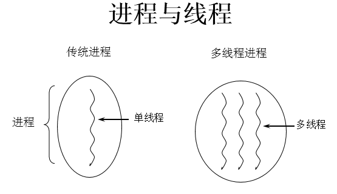
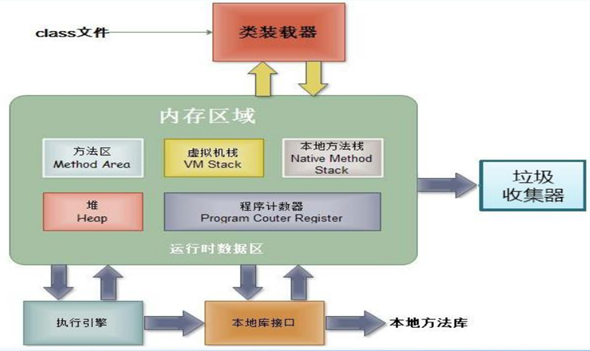

1. **程序(programm)**
   概念：是为完成特定任务、用某种语言编写的一组指令的集合。即指一段静态的代码。

2. **进程(process)**
   概念：在系统中运行的一个应用程序就是一个进程
   说明：每一个进程都有自己的内存空间和系统资源

3. **线程(thread)**
   概念：进程可进一步细化为线程，是一个程序内部的一条执行路径,同一个进程内会有一个或多个线程。
   说明：线程作为调度和执行的单位，每个线程拥独立的运行栈和程序计数器(pc)，线程切换的开销小。

   

4. **管程(Monitor监视器)**:也就是我们平时说的锁
   05.用户线程与守护线程
    用户线程: 是系统的工作线程，它会完成这个程序需要完成的业务操作。
    守护线程: 是一种特殊的线程为其它线程服务的，在后台默默地完成一些系统性的服务，比如垃圾回收线程就是最典型的例子.
          守护线程作为一个服务线程，没有服务对象就没有必要继续运行了，如果用户线程全部结束了，意味着程序需要完成的业务操作已经结束了，系统可以退出了。所以假如当系统只剩下守护线程的时候，java虚拟机会自动退出。

补充：
内存结构：

进程可以细化为多个线程。
每个线程，拥有自己独立的：栈、程序计数器
多个线程，共享同一个进程中的结构：方法区、堆。