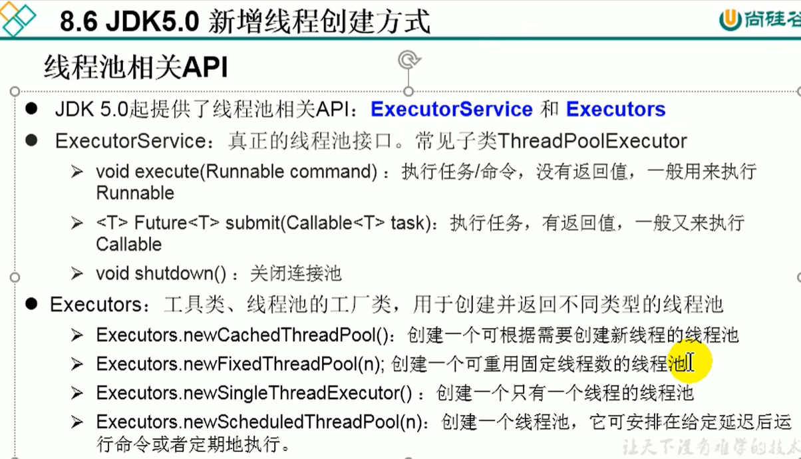
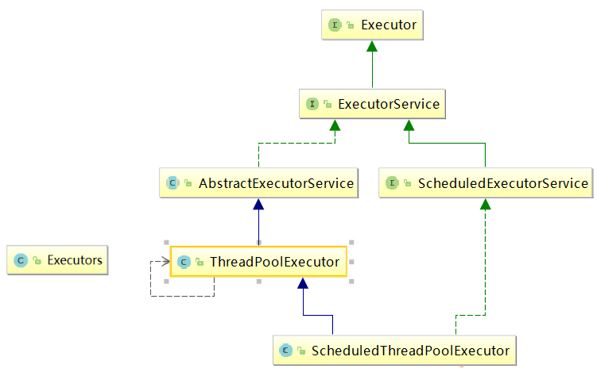
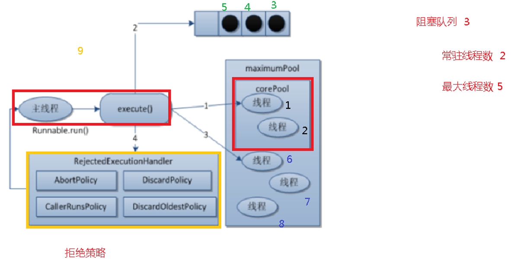
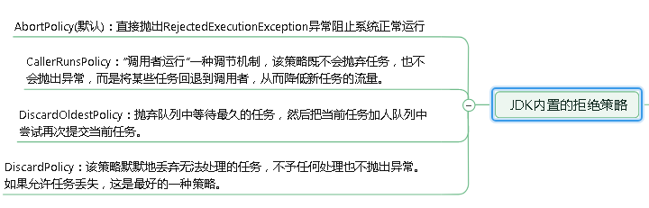
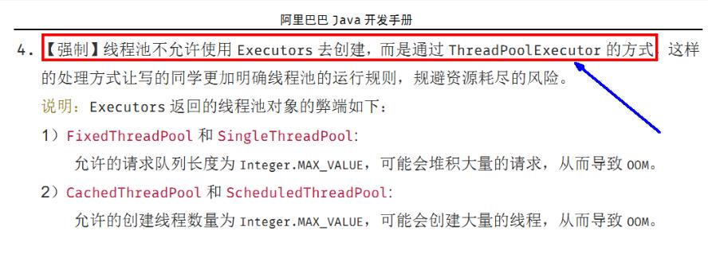

## 一：使用线程池

```java
class NumberThread implements Runnable{

    @Override
    public void run() {
        for(int i = 0;i <= 100;i++){
            if(i % 2 == 0){
                System.out.println(Thread.currentThread().getName() + ": " + i);
            }
        }
    }
}

class NumberThread1 implements Runnable{

    @Override
    public void run() {
        for(int i = 0;i <= 100;i++){
            if(i % 2 != 0){
                System.out.println(Thread.currentThread().getName() + ": " + i);
            }
        }
    }
}

public class ThreadPool {

    public static void main(String[] args) {
        //1. 提供指定线程数量的线程池
        ExecutorService service = Executors.newFixedThreadPool(10);
        ThreadPoolExecutor service1 = (ThreadPoolExecutor) service;
        //设置线程池的属性
//        System.out.println(service.getClass());
//        service1.setCorePoolSize(15);
//        service1.setKeepAliveTime();


        //2.执行指定的线程的操作。需要提供实现Runnable接口或Callable接口实现类的对象
        service.execute(new NumberThread());//适合适用于Runnable
        service.execute(new NumberThread1());//适合适用于Runnable

//        service.submit(Callable callable);//适合使用于Callable
        //3.关闭连接池
        service.shutdown();
    }

}
```

说明：
* 线程池的好处：
* 1.提高响应速度（减少了创建新线程的时间）
* 2.降低资源消耗（重复利用线程池中线程，不需要每次都创建）
* 3.便于线程管理
*      corePoolSize：核心池的大小
*      maximumPoolSize：最大线程数
*      keepAliveTime：线程没任务时最多保持多长时间后会终止

面试题：Java中多线程的创建有几种方式？四种。

## 二:继承实现关系：



## 三：常用参数

**• corePoolSize 线程池的核心线程数** 
**• maximumPoolSize 能容纳的最大线程数** 
**• keepAliveTime 空闲线程存活时间(除了核心线程,其他都是空闲线程)**
**• unit 存活的时间单位** 
**• workQueue 存放提交但未执行任务的队列** 
**• threadFactory 创建线程的工厂类** 
**• handler 等待队列满后的拒绝策略**

## 四：拒绝策略实现方式



​		 线程池中，有三个重要的参数，决定影响了拒绝策略：**corePoolSize - 核心线程数，**
也即最小的线程数。**workQueue - 阻塞队列** 。 **maximumPoolSize - 最大线程数**(即是核心线程数+空闲线程数) 。

#####  1)拒绝策略执行顺序：

   ①当提交任务数大于 **corePoolSize** 的时候，会优先将任务放到 **workQueue** 阻塞队列中。当阻塞队列饱和后，会扩充线程池中线程数，直到达到 **maximumPoolSize** 最大线程数配置。此时，再多余的任务，则会触发线程池的拒绝策略了。 
总结起来，也就是一句话，当提交的任务数大于（**workQueue.size() + maximumPoolSize** ），就会触发线程池的拒绝略。

#####  2)JDK内置策略:



## 五：线程池底层工作原理:

  1. 在创建了线程池后，线程池中的线程数为零 
  2. 当调用 execute()方法添加一个请求任务时，线程池会做出如下判断： 
       2.1 如果正在运行的线程数量小于 corePoolSize，那么马上创建线程运行这个任务； 
          2.2 如果正在运行的线程数量大于或等于 corePoolSize，那么将这个任务放入队列； 
          2.3 如果这个时候队列满了且正在运行的线程数量还小于maximumPoolSize，那么还是要创建非核心线程立刻运行这个任务； 
          2.4 如果队列满了且正在运行的线程数量大于或等于 maximumPoolSize，那么线程池会启动饱和拒绝策略来执行。 
 3. 当一个线程完成任务时，它会从队列中取下一个任务来执行 
 4. 当一个线程无事可做超过一定的时间（keepAliveTime）时，线程会判断： 
      4.1 如果当前运行的线程数大于 corePoolSize，那么这个线程就被停掉。 
      4.2 所以线程池的所有任务完成后，它最终会收缩到 corePoolSize 的大小。 

## 六:为什么不允许适用不允许 Executors.的方式手动创建线程池,如下图



## 七:使用ThreadPoolExecutor自定义线程池

```java
public class ThreadPoolDemo {
    public static void main(String[] args) {
        ThreadPoolExecutor service = new ThreadPoolExecutor(
                2, //核心线程数
                5, //最大线程数
                2L, //空闲线程存活时间
                TimeUnit.SECONDS, //时间单位
                new ArrayBlockingQueue<>(3), //阻塞队列
                Executors.defaultThreadFactory(), //线程工厂
                new ThreadPoolExecutor.AbortPolicy() //拒绝策略
        );
        //10个顾客办理业务
        try {
            for (int i = 1; i <= 10 ; i++) {
                //执行
                service.execute(() ->{
                    System.out.println(Thread.currentThread().getName()+" 办理业务");
                });
            }
        } catch (Exception e) {
            e.printStackTrace();
        } finally {
            //关闭线程池
            service.shutdown();
        }  }}
```

