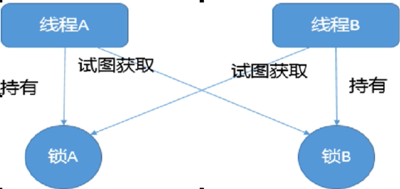
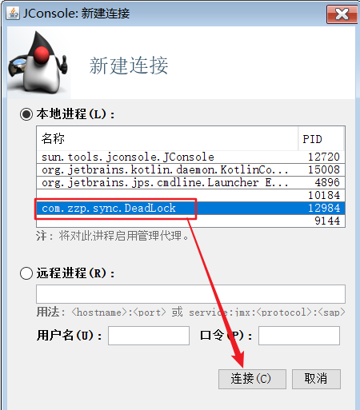
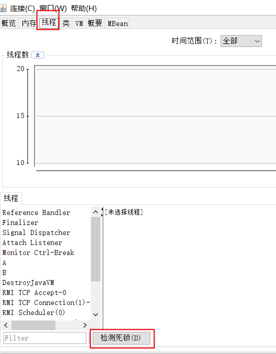
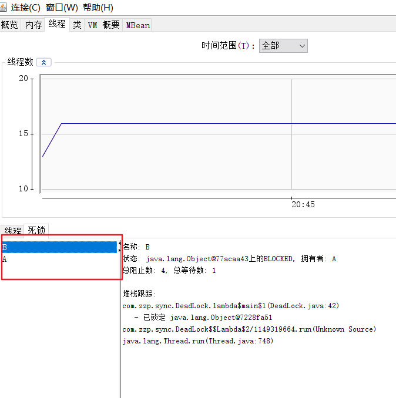

## 一： 死锁是什么？

​    死锁是指两个或两个以上的线程在执行过程中,因争夺资源而造成的-.种**互相等待的现象**,若无外力干涉那它们都将无法推进下去，如果系统资源充足，进程的资源请求都能够得到满足，死锁出现的可能性就很低，否则就会因争夺有限的资源而陷入死锁。



##  二：检查死锁的方法:

   方式一：
        ①.运行死锁的类，在Terminal中输入 jps -l
        ②.查看该类的端口,输入 jstack 端口号
    方式二：

​        ①在运行中输入jconsole


​         ②连接自己项目运行的程序



​     ③选择线程一栏，点击检测死锁



​      ④即可查看到死锁



####   手写死锁代码演示:

```java
public class DeadLock {
    //锁a
    static Object a=new Object();
    //锁b
    static Object b=new Object();
    public static void main(String[] args) {
        new Thread(() -> {
            synchronized (a){
                System.out.println(Thread.currentThread().getName()+"持有锁a,试图获取锁b");
                try {
                    TimeUnit.SECONDS.sleep(1);
                } catch (InterruptedException e) {
                    e.printStackTrace();
                }
                synchronized (b){
                    System.out.println(Thread.currentThread().getName()+"获取锁b");
                }
            }
        },"A").start();

        new Thread(() -> {
            synchronized (b){
                System.out.println(Thread.currentThread().getName()+"持有锁b,试图获取锁a");
                try {
                    TimeUnit.SECONDS.sleep(1);
                } catch (InterruptedException e) {
                    e.printStackTrace();
                }
                synchronized (a){
                    System.out.println(Thread.currentThread().getName()+"获取锁a");
                }
            }
        },"B").start();
    }
}
```

### 描述一下线程安全活跃性问题？

线程安全的活跃性问题可以分为 **死锁、活锁、饥饿** 
1.***活锁*** 就是有时线程虽然没有发生阻塞，但是仍然会存在执行不下去的情况，活锁不会阻塞线程，线程会一直重复执行某个相同的操作，并且一直失败重试

1) 我们开发中使用的异步消息队列就有可能造成活锁的问题，在消息队列的消费端如果没有正确的ack消息，并且执行过程中报错了，就会再次放回消息头，然后再拿出来执行，一直循环往复的失败。这个问题除了正确的ack之外，往往是通过将失败的消息放入到延时队列中，等到一定的延时再进行重试来解决。 
2)  解决活锁的方案很简单，尝试等待一个随机的时间就可以，会按时间轮去重试

2.***饥饿*** 就是 线程因无法访问所需资源而无法执行下去的情况
    1. 饥饿 分为两种情况：
       一种是其他的线程在临界区做了无限循环或无限制等待资源的操作，让其他的线程一直不能拿到锁进入临界区，对其他线程来说，就   进入了饥饿状态
       另一种是因为线程优先级不合理的分配，导致部分线程始终无法获取到CPU资源而一直无法执行
     2. 解决饥饿的问题几种方案:
            1.保证资源充足，很多场景下，资源的稀缺性无法解决
            2.公平分配资源，在并发编程里使用公平锁，例如FIFO策略，线程等待是有顺序的，排在等待队列前面的线程会优先获得资源
            3.避免持锁的线程长时间执行，很多场景下，持锁的线程的执行时间也很难缩短

3.***死锁*** 线程在对同一把锁进行竞争的时候，未抢占到锁的线程会等待持有锁的线程释放锁后继续抢占，如果两个或两个以上的线程互相持有对方将要抢占的锁，互相等待对方先行释放锁就会进入到一个循环等待的过程，这个过程就叫做死锁