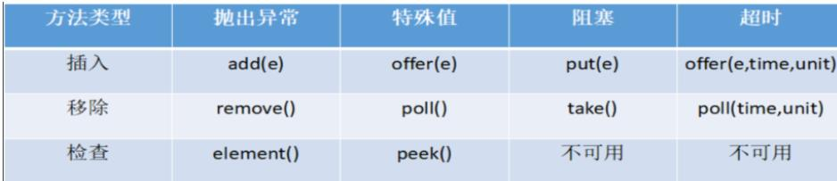
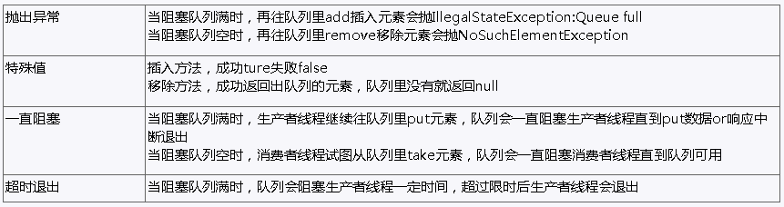

## 一： 常见的 BlockingQueue

当队列是空的,从队列中获取元素的操作将会被阻塞
当队列是满的,从队列中添加元素的操作将会被阻塞
1）ArrayBlockingQueue,LinkedBlockingQueue，DelayQueue,PriorityBlockingQueue
 synchronousQueue

## 二：BlockingQueue 核心方法

**【1】为什么需要 BlockingQueue?** 
    在 concurrent 包发布以前，在多线程环境下，我们每个程序员都必须去自己控制这些细节，尤其还要兼顾效率和线程安全，而这会给我们的程序
带来不小的复杂度。使用后我们不需要关心什么时候需要阻塞线程，什么时候需要唤醒线程因为这一切 BlockingQueue 都给你一手包办了 。