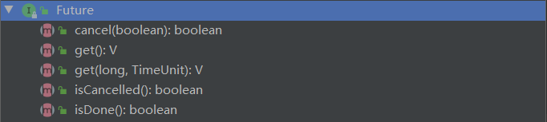
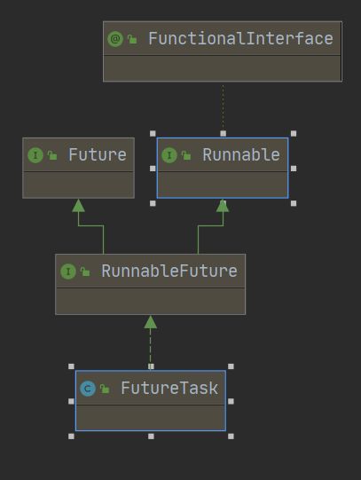
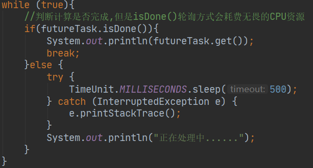
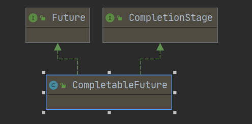
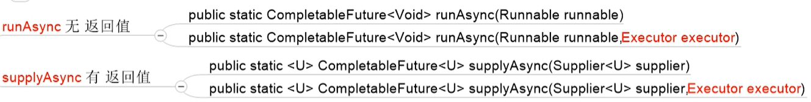
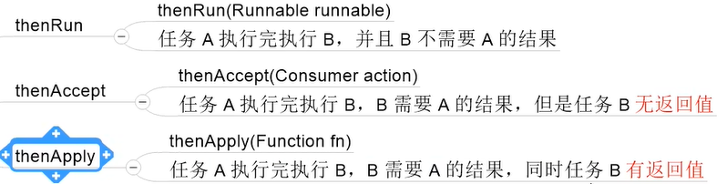
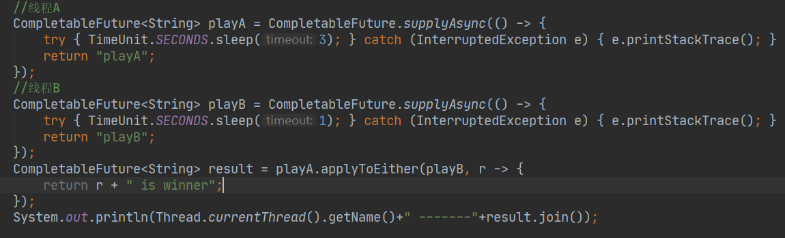
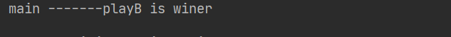
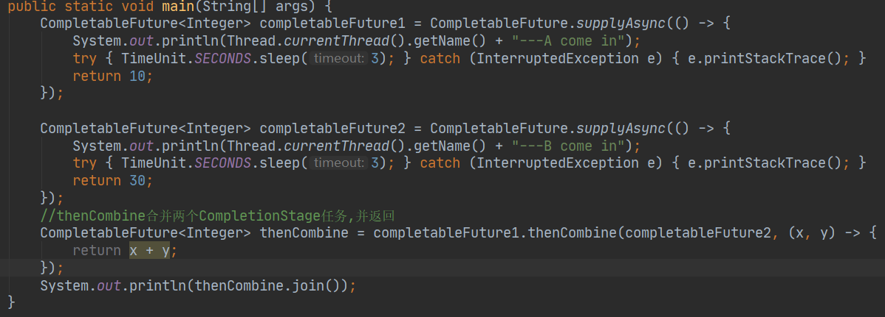
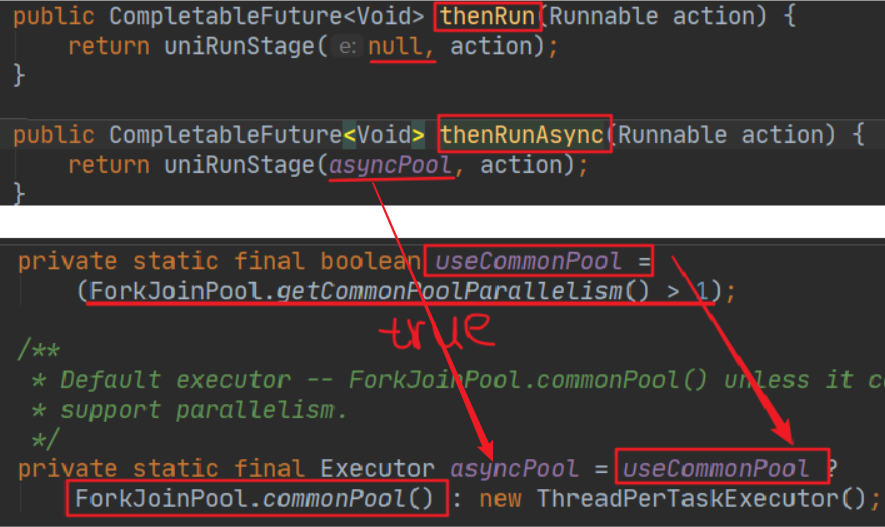

## 一:Future接口(异步任务接口)

  1) Future接口(FutureTask实现类)定义了异步任务执行的一些方法,如获取**异步任务的执行结果**,取消任务的执行,判断任务是否被取消,判断任务执行是否完毕等;Future接口可以为主线程开一个分支任务,专门为主线程处理耗时费力的业务

 	比如主线程让一个子线程去执行任务，子线程可能比较耗时，启动子线程开始执行任务后，主线程就去做其他事情了，忙其它事情或者先执行完，过了一会才去获取子任务的执行结果或变更的任务状态。

2. Future是Java5新加的一个接口，它提供了一种**异步并行计算的功能**。如果主线程需要执行一个很耗时的计算任务，我们就可以通过future把这个任务放到异步线程中执行。主线程继续处理其他任务或者先行结束，再通过Future获取计算结果。

## 二:FutureTask(异步任务类)

实现Future异步接口和Runnable多线程接口,并且提供了接收Callable的构造器.由此将:**多线程/有返回值/支持异步任务**  三个结合起来.

  1)get()容易造成阻塞,一般建议放在程序后面,一旦调用只能等到计算出结果后才能离开 
   2)解决get()会造成阻塞的方法:
      ①get(long n,TimeUnit),表示指定时间内若未收到返回结果,则抛出异常TimeoutException,中止程序
      ②isDone()轮询,判断计算是否完成,但是isDone()轮询方式会耗费无畏的CPU资源

## 三:CompletableFuture(实现了Future和CompletionStage接口)

1. 在Java8中，CompletableFuture提供了非常强大的Future的扩展功能，可以帮助我们简化异步编程的复杂性，并且提供了函数式编程的能力，可以通过回调的方式处理计算结果，也提供了转换和组合CompletableFuture的方法。它是Future的功能增强版,减少阻塞和轮询,可以传入回调对象,当异步任务完成或发生异常时,自动调用回调对象的回调方法

2. 它可能代表一个明确完成的Future，也有可能代表一个完成阶段（CompletionStage)，它支持在计算完成以后触发一些函数或执行某些动作。

3. 它实现了Future和CompletionStaqe接口

   **1)CompletionStage**
     *代表异步计过程中的某个阶段,一个阶段完成后可能会触发另外一个阶段

   2)四个静态方法,来创建一个异步任务

 *   **1.CompletableFuture.runAsync(Runnable runnable)**: 没有返回值,如果没有传入指定的线程池,其内部会使用默认的                  ForkJoinPool.commonPool()作为它的线程池执行异步代码	,如果指定线程池,则使用我们传入的线程池执行异步代码
 *   **2.CompletableFuture.runAsync(Runnable runnable,Executor executor):**传入指定的线程池会使用该线程池pool-1-thread
 *   **3.CompletableFuture.supplyAsync(Supplier<U> supplier)**:有返回值,无线程池
 *   **4.CompletableFuture.supplyAsync(Supplier<U> supplier,Executor executor):**有返回值,有线程池

 **3)CompletableFuture的优点:**
    ①异步任务结束时，会自动回调某个对象的方法;
    ②主线程设置好回调后，不再关心异步任务的执行，异步任务之间可以顺序执行异步任务出错时，会自动回调某个对象的方法;

**4)join() 和 get()的区别:get()在编译器期间会抛出异常,而join不会.**

 ①获取结果和触发计算:
      get()/join():get()在编译器期间会抛出异常,而join不会
      get(long timeout,TimeUnit unit):在指定timeout时间内若还没计算完,则抛出异常,若计算完成则正常返回结果
      getNow(T valueIfAbsent):立即获取结果,若计算完成,则返回计算的结果,若未计算完,则返回指定的valueIfAbsent
      boolean complete(T value):表示是否打断get()方法,立即返回括号值;若计算完成,complete(T value)为false,返回值是计算出的结果,若未完成complete(T value)为true,则返回值为设定的value值
    ②对计算结果进行处理
      thenApply(Function<? super T,? extends U> fn):计算结果存在依赖关系(计算结果可以传给下一步),让线程串行化,若出现异常则中止
      handle(BiFunction<? super T, Throwable, ? extends U> fn):计算结果存在依赖关系(计算结果可以传给下一步),让线程串行化,出现异常也可以带着异常走下一步
    ③对计算结果进行消费
		 如:thenAccept(Consumer<? super T> action):接收上一次任务的结果,并消费处理,无返回结果

④对计算速度进行选用
     applyToEither(CompletionStage<? extends T> other, Function<? super T, U> fn):比较两个线程谁执行的快

  ⑤对计算结果进行合并
		thenCombine(CompletionStage<? extends U> other,BiFunction<? super T,? super U,? extends V> fn):合并两个CompletionStage任务,并返回

 **4)thenRun() 和  thenRunAsync()的区别**
  1.当CompletableFuture没有传入自定义线程池,都使用的是默认线程池ForkJoinPool
  2.当CompletableFuture传入了一个自定义线程池,即如果执行第一个任务时,传入了一个自定义线程池:
     ①调用thenRun方法执行第二个任务时,则第二个任务和第一个任务使用的是同样的线程池.
     ②调用thenRunAsync方法执行第二个任务时,则第一个任务使用的是自己传入的线程池,第二个任务使用的是默认的ForkJoinPool
**[备注]** 有可能处理的太快,系统优化切换原则,直接使用main线程处理
          其他如: thenAccept和thenAcceptAsync,thenApply和thenApplyAsync等之间的区别也是同上
**[原因]**thenRunAsync底层默认传入的是asyncPool方法中的ForkJoinPool.commonPool()线程池,而thenRun传入的是null

