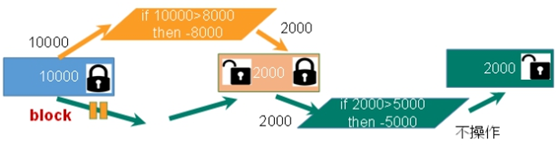
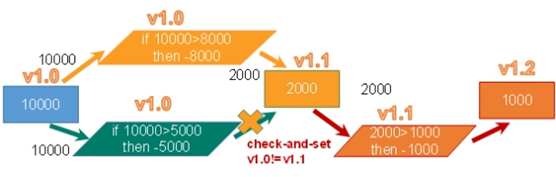
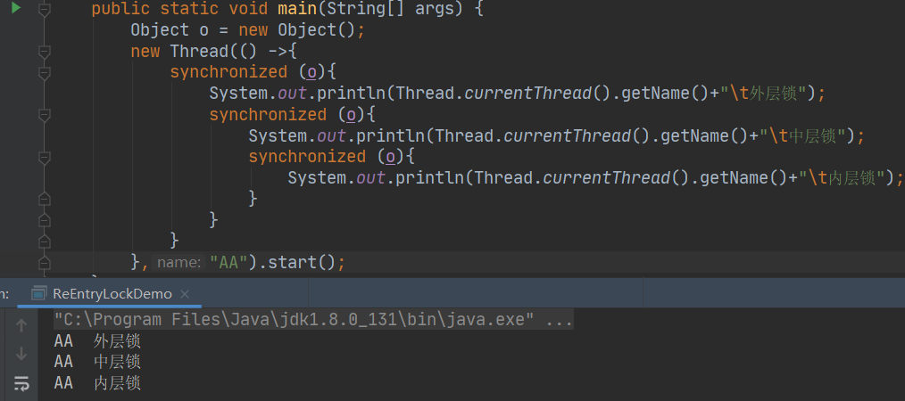
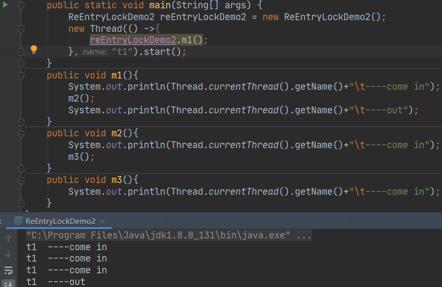

## 一:悲观锁

​       

​		**悲观锁(Pessimistic Lock)**, 顾名思义，就是很悲观，每次去拿数据的时候都认为别人会修改，所以每次在拿数据的时候都会上锁，这样别人想拿这个数据就会block直到它拿到锁。<u>传统的关系型数据库里边就用到了很多这种锁机制</u>，比如行锁，表锁等，读锁，写锁等，都是在做操作之前先上锁。
 1)synchronized关键之和Lock的实现类都是悲观锁
 2)适合写操作多的场景,先加锁可以保证写操作是数据正确

## 二:乐观锁

​		**乐观锁(Optimistic Lock)**, 顾名思义，就是很乐观，每次去拿数据的时候都认为别人不会修改，所以不会上锁，但是在更新的时候会判断一下在此期间别人有没有去更新这个数据，可以使用版本号等机制。<u>乐观锁适用于多读的应用类型，这样可以提高吞吐量。Redis就是利用这种check-and-set机制实现事务的。</u>
​      1)适合读操作多的场景,不加锁的特点能够使其读操作的性能大幅提升
​      2)乐观锁的两种实现方式:①采用Version版本号机制 ②CAS(Compare-and-Swap,即比较并替换),算法实现

## 一:公平锁

​	 是指多个线程按照申请锁的顺序来获取锁，这里类似排队买票，先来的人先买后来的人在队尾排着，这是公平的      
 Lock lock = new ReentrantLock(true);//true表示公平锁,先来先得

##   二:非公平锁

​     是指多个线程获取锁的顺序并不是按照申请锁的顺序，有可能后中请的线程比先申请的线程优先获取锁，在高并发环境下，有可能造成优先级翻转或者饥饿的状态（某个线程一直得不到锁)
​      Lock lock = new ReentrantLock(false);//false表示非公平锁，后来的也可能先获得锁
​      Lock lock = new ReentrantLock();//默认非公平锁

### [面试] 为什么会有公平锁和非公平锁的设计？为什么默认非公平锁？

​    1.恢复挂起的线程到真正锁的获取还是有时间差的，从开发人员来看这个时间微乎其微，但是从CPU的角度来看，这个时间差存在的还是很明显的。所以非公平锁能更充分的利用CPU的时间片，尽量减少CPU空闲状态时间。
​    2.使用多线程很重要的考量点是线程切换的开销，当采用非公平锁时，当1个线程请求锁获取同步状态，然后释放同步状态，所以刚释放锁的线程在此刻再次获取同步状态的概率就变得非常大，所以就减少了线程的开销。

##  一:可重入锁

   是指在同一个线程在外层方法获取锁的时候，再进入该线程的内层方法会自动获取锁(前提，锁对象得是同- -个对象)，不会因为之前已经获取过还没释放而阻塞。
    如果是1个有synchronized修饰的递归调用方法，程序第2次进入被自己阻塞了岂不是天大的笑话，出现了作茧自缚。所以Java中ReentrantLock和synchronized都是可重入锁，可重入锁的一一个优点是:可以一定程度避免死锁。
    
   1)**隐式锁**(即synchronized关键字使用的锁),默认是可重入锁
    指的是可重复可递归调用的锁，在外层使用锁之后，在内层仍然可以使用，并且不发生死锁，这样的锁就叫做可重入锁。
    简单的来说就是:**在一个synchronized修 饰的方法或代码块的内部调用本类的其他synchronized修饰的方法或代码块时，是永远可以得到锁的。**
	①synchronized同步代码块可重入锁代码演示:

②synchronized同步方法可重入锁演示

1)**显式锁**(即ReentrantLock),是可重入锁
    正常情况下,加锁几次就要解锁几次,如果加锁和解锁次数不一样,则别的线程无法获取到锁,导致一直等待.