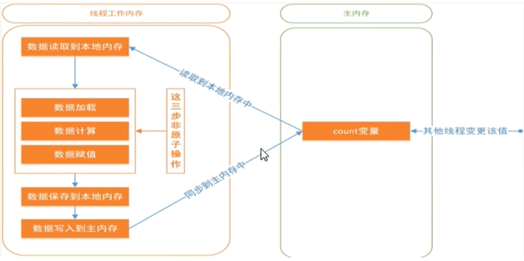
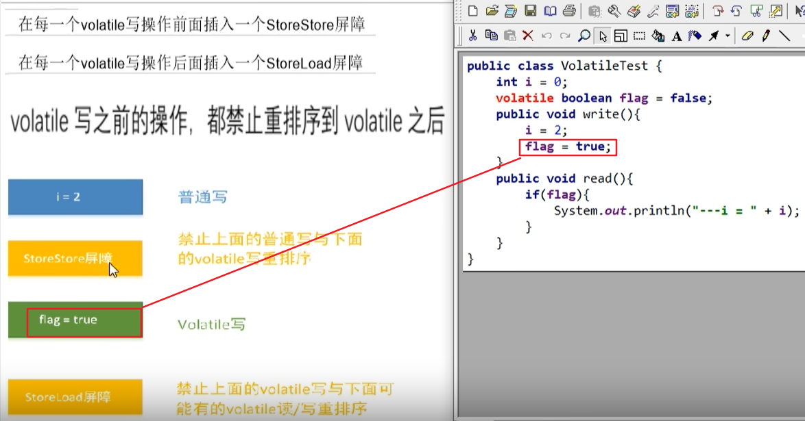
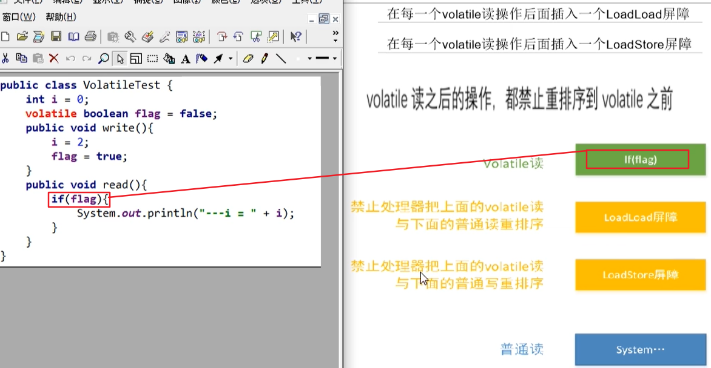

##  一:volatile变量的

#### 1)两大特点

​    ①可见性:写完volatile变量后**立即刷新回主内存并及时发出通知**，所有线程可以去主内存拿最新版，前面的修改对后面所有线程可见,**保证不同线程对某个变量完成操作后结果及时可见，即该共享变量一旦改变所有线程立即可见**
​     ②有序性:禁止指令重排

#### 2)volatile的内存语义

 ①当写一个volatile变量时，JMM会把该线程对应的本地内存中的共享变量值立即刷新回主内存中。
 ②当读一个volatile变量时，JMM会把该线程对应的本地内存设置为无效，重新回到主内存中读取最新共享变量
 ③所以volatile的写内存语义是直接刷新到主内存中，读的内存语义是直接从主内存中读取。

#### 3)使用volatile修饰共享变量或被volatile修改的变量有以下特点: 

   1.线程中**读取**的时候，每次读取都会去主内存中读取共享变量最新的值，然后将其复制到工作内存
   2.线程中**修改**了工作内存中变量的副本，修改之后会立即刷新到主内存

#### 【重点】volatile凭什么可以保证可见性和有序性? ? ?  答：内存屏障Memory Barrier 

​     1)内存屏障(也称内存栅栏，屏障指令等，是一类同步屏障指令，是CPU或编译器在对屏障指令的 前 和 后所发出的内存操作,执行一个排序约束)，避免代码重排序。内存屏障其实就是一种JVM指令，Java内存模型的重排规则会要求Java编译器在生成JVM指令时插入特定的内存屏障指令，通过这些内存屏障指令，volatile实现了Java内存模型中的**可见性**和**有序性**(禁重排)，但volatile; **无法保证原子性**。**原子性**指的是一个操作是**不可中断**的，即使是在多线程环境下，一个操作一旦开始就不能被其他线程影响,才叫做原子性。
​      **内存屏障**之前的所有**写操作**都要回写到**主内存**，
​      **内存屏障**之后的所有**读操作**都能获得内存屏障之前的所有写操作的最新结果(实现了可见性)。

#### 【重点】volatile为什么不能保证原子性?



```tex
答:对于volatle变量具备可见性，JVM只是保证从主内存加载到线程工作内存的值是最新的，**也仅是数据加载时是最新的**。但是多线程环境下，"数据计算""和"数据赋值"操作可能多次出现，若数据在加载之后，若主内存volatile修饰变量发生修改之后，线程工作内存中的操作将会作废去读主内存最新值，操作出现写丢失问题。**即各线程私有内存和主内存公共内存中变量不同步**，进而导致数据不一致。由此可见volatle解决的是变量读时的可见性问题，但无法保证原子性，对于多线程修改主内存共享变量的场景必须使用加锁同步。
```

####   2)内存屏障分为：

​         ①读屏障(Load Barrier):在读指令之前插入读屏障，让工作内存或CPU高速缓存当中的缓存数据失效，重新回到主内存中获取最新数据
​         ②写屏障(Store Barrier):在写指令之后插入写屏障，强制把写缓冲区的数据刷回到主内存中

####  3)四大屏障插入情况:

  ①在每一个volatile写操作前面插入一个StoreStore屏障----StoreStore屏障禁止上面的普通写和下面的volatile写操作重排序; 前面所有的普通写的操作，数据都已经刷新到主存;                                                                                    普通写和 volatile 写禁止重排;volatile 写和 volatile 写禁止重排

  ②在每一个volatile写操作后面插入一个StoreLoad屏障-----StoreLoad屏障禁止上面的volatile 写和下面的volatile读/写或普通写操作重排序; 前面volatile 写的操作，数据都已经刷新到主内存 ;
                  volatile 写和普通写禁止重排;volatile 写和 volatile读/写禁止重排

  ③在每一个volatile读操作后面插入一个LoadLoad屏障------LoadLoad屏障禁止下面的普通读、volatile 读和上面的volatile读重排序;------
                  volatile读和普通读禁止重排; volatile读和volatile读禁止重排

  ④在每一个volatile读操作后面插入一个LoadStore屏障-----LoadStore屏障禁止上面的volatile读和下面的volatile 写或普通写重排序;--------                volatile读和普通写禁止重排;volatile 读和volatile 写禁止重排





#### 【重点】volatile变量不适合参与到依赖当前值的运算  

​           volatile变量不适合参与到依赖当前值的运算，如i=i+ 1; i++;之类的
​           那么依靠可见性的特点volatile可以用在哪些地方呢?通常volatile用做保存某个状态的boolean值or int值。
​			

####  【重点】 volatile写之前的操作，都禁止重排序到volatile之后

​           volatile读之后的操作，都禁止重排序到volatile 之前
​           volatile写之后volatile读，禁止重排序