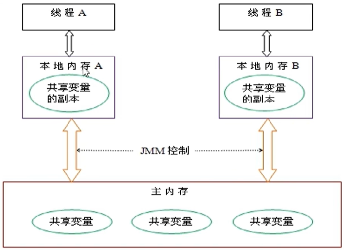

## 一:什么是JMM?

​	 JVM规范中试图定义一种Java内存模型〈java Memory Model，简称JMM)**来屏蔽掉各种硬件和操作系统的内存访问速度差异**，以实现让Java程序在各种平台下都能达到一致的**内存访问效果**。
​	 JMM(Java内存模型Java Memory Model，简称JMM)本身是一种**抽象的**概念**并不真实存在它仅仅描述的是一组约定或规范**，通过这组规范定义了程序中(尤其是多线程)各个变量的读写访问方式并决定一个线程对共享变量的写入何时以及如何变成对另一个线程可见，关键技术点都是围绕多线程的**原子性、可见性和有序性**展开的。

## 二:JMM的三大特性?(可见性/原子性/有序性)

  (1)**可见性**:是指当一个线程修改了某一个共享变量的值，其他线程是否能够立即知道该变更，JMM规定了所有的变量都存储在主内存中。

  (2)**原子性**:系统主内存**共享变量**数据修改被写入的时机是不确定的，**多线程并发下很可能出现"脏读"**，所以每个线程都有自己的工作内存、线程自己的工作内存中保存了该线程使用到的变量的**主内存副本拷贝**，线程对变量的所有操作（读取，赋值等）都必需在线程自己的工作内存中进行，而不能够直接读写主内存中的变量。不同线程之间也无法直接访问对方**工作内存**中的变量，线程间变量值的传递均需要通过**主内存**来完成

 (3)**有序性**:Java规范规定JVM线程内部维持顺序化语义，即只要程序的最终结果与它顺序化执行的结果相等，那么指令的执行顺序可以与代码顺序不一致，此过程叫指令的重排序。处理器在进行重排序时必须考虑指令之间的数据依赖性。

## 三:多线程对变量的存写过程

1)我们定义的所有共享变量都储存在物理主内存中
2)每个线程都有自己独立的工作内存，里面保存该线程使用到的变量的副本(是主内存中该变量的一份拷贝)
3)线程对共享变量所有的操作都必须先在线程自己的工作内存中进行后写回主内存，不能直接从主内存中读写(不能越级)
4)不同线程之间也无法直接访问其他线程的工作内存中的变量，线程间变量值的传递需要通过主内存来进行(同级不能相互访问)

## 四:JMM之happens_before

   1)在JMM中，如果一个操作执行的结果需要对另一个操作可见性或者代码重排序，那么这两个操作之间必须存在happens-before(先行发生)原则。逻辑上的先后关系
    **2)happens_before两个总原则:**
      ①如果一个操作happens-before另一个操作，那么第一个操作的执行结果将对第二个操作可见，而且第一个操作的执行顺序排在第二个操作之前。
      ②两个操作之间存在happens-before关系，并不意味着一定要按照happens-before原则制定的顺序来执行。如果重排序之后的执行结果与按照happens-before关系来执行的结果一致，那么这种重排序并不非法。
    **3)happens_before之8条规则:**
     1. 次序规则:一个程序内按照代码顺序,写在前面的操作先行发生于写在后面的操作
     2. 锁定规则:一个unLock操作先行发生于后面(指时间上的先后)对同一把锁的lock操作
     3. volatile变量规则:对一个volatile变量的写操作先行发生于后面对这个变量的读操作,前面的写对后面的读是可见的
     4. 传递规则:如果操作A先行发生于操作B,而操作B又先行发生于操作C,则可以得出操作A先发生于操作C
     5. 线程启动规则:Thread对象的start()方法先行发生于此线程的每一个动作
     6. 线程中断规则:对线程interrupt()方法的调用先行发生于被中断线程的代码检测到中断时间的发生
     7. 线程中止规则:线程中的所有操作都先行发生于对此线程的终止检测，我们可以通过isAlive()等手段检测线程是否已经终止执行。
     8. 对象终结规则:一个对象的初始化完成（构造函数执行结束）先行发生于它的finalize()方法的开始