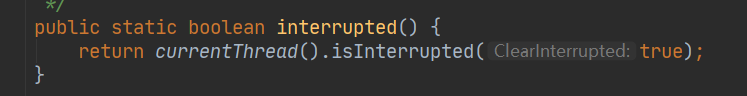

## 一:什么是中断机制?

​    在Java中没有办法立即停止一条线程，然而停止线程却显得尤为重要，如取消一个耗时操作。因此，Java提供了一种用于停止线程的**协商机制**―—中断，也即中断标识协商机制。
​     <u>中断只是一种协作协商机制，Java没有给中断增加任何语法，中断的过程完全需要程序员自己实现。若要中断一个线程，你需要手动调用该线程的interrupt方法，该方法也仅仅是将线程对象的中断标识设成true</u>;接着你需要自己写代码不断地检测当前线程的标识位，如果为true，表示别的线程请求这条线程中断，此时究竟该做什么需要你自己写代码实现。
​      每个线程对象中都有一个中断标识位，用于表示线程是否被中断;该标识位为true表示中断，为false表示未中断;通过调用线程对象的interrupt方法将该线程的标识位设为true;可以在别的线程中调用，也可以在自己的线程中调用。

## 二:中断的相关API方法之三大方法说明

  1)public void **interrupt()**:实例方法 
    ----仅仅只是设置线程的中断状态为true,发起一个协商而不会立刻停止线程
   2)public static boolean **interrupted()**:静态方法  Thread.inrrupted()
    ----判断线程是否被中断并清除当前中断状态
      此方法做了两件事:
       ①返回当前线程的中断状态,测试当前线程是否已被中断
       ②将当前线程的中断状态清零并重新设置为false,清除线程的中断状态
   3)public boolean **isInterrupted()**:实例方法
   -----判断当前线程是否被中断(通过检查中断标志位)  

#### 【面试】 isInterrupted() 和 interrupted()的区别？

​      答：isInterrupted()是实例方法,interrupted()是静态方法,而它们底层都是调用了被native修饰的isInterrupted()方法，interrupted()传入的true,表示清空中断标识位,isInterrupted()传入的false,表示不清空中断标识位

## 三:具体来说，当对一个线程来说，调用interrupt()时

​    ①如果线程处于正常活动状态，那么该线程的中断标志设置为true,仅此而已。
被设置中断标志的线程将继续正常运行，不受影响。
​     所以,interrupt()并不能真正的中断线程，需要被调用的线程自己进行配合才行.
​    ②如果线程处于被阻塞状态,(例如处于:sleep,wait,join等状态),在别的线程中调用当前线程对象的interrupt方法,那么线程将立即退出被阻塞状态,同时中断状态将被清除,并抛出一个InterrupedException异常.

#### 【面试】当前线程的中断标识为true,是不是线程就立刻停止?

​    答：中断只是一中协商机制,实例方法Interrupt()仅仅只是设置线程的中断状态位为true,不会停止线程