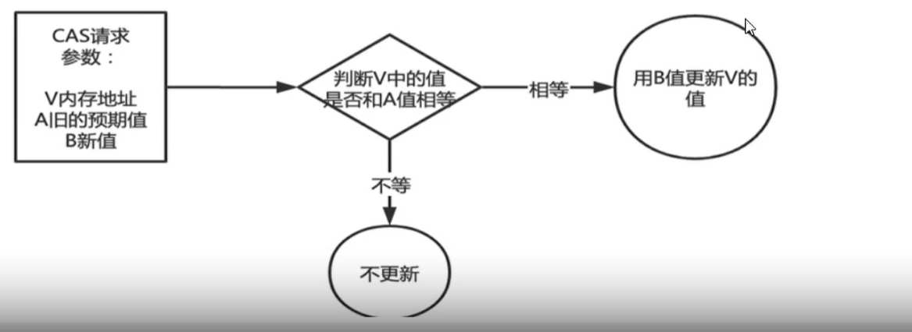
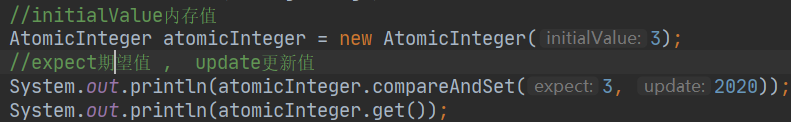
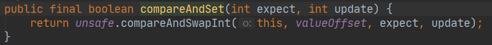
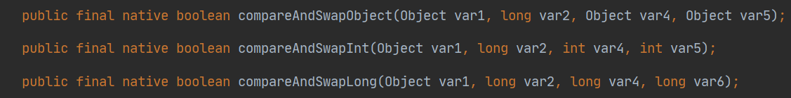

## 一:什么是CAS?

###    1)**compare and swap**

​		中文翻译成比较并交换,**实现并发算法时常用到的一种技术**。它是一种CPU并发原语，它包含三个操作数——**内存位置、预期原值及更新值**。它的功能是判断内存某个位置的值是否为预期值，如果是则更改为新的值，这个过程是原子的。如:Atomiclnteger类主要利用CAS (compare and swap) + volatle和 native方法来保证原子操作，从而避免 synchronized的高开销，执行效率大为提升。

​    执行CAS操作的时候，将内存位置的值与预期原值比较:
​    如果**相匹配**，那么处理器会自动将该位置值更新为新值，
​    如果**不匹配**，处理器不做任何操作，多个线程同时执行CAS操作只有一个会成功。
​    2)CAS是JDK提供的非阻塞原子性操作，它通过硬件保证了比较-更新的原子性。
​      CAS是一条CPU的原子指令(cmpxchg指令），不会造成所谓的数据不一致问题，Unsafe提供的CAS方法（如compareAndSwapXXX）底层实现即为CPU指令cmpxchg。执行cmpxchg指令的时候，会判断当前系统是否为多核系统，如果是就给总也就是说CAS的原子性实际上是CPU实现独占的线加锁，只有一个线程会对总线加锁成功，加锁成功之后会执行cas操作，，比起用synchronized重量级锁，这里的排他时间要短很多，所以在多线程情况下性能会比较好。
​    

###    **2)原理:**

​     CAS有3个操作数，位置内存值V，旧的预期值A，要修改的更新值B。当且仅当旧的预期值A和内存值V相同时，将内存值V修改为B，否则什么都不做或重来**当它重来重试的这种行为成为----自旋! !**

###    **3)代码演示:**

**①compareAndSet(int expect, int update)的底层其实是调用了unsafe类的方法,并传入了四个参数**

   var1:表示要操作的都对象
        var2:表示要操作对象中属性地址的偏移量(即内存值)
        var3:表示需要修改数据的期望的值
        var4:表示需要修改的新值

#### 【面试】UnSafe是什么？

​     是CAS的核心类，由于Java方法无法直接访问底层系统，需要通过本地〈native)方法来访问，Unsafe相当于一个后门，基于该类可以直接操作特定内存的数据。**Unsafe类存在于sun.misc包中**，其内部方法操作可以像C的指针一样直接操作内存，因为Java中CAS操作的执行依赖于Unsafe类的方法。
​     注意Unsafe类中的所有方法都是native修饰的，也就是说Unsafe类中的方法都直接调用操作系统底层资源执行相应任务

### 二:CAS之自旋锁?

   CAS是实现自旋锁的基础，CAS利用CPU指令保证了操作的原子性，以达到锁的效果，至于自旋呢，看字面意思也很明白，自己旋转。是指尝试获取锁的线程不会立即阻塞，而是**采用循环的方式去尝试获取锁**，当线程发现锁被占用时，会不断循环判断锁的状态，直到获取。这样的好处是减少线程上下文切换的消耗，缺点是循环会消耗CPU

### 三:CAS的缺点?

  ①循环时间长cpu消耗过大,开销很大
   ②会导致"ABA问题"
    CAS算法实现一个重要前提需要取出内存中某时刻的数据并在当下时刻比较并替换，那么在这个时间差类会导致数据的变化。
    比如说一个线程1从内存位置V中取出A，这时候另一个线程2也从内存中取出A，并且线程2进行了一些操作将值变成了B，然后线程2又将V位置的数据变成A，这时候线程1进行CAS操作发现内存中仍然是A，预期OK，然后线程1操作成功。
    **尽管线程1的CAS操作成功，但是不代表这个过程就是没有问题的。**