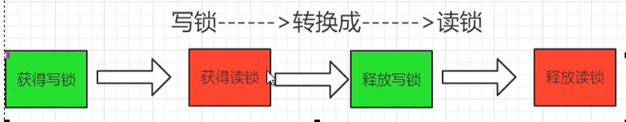
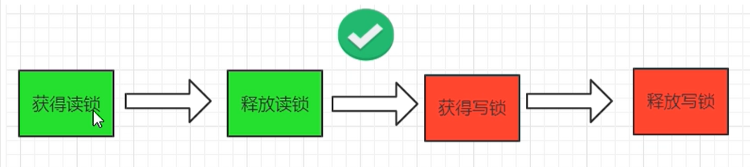

## 一、读写锁ReentrantReadWriteLock 

   **它只允许读读共存，而读写和写写依然是互斥的**，大多实际场景是“读/读”线程间并不存在互斥关系，只有"读/写"线程或"写/写"线程间的操作需要互斥的。因此引入ReentrantReadWriteLock。
   一个ReentrantReadWriteLock同时只能存在一个写锁但是可以存在多个读锁，但不能同时存在写锁和读锁(切菜还是拍蒜选一个)。也即**一个资源可以被多个读操作访问** 或 **一个写操作访问**，但两者不能同时进行。
    只有在读多写少的情况下，读写锁才具有较高的性能体现

## 二、ReentrantReadWriteLock锁降级

  1)ReentrantReadWiteLock锁降级:将写入锁降级为读锁(类似Linux文件读写权限理解，就像写权限要高于读权限一样)，锁的严苛程度变强叫做升级，反之叫做降级。
   2)写锁的降级，降级成为了读锁
    ①如果同一个线程持有了写锁，在没有释放写锁的情况下，它还可以继续获得读锁。这就是写锁的降级，降级成为了读锁
    ②规则惯例，先获取写锁，然后获取读锁，再释放写锁的次序，即**写锁能够降级成为读锁**，但是从**读锁升级到写锁是不可能的**(如果有线程在读，那么写线程是无法获取写锁的,这是悲观锁的策略)
    ③如果释放了写锁，就完全转换为读锁 	

 3)在ReentrantReadWriteLock中,当读锁被使用时,如果有线程获取写锁,该写线程会被阻塞，所以需要释放所有读锁，才能获取写锁

**总结**:写锁和读锁是互斥的《这里的互斥是指**线程间的互斥**，当前线程可以获取到写锁又获取到读锁，但是获取到了读锁不能继续获取写锁)，这是因为读写锁要**保持写操作的可见性**。因为，如果允许读锁在被获取的情况下对写锁的获取，那么正在运行的其他读线程无法感知到当前写线程的操作。

### 三、StampedLock(邮戳锁/票据锁)：

​    1)JDK1.8中新增的一个读写锁(**读的过程也允许获取写锁的介入**)，是对JDK1.5中的读写锁ReentrantReadWriteLock的优化
​     2)StampedLock的特点：(StampedLock不是可重入锁)
​        Ⅰ.所有**获取锁**的方法，都返回一个邮戳(Stamp), stamp为零表示获取失败，其余都表示成功;
​        Ⅱ.所有**释放锁**的方法，都需要一个邮戳〈Stamp)，这个stamp必须是和成功获取锁时得到的Stamp一致;
​        Ⅲ.StampedLock是**不可重入的**，危险(如果一个线程已经持有了写锁，再去获取写锁的话就会造成死锁)
​        Ⅳ.StampedLock的三种访问模式:
​           ①Reading(读模式悲观）:功能和ReentrantReadWriteLock的读锁类似
​           ②Writing（写模式）:功能和ReentrantRedWriteLock的写锁类似
​           ③Optimistic reading（乐观读模式）:无锁机制，类似于数据库中的乐观锁，支持读写并发，很乐观认为读取时没人修改，假如被修改再实现升级为悲观读模