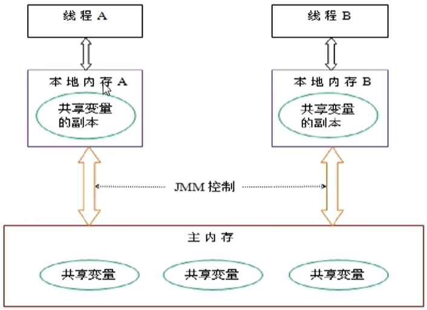
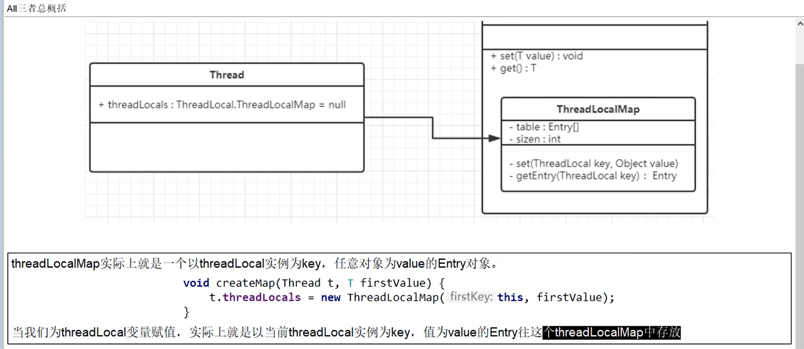
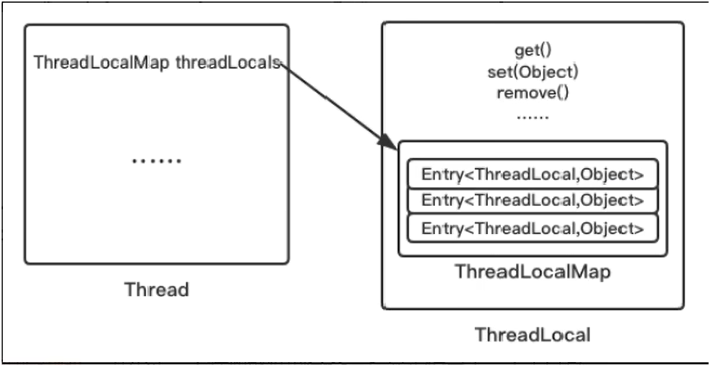

# 一:ThreadLocal简介

## 1.什么是ThreadLocal

​     ThreadLocal提供线程局部变量。这些变量与正常的变量不同，因为每一个线程在访问ThreadLocal实例的时候（通过其getiset方法)都有自己的、独立初始化的变量副本。ThreadLocal实例通常是类中的私有静态字段，使用它的目的是希望将状态（例如，用户lID或事务ID）与线程关联起来。

## 2.ThreadLocal的作用

 	 主要解决了让每个线程绑定自己的值，通过便川get()和set()方法，获取默认值或将其值史改为当前线程所存的副本的值==**从而避免了线程安全问题**==，比如我们之前讲解的8锁案例，资源类是使用同一部手机，多个线程抢夺同一部手机使用，假如人手一份是不是天下太平??



【强制】必须回收自定义的ThreadLocal变量，尤其在线程池场景下，线程经常会被复用，如果不清理自定义的ThreadLocal变量，可能会影响后续业务逻辑和造成内存泄露等问题。尽量在代理中使用try-finally块进行回收。

```java
threadLocalFiled.set(userInfo);
try{
   //... 
}finally{
    threadLocalFiled.remove();
}
```

# 二:源码分析

## 1.Thread,ThreadLocal,ThreadLocalMap之间的关系



 近似的可以理解为:
  	 ThreadLocalMap从字面上就可以看出这是一个保存ThreadLocal对象的map(其实是以ThreadLocal为sKey)，不过是经过了两层包装的ThreadLocal对象:



​		 **JVM内部维护了一个线程版的Map<ThreadLocal,Value>**(通过ThreadLocal对象的set方法，结果把ThreadLocal对象自己当做key,放进了ThreadLoalMap中),每个线程要用到这个T的时候，用当前的线程去Map里面获取，通过这样让每个线程都拥有了自己独立的变量，人手一份，竞争条件被彻底消除，在并发模式下是绝对安全的变量。

# 三.ThreadLocal内存泄露问题

看完JVM后学习......来自github的修改
