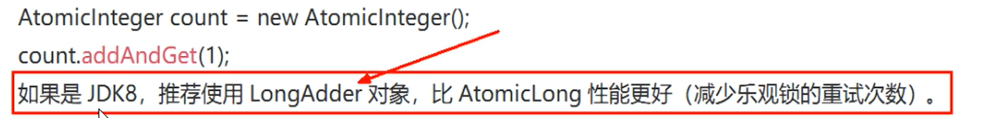
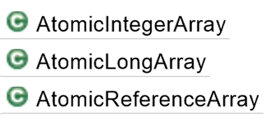
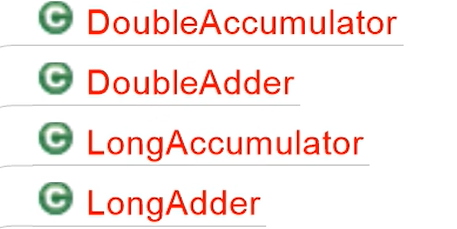
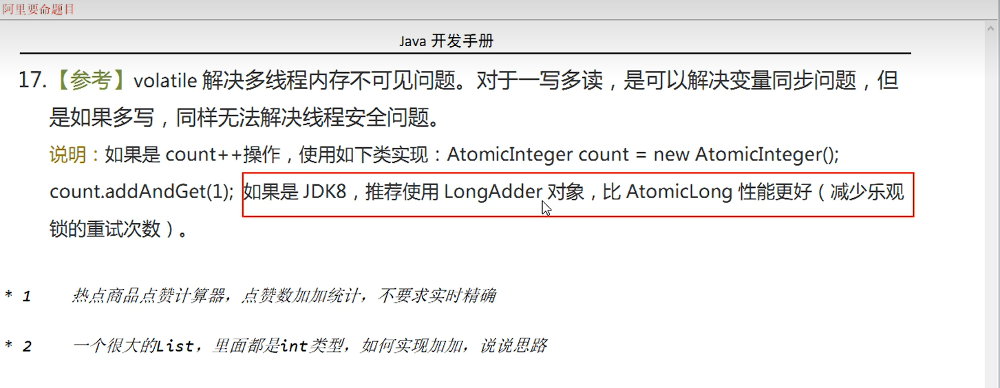

### 前言

> **volatile解决多线程内存不可见问题对于一写多读，是可以解决变量同步问题，但是如果多写，同样无法解决线程安全问题。**

说明：如果是count++操作，使用如下类实现：



### 一、基本类型原子类


```java
/**
 * @author zzp
 * @create 2022-08-31 19:12
 */
class MyNumber{
    AtomicInteger atomicInteger = new AtomicInteger();

    public void add(){
        atomicInteger.getAndIncrement();
    }
}
public class AtomicIntegerDemo {

    public static final int SIZE = 50;

    public static void main(String[] args) throws InterruptedException {
        MyNumber myNumber = new MyNumber();
        CountDownLatch countDownLatch = new CountDownLatch(SIZE);
        for (int i = 1; i <= SIZE ; i++) {
            new Thread(() ->{
                try {
                    for (int j = 1; j <= 1000 ; j++) {
                        myNumber.add();
                    }
                } finally {
                    //每个线程执行完一次,就使countDownLatch减一
                    countDownLatch.countDown();
                }
            },String.valueOf(i)).start();
        }

        //try { TimeUnit.MILLISECONDS.sleep(2000); } catch (InterruptedException e) { e.printStackTrace(); }

        //在countDownLatch的值大于0时会一直阻塞
        countDownLatch.await();

        System.out.println(Thread.currentThread().getName()+" 结果:"+myNumber.atomicInteger.get());
    }
}
```

### 二、数组类型原子类



```java
/**
 * @author 朱子鹏
 * @create 2022-08-31 19:31
 */
public class AtomicIntegerArrayDemo {
    public static void main(String[] args) {
        AtomicIntegerArray atomicIntegerArray = new AtomicIntegerArray(new int[5]);
        //AtomicIntegerArray atomicIntegerArray = new AtomicIntegerArray(new int[]{1, 2, 3, 4});

        for (int i = 0; i < atomicIntegerArray.length(); i++) {
            System.out.println(atomicIntegerArray.get(i));
        }

        int add = atomicIntegerArray.getAndAdd(0, 2);
        System.out.println(atomicIntegerArray.get(0));

        int andIncrement = atomicIntegerArray.getAndIncrement(1);
        System.out.println(atomicIntegerArray.get(1));
    }
}
```

### 三、引用类型原子类


- #### AtomicReference:实现自旋锁

```java
import java.util.concurrent.TimeUnit;
import java.util.concurrent.atomic.AtomicReference;

public class AtomicReferenceDemo {
    //初始化一个原子线程类
    AtomicReference atomicReference = new AtomicReference();

    public void lock(){
        Thread thread = Thread.currentThread();
        System.out.println(thread.getName()+"\t----come in");
        //表示如果当前预期值不是null,即还没有别的线程占用位置,则更改位当前线程
        while ( !atomicReference.compareAndSet(null, thread)) {

        }
    }
    public void unLock(){
        Thread thread = Thread.currentThread();
        atomicReference.compareAndSet(thread,null);
        System.out.println(thread.getName()+"\t----take over : out");
    }

    public static void main(String[] args) {
        AtomicReferenceDemo sinLockDemo = new AtomicReferenceDemo();

        new Thread(() ->{
            sinLockDemo.lock();
            try { TimeUnit.SECONDS.sleep(5); } catch (InterruptedException e) { e.printStackTrace(); }
            sinLockDemo.unLock();
        },"A").start();

        //暂停一下,让A线程先于B线程启动
        try { TimeUnit.MILLISECONDS.sleep(500); } catch (InterruptedException e) { e.printStackTrace(); }

        new Thread(() ->{
            sinLockDemo.lock();
            sinLockDemo.unLock();
        },"B").start();
    }
}
```


- #### AtomicStampedReference:增加版本号,解决ABA问题, <u>==解决修改过几次==</u>

```java
import java.util.concurrent.TimeUnit;
import java.util.concurrent.atomic.AtomicInteger;
import java.util.concurrent.atomic.AtomicStampedReference;

public class AtomicStampedReferenceDemo {
    static AtomicInteger atomicInteger = new AtomicInteger(100);
    //AtomicStampedReference增加版本号,解决ABA问题
    static AtomicStampedReference stampedReference = new AtomicStampedReference<>(100,1);

    public static void main(String[] args) {

        new Thread(() ->{
            //获取首次流水版本号
            int stamp = stampedReference.getStamp();
            System.out.println(Thread.currentThread().getName()+"\t首次版本号:"+stamp);

            try { TimeUnit.MILLISECONDS.sleep(200); } catch (InterruptedException e) { e.printStackTrace(); }

            stampedReference.compareAndSet(100,101,stampedReference.getStamp(),stampedReference.getStamp()+1);
            System.out.println(Thread.currentThread().getName()+"\t2次流水号:"+stampedReference.getStamp());
            stampedReference.compareAndSet(101,100,stampedReference.getStamp(),stampedReference.getStamp()+1);
            System.out.println(Thread.currentThread().getName()+"\t3次流水号:"+stampedReference.getStamp());


        },"t1").start();

        new Thread(() ->{
            //获取首次版本号
            int stamp = stampedReference.getStamp();
            System.out.println(Thread.currentThread().getName()+"\t首次版本号:"+stamp);
            //暂停一秒,等待线程t1完成2次流水,发生ABA问题
            try { TimeUnit.SECONDS.sleep(1); } catch (InterruptedException e) { e.printStackTrace(); }
            boolean b = stampedReference.compareAndSet(100, 2020, stamp, stamp + 1);
            System.out.println(b+"\t"+stampedReference.getReference()+"\t"+stampedReference.getStamp());

        },"t2").start();


    }
    public static void atomicIntegerTest(){
        //线程t1在对内存值100更改完101,之后又更改完回100
        new Thread(() ->{
            atomicInteger.compareAndSet(100,101);
            try { TimeUnit.MILLISECONDS.sleep(10); } catch (InterruptedException e) { e.printStackTrace(); }
            atomicInteger.compareAndSet(101,100);
        },"t1").start();

        //线程t2,无法感知到内存值100被改动过
        new Thread(() ->{
            try { TimeUnit.MILLISECONDS.sleep(10); } catch (InterruptedException e) { e.printStackTrace(); }
            System.out.println(atomicInteger.compareAndSet(100, 2022)+"\t"+atomicInteger.get());
        },"t2").start();
    }
}
```


- #### AtomicMarkableReference: 定义的状态戳简化为true|false,==解决是否修改过==

```java
public class AtomicMarkableReferenceDemo {

    static AtomicMarkableReference<Object> reference = new AtomicMarkableReference<>(100,false);

    public static void main(String[] args) {

        new Thread(() ->{
            boolean marked = reference.isMarked();
            System.out.println(Thread.currentThread().getName()+"\t默认标识"+marked);

            try { TimeUnit.MILLISECONDS.sleep(1000); } catch (InterruptedException e) { e.printStackTrace(); }

            reference.compareAndSet(100,1000,marked,!marked);
        },"线程一").start();

        new Thread(() ->{
            boolean marked = reference.isMarked();
            System.out.println(Thread.currentThread().getName()+"\t默认标识"+marked);

            try { TimeUnit.MILLISECONDS.sleep(2000); } catch (InterruptedException e) { e.printStackTrace(); }

            boolean b = reference.compareAndSet(100, 2000, marked, !marked);
            System.out.println(Thread.currentThread().getName()+"\t操作的结果:"+b);
            System.out.println(Thread.currentThread().getName()+" "+reference.isMarked());
            System.out.println(Thread.currentThread().getName()+" "+reference.getReference());
        },"线程二").start();
    }
}
```

### 四、对象的属性修改原子类


- #### **使用目的: **

   以一种 线程安全的方式操作非线程安全对象内的某些字段

- #### 使用要求

  1. 更新的对象属性必须使用**public volatile**修饰符。
  2. 因为对象的属性修改类型原子类都是抽象类，所以每次使用都必须使用静态方法**newUpdater()**创建一个更新器，并且需要设置想要更新的类和属性。

- #### 面试官：你在哪里用了volatile？

  AtomicReferenceFieldUpdater  ,  AtomicIntegerFieldUpdater

  

-   **AtomicIntegerFieldUpdater**

  ```java
  /**
   * 以一中线程安全的方式操作非线程安全对象的某些字段
   *  需求:
   *  10个线程,
   *  每个线程转账1000,
   *  不使用synchronized,使用AtomicIntegerFieldUpdater来实现
   * @author zzp
   * @create 2022-08-31 20:13
   */
  public class AtomicIntegerFieldUpdaterDemo {
      public static void main(String[] args) throws InterruptedException {
          Bank bank = new Bank();
          CountDownLatch countDownLatch = new CountDownLatch(10);
          for (int i = 1; i <=10 ; i++) {
              new Thread(() ->{
                  try {
                      for (int j = 1; j <= 1000; j++) {
                          //bank.add();
                          bank.getAndIncrement(bank);
                      }
                  } finally {
                      countDownLatch.countDown();
                  }
              },"t").start();
          }
  
          countDownLatch.await();
  
          System.out.println(Thread.currentThread().getName()+"\t"+bank.money);
      }
  }
  class Bank{
      String name = "CBC";
  
      //更新对象的属性必须使用public volatile
      public volatile int money = 0;
  
      //使用synchronized 会将当前对象锁住,效率低
      public synchronized void add(){
          money++;
      }
  
      //因为对象的属性修改类型原子类都是抽象类，所以每次使用都必须
      //使用静态方法newUpdater()创建一个更新器，并且需要设置想要更新的类和属性。
      AtomicIntegerFieldUpdater atomicIntegerFieldUpdater=AtomicIntegerFieldUpdater.newUpdater(Bank.class,"money");
  
      //不加synchronized,保证高性能原子性
      public void getAndIncrement(Bank bank){
          atomicIntegerFieldUpdater.getAndIncrement(bank);
      }
  }
  ```

-  **AtomicReferenceFieldUpdater**

  ```java
  /**
   * 需求:
   * 多线程并发调用一个类的初始化方法，如果未被初始化过，
   * 将执行初始化工作,要求只能被初始化一次，只有一个线程操作成功
   *
   * @author 朱子鹏
   * @create 2022-08-31 20:29
   */
  public class AtomicReferenceFieldUpdaterDemo {
      public static void main(String[] args) {
          MyVar myVar = new MyVar();
  
          for (int i = 1; i <= 5; i++) {
              new Thread(() ->{
                  myVar.init(myVar);
              },String.valueOf(i)).start();
          }
      }
  }
  class MyVar{
      public volatile Boolean isInIT = Boolean.FALSE;
  
      AtomicReferenceFieldUpdater reference = AtomicReferenceFieldUpdater.newUpdater(MyVar.class,Boolean.class,"isInIT");
  
      public void init(MyVar myVar){
          if (reference.compareAndSet(myVar,Boolean.FALSE,Boolean.TRUE)) {
              System.out.println(Thread.currentThread().getName()+"\t"+"初始化工作开始");
              try { TimeUnit.MILLISECONDS.sleep(3000); } catch (InterruptedException e) { e.printStackTrace(); }
              System.out.println(Thread.currentThread().getName()+"\t"+"init over");
          }else {
              System.out.println(Thread.currentThread().getName()+"\t"+"已有其他线程在初始化工作");
          }
      }
  }
  ```

### 五、原子操作增强类原理深度解析





- LongAdder , LongAccumulator

```java

/**
 * LongAdder只能用来计算加法,  且从零开始计算
 * LongAccumulator提供了自定义函数的操作
 *
 * @author zzp
 * @create 2022-08-31 21:20
 */
public class LongAdderAndAccumulator {

    public static void main(String[] args) {
        LongAdder longAdder = new LongAdder();
        longAdder.increment();
        longAdder.increment();
        System.out.println(longAdder.sum());

        LongAccumulator longAccumulator = new LongAccumulator((l,r) -> l*r,1);
        longAccumulator.accumulate(1);//1
        longAccumulator.accumulate(3);//4
        System.out.println(longAccumulator.get());
    }
}
```


- **性能比较: synchronized < AtomicLong < LongAdder < LongAccumulator**

```java
/**
 * 性能比较:
 *   synchronized < AtomicLong < LongAdder < LongAccumulator
 *
 * @author 朱子鹏
 * @create 2022-08-31 21:34
 */
class ClickNumber{
    int number = 0;

    //方式一:使用synchronized进行累加
    public synchronized void clickBySynchronized(){
       number++;
    }

    //方式二:使用AtomicLong进行累加
    AtomicLong atomicLong = new AtomicLong();
    public void clickByAtomicLong(){
        atomicLong.getAndIncrement();
    }

    //方式三:使用LongAdder进行累加
    LongAdder longAdder = new LongAdder();
    public void clickByLongAdder(){
        longAdder.increment();
    }

    //方式四:使用LongAccumulator进行累加
    LongAccumulator longAccumulator = new LongAccumulator((x,y) ->x+y,0);
    public void clickByLongAccumulator(){
        longAccumulator.accumulate(1);
    }
}
//50个线程,每个线程100万次,求点赞数
public class AccumulatorCompareDemo {

    public static final int _1w = 10000;

    public static void main(String[] args) throws InterruptedException {
        ClickNumber clickNumber = new ClickNumber();
        long start;
        long end;

        CountDownLatch countDownLatch1 = new CountDownLatch(50);
        CountDownLatch countDownLatch2 = new CountDownLatch(50);
        CountDownLatch countDownLatch3 = new CountDownLatch(50);
        CountDownLatch countDownLatch4 = new CountDownLatch(50);

        //clickBySynchronized
        start = System.currentTimeMillis();
        for (int i = 1; i <= 50 ; i++) {
            new Thread(() ->{
                try {
                    for (int j = 0; j < _1w * 100; j++) {
                        clickNumber.clickBySynchronized();
                    }
                } finally {
                    countDownLatch1.countDown();
                }
            }).start();
        }
        countDownLatch1.await();
        end = System.currentTimeMillis();
        System.out.println(end - start); //2464

        //clickByAtomicLong
        start = System.currentTimeMillis();
        for (int i = 1; i <= 50 ; i++) {
            new Thread(() ->{
                try {
                    for (int j = 0; j < _1w * 100; j++) {
                        clickNumber.clickByAtomicLong();
                    }
                } finally {
                    countDownLatch2.countDown();
                }
            }).start();
        }
        countDownLatch2.await();
        end = System.currentTimeMillis();
        System.out.println(end - start); //1183

        //clickByLongAdder
        start = System.currentTimeMillis();
        for (int i = 1; i <= 50 ; i++) {
            new Thread(() ->{
                try {
                    for (int j = 0; j < _1w * 100; j++) {
                        clickNumber.clickByLongAdder();
                    }
                } finally {
                    countDownLatch3.countDown();
                }
            }).start();
        }
        countDownLatch3.await();
        end = System.currentTimeMillis();
        System.out.println(end - start);//216

        //clickByLongAccumulator
        start = System.currentTimeMillis();
        for (int i = 1; i <= 50 ; i++) {
            new Thread(() ->{
                try {
                    for (int j = 0; j < _1w * 100; j++) {
                        clickNumber.clickByLongAccumulator();
                    }
                } finally {
                    countDownLatch4.countDown();
                }
            }).start();
        }
        countDownLatch4.await();
        end = System.currentTimeMillis();
        System.out.println(end - start); //213
    }
}
```

