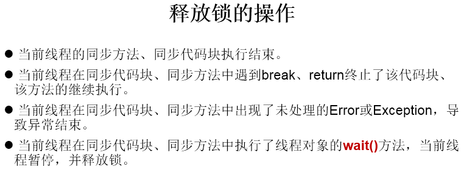
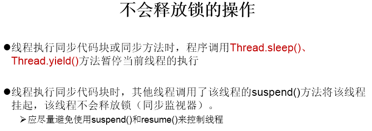

1.线程通信涉及到的三个方法：
* wait():一旦执行此方法，当前线程就进入阻塞状态，并释放同步监视器。
* notify():一旦执行此方法，就会唤醒被wait的一个线程。如果有多个线程被wait，就唤醒优先级高的那个。
* notifyAll():一旦执行此方法，就会唤醒所有被wait的线程。

2.说明：

  1.wait()，notify()，notifyAll()三个方法必须使用在同步代码块或同步方法中。

  2.wait()，notify()，notifyAll()三个方法的调用者必须是同步代码块或同步方法中的同步监视器。

​        否则，会出现IllegalMonitorStateException异常

  3.wait()，notify()，notifyAll()三个方法是定义在java.lang.Object类中。
3.面试题：
**面试题：sleep() 和 wait()的异同？**

 1.相同点：1）一旦执行方法，都可以使得当前的线程进入阻塞状态。
                    2）它们都可以被 interrupted 方法中断。

 2.不同点：1）两个方法声明的位置不同：Thread类中声明sleep() , Object类中声明wait()

​                    2）调用的要求不同：sleep()可以在任何需要的场景下调用。 wait()必须使用在同步代码块或同步方法中

​                    3）关于是否释放同步监视器：如果两个方法都使用在同步代码块或同步方法中，sleep()不会释放锁，wait()会释放锁。

**四、wait() 与 await()**

1.相同点: 1) 都会导致当前线程被阻塞并会释放锁

2.不同点: 1) wait()是Object超类中的方法,而await()是ConditionObject类中的方法

​                 2)使用场景不同,wait()需要使用synchronized把代码同步包起来,而await()是使用在ReentrantLock类中的lock()上锁和unlock()                                    解锁
​                 3)wait()造成阻塞的线程,由notify()/notifyAll()唤醒;  await()造成阻塞的线程由signal()/signalAll()唤醒

​                 4)使用await() 需要通过如下获取 ：

```java
        ReentrantLock lock=new ReentrantLock();
        Condition condition=lock.newCondition();
        condition.await();
        condition.signal();/signalAll();
```

**4.**
**小结释放锁的操作：**



**小结不会释放锁的操作：**



