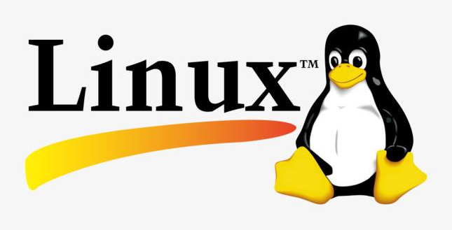
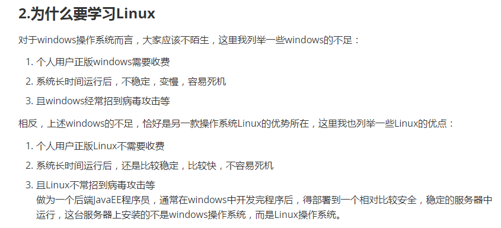
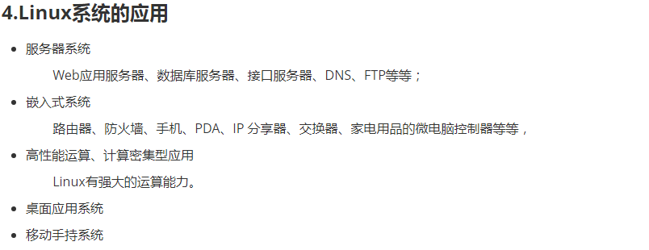
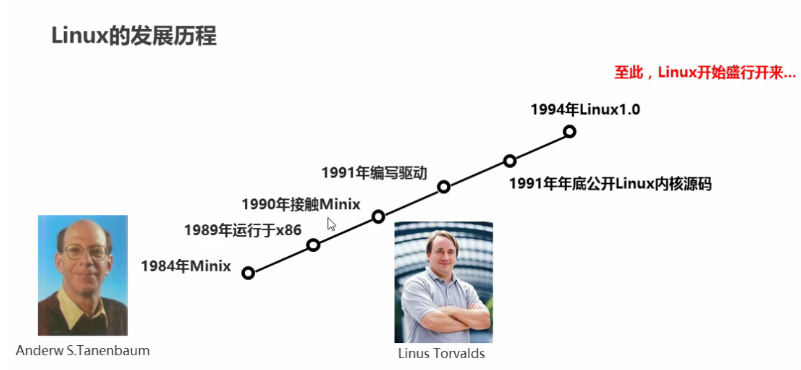
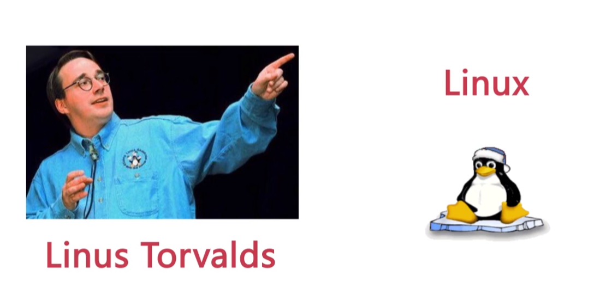
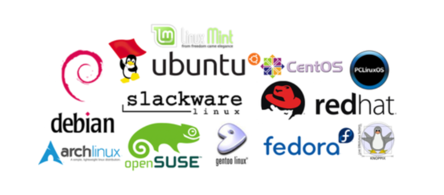

|                   Linux                    |
| :----------------------------------------: |
|  |

### 一、引言

--------

#### 1.1 开发环境(开发人员)

> 平时大家大多是在Windows或者Mac操作系统下去编写代码进行开发，在开发环境中安装大量的软件，这样会导致环境的稳定性和安全性降低

#### 1.2 测试环境(测试人员)

> 一般克隆一份开发环境(或者生产环境)，会将开发环境中的程序部署到测试环境中，这个环境的主要目的是去程序进程检测，收集程序中的各种问题，并交给开发人员进行修改

#### 1.3 生产环境(运维人员)

> 是将程序运行在此环境中，供用户去使用。这个环境是有专业的人员去维护，一般人是没有权限去操做生产环境的

#### 1.4 操作系统(系统选择)

> 生产环境中，常用的操作系统有Windows 2003 service，Linux，Unix等等，Linux操作系统，在生产环境中占据了大量的市场份额，Linux主要以稳定，可靠，免费的特点成为全球使用最多的服务器操作系统。
>
> Linux系统现在已经成为后台开发人员必备的技能，并且后期学习的各种知识都会涉及到Linux操作系统。

|          生产环境为啥用Linux系统?          |
| :----------------------------------------: |
|  |

|              Linux系统有啥用?              |
| :----------------------------------------: |
|  |

### 二、Linux介绍

----

#### 2.1 Linux发展史(大学教授与大学生的故事)

> 在Linux操作系统出现之前，还有一个操作系统叫做Minix，Minix操作系统是由一名大学教授研发出来的，当时大学是为了给学生上课，买了一套Unix操作系统，参考Unix自己写了一个操作系统，并且命名为Minix。同时将Minix开源，供学校内部的研究和教学，到了2000年，将Minix操作系统完全对外开源。
>
> Minix由于完全对外开源之后，在互联网上迅速的传播，但是大家在使用时，发展Minix不时很完美，内部存在各种各样问题。用户将问题解决后，编写了一个补丁，将补丁以邮件的方式发给Andrew，但是Andrew教授最初的目的只是为了教学和研究,不再维护。
>
> 于此同时，一位芬兰的大学生出现了，叫Linus，在Minix操作系统基础上，自己添加了一些补丁和插件，并将其命名为Linux操作系统，并且完全对外开源，而且开始维护Linux操作系统。
>
> 另外,插播一下,之前学习的Git也是Linus研发的。

|                           大学教授                           |
| :----------------------------------------------------------: |
|  |

|                   大学生                   |
| :----------------------------------------: |
|  |

#### 2.2 Linux的版本

> Linux的版本分为两种,
>
> 一种是Linus团队正在维护的开源内核版本。
>
> 另一种是一些厂商基于内核版本封装的发行版本。
>
>    - Linux的内核版本官网：https://www.kernel.org/
>
> - Linux的发行版本如下很多,咱们需要学习的发行版本是CentOS(免费,好用,入门快)

|            Linux的常见发行版本             |
| :----------------------------------------: |
|  |

