### 十二、Linux下安装软件【`重点`】,暂时是重点,以后绝对不用,拷贝了解即可

---

#### Linux安装软件的三种方式

>1、RPM
>
>RPM是”Redhat Package Manager”的缩写，根据名字也能猜到这是Redhat公司开发出来的。RPM 是以一种数据库记录的方式来将你所需要的套件安装到你的Linux 主机的一套管理程序。也就是说，你的linux系统中存在着一个关于RPM的数据库，它记录了安装的包以及包与包之间依赖相关性。RPM包是预先在linux机器上编译好并打包好的文件，安装起来非常快捷。
>但是也有一些缺点，比如安装的环境必须与编译时的环境一致或者相当；包与包之间存在着相互依赖的情况；卸载包时需要先把依赖的包卸载掉，如果依赖的包是系统所必须的，那就不能卸载这个包，否则会造成系统崩溃。 
>
>2、YUM
>
>yum比rpm工具好用多了，当然前提是你使用的linux系统是支持yum的。
>
>yum最大的优势在于可以联网去下载所需要的rpm包，然后自动安装，在这个工程中如果要安装的rpm包有依赖关系，yum会帮你解决掉这些依赖关系依次安装所有rpm包。
>
>3、源码
>
>源码包安装是最常用的，大部分软件都是通过源码安装的。安装一个源码包，是需要我们自己把源代码编译成二进制的可执行文件。如果你读得懂这些源代码，那么你就可以去修改这些源代码自定义功能，然后再去编译成你想要的。使用源码包的好处除了可以自定义修改源代码外还可以定制相关的功能，因为源码包在编译的时候是可以附加额外的选项的。 


#### 12.1 安装JDK

> 在Linux下安装JDK，并配置JAVA_HOME环境变量


##### 12.1.1 下载JDK的压缩包

> 去逛网下载压缩包，由于oracle官网更新，需要登录并同意协议才允许下载
>
> [https://www.oracle.com/java/technologies/javase-jdk8-downloads.html]()
>
> 如果上面链接失效,可以用下面这个百度云链接去下载,或者百度搜索下载也行↓
>
> 链接：https://pan.baidu.com/s/1amYnJalM7SStG8Wpj7c4IA 
> 提取码：14vr
>
> 下载成功软件的样子是


##### 12.1.2 将jdk压缩包拉取到Linux系统中

> 需要使用图形化界面的Sftp拖拽到Linux操作系统

|               Xterm的Sftp图                |
| :----------------------------------------: |
| 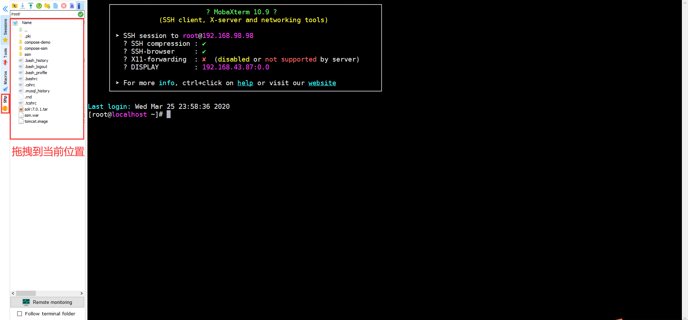 |


##### 12.1.3 将jdk的压缩包解压

> 后期大多软件都安装在/usr/local下，直接使用tar解压

```sh
tar -zxvf jdk-8u291-linux-x64.tar.gz -C /usr/local
```


##### 12.1.4 将jdk的目录名修改一下

> 为了方便配置环境变量，修改一下目录名称

```sh
cd /usr/local
mv jdk1.8.0_291 jdk
```


##### 12.1.5 配置环境变量

> Linux提供了两种环境变量的文件
>
> - 第一个是用户级别的环境变量，存放在：~/.bashrc
> - 第二个是系统级别的环境变量，存放在：/etc/profile
>
> 修改哪个文件都可以，毕竟虚拟机就我们自己使用

```sh
vi /etc/profile

# 在环境变量文件已有内容的后面，添加如下内容,然后esc:wq退出并且保存!
export JAVA_HOME=/usr/local/jdk
export PATH=$JAVA_HOME/bin:$PATH

# 重新加载环境变量文件
source /etc/profile
# 最终测试
java -version
```

|                           测试效果                           |
| :----------------------------------------------------------: |
| 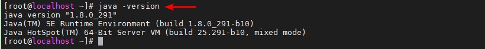 |


#### 12.2 安装MySQL

##### 检查系统中是否已经安装MySQL

~~~shell
rpm -qa | grep mysql
~~~


>返回空值的话，就说明没有安装 MySQL 。


##### 下载安装文件

~~~shell
yum -y install wget
wget http://repo.mysql.com/mysql-community-release-el7-5.noarch.rpm
~~~

##### 安装mysql-community-release-el包

~~~shell
rpm -ivh mysql-community-release-el7-5.noarch.rpm
~~~

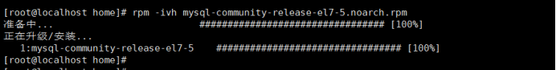	

>安装完成之后，会在 /etc/yum.repos.d/ 目录下新增 mysql-community.repo 、mysql-community-source.repo 两个 yum 源文件。

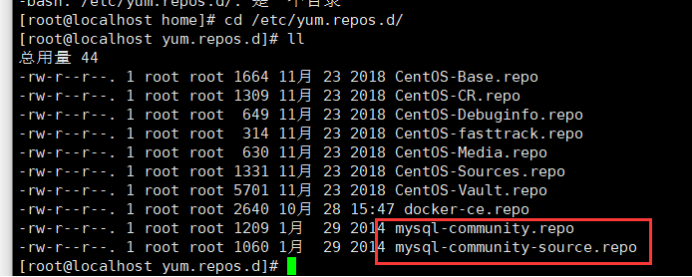	

##### 安装mysql

~~~shell
yum install mysql-server
~~~

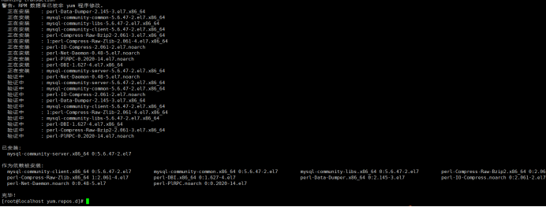	

##### 检查mysql是否安装成功

~~~~shell
rpm -qa | grep mysql
~~~~

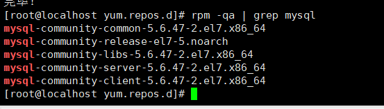	


##### 启动 mysql 服务

~~~shell
systemctl start mysqld.service    #启动 mysql,2

systemctl restart mysqld.service  #重启 mysql
systemctl stop mysqld.service     #停止 mysql
systemctl enable mysqld.service   #设置 mysql 开机启动

systemctl status mysqld.service   #查看mysql服务是否启动,即查看mysql服务的状态,1
~~~

##### 查看 mysql服务是否启动成功

~~~shell
ps -ef|grep mysql
~~~

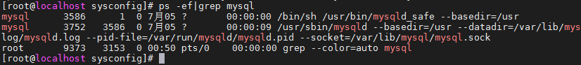	


##### 设置root账号密码

>mysql5.6 安装完成后，它的 root 用户的密码默认是空的，我们需要及时用 mysql 的 root 用户登录并修改密码。
>
>update user set password=PASSWORD("root") where User='root'; -- 修改root账号密码

~~~mysql
mysql -u root -- 进入MySQL
mysql> use mysql; -- 使用mysql数据库
mysql> update user set password=PASSWORD("root") where User='root'; -- 修改root账号密码
mysql> flush privileges; -- 刷新MySQL的系统权限
~~~

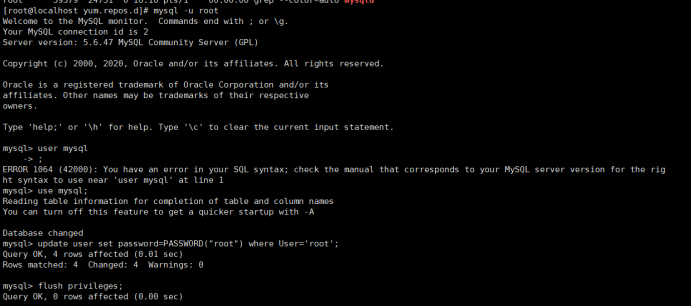	

##### 设置远程主机登录

~~~mysql
GRANT ALL PRIVILEGES ON *.* TO root@"%" IDENTIFIED BY "root";
~~~


##### Linux卸载MySQL

>若该系统已经安装过mysql需要卸载，然后重新进行安装Mysql5+。这里可以参考下面的命令进行删除。
>
>1. yum remove mysql mysql-server mysql-libs mysql-server 
>2. find / -name mysql :将找到的相关东西delete掉；
>3. rpm -qa|grep mysql(若有，将查询出来的东西yum remove掉)


如果远程连接,打开sqlyog连接,报错2003,可以是mysql服务器还没启动但是我们刚刚启动,或者有防火墙↓

| 如果远程连接,打开sqlyog连接,报错2003,因为有防火墙↓ |
| :------------------------------------------------: |
|     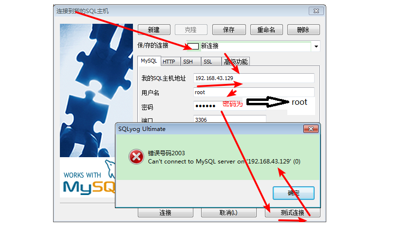     |

这里为了快速演示,直接关闭防火墙↓

```shell
systemctl stop firewalld.service          #停止firewall
systemctl disable firewalld.service    #禁止firewall开机启动
```

[centos7关闭防火墙](https://www.cnblogs.com/yyxq/p/10551274.html)

如果不关闭防火墙,按照下图用vi操作防火墙配置文件,增加端口3306,然后重启防火墙,让配置其作用↓

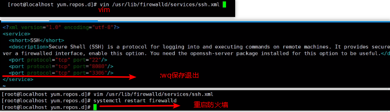

```shell
vi /usr/lib/firewalld/services/ssh.xml
查看模式↓
yy复制
p向下一行粘贴
dd是删除一行,现在暂时不用

按i编辑内容
esc退出编辑
:wq退出保存

systemctl restart firewalld重启防火墙让配置起作用
```


#### 12.3 安装Tomcat

> 在Linux下安装Tomcat，以便部署工程项目到Linux操作系统上


##### 12.3.1 下载Tomcat的压缩包

> 通过wget直接下载即可

```sh
wget https://mirrors.tuna.tsinghua.edu.cn/apache/tomcat/tomcat-8/v8.5.53/bin/apache-tomcat-8.5.53.tar.gz
```

> 上面这个连接现在已经下载不了报404,可以直接用资料文件里面的压缩包,跟之前一样上次到linux服务器↕
>
> 如果上面链接失效,可以用下面这个百度云链接去下载,或者百度搜索下载也行↓
>
> 链接：https://pan.baidu.com/s/1tV_T9rcKMFTAgdn6TPBkBg 
> 提取码：atuj
>
> 下载成功软件的样子是

|            资料文件夹里面有软件            |
| :----------------------------------------: |
| 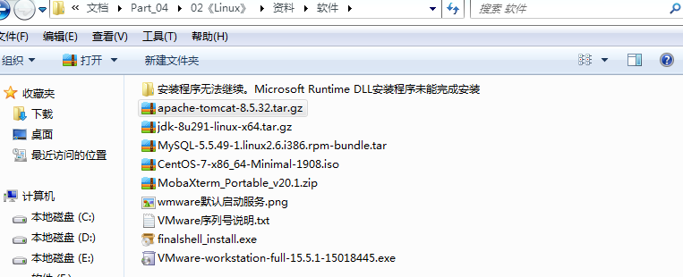 |


##### 12.3.2 解压压缩包

> 一样解压到/usr/local目录下

```sh
tar -zxvf apache-tomcat-8.5.32.tar.gz -C /usr/local
```


##### 12.3.3 启动Tomcat并监听日志

> 通过./执行可运行文件，并使用tail监控日志信息

```sh
# 跳转到tomcat的bin目录
cd /usr/local/apache-tomcat-8.5.32/bin
# 启动
./startup.sh

# 监控日志
cd ../logs
tail -f catalina.out
# 启动成功如下
```

|              日志及Tomcat首页              |
| :----------------------------------------: |
| 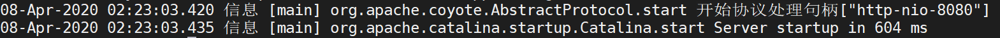 |
| 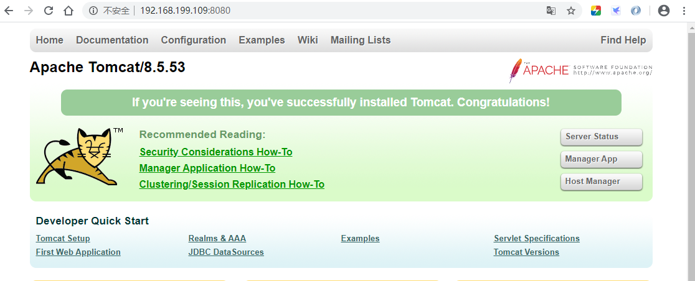 |
