### 三、Linux安装

>理解为啥需要虚拟机软件?
>
>软件可以模拟硬件的功能,比如计算器软件可以模拟电脑硬件的计算功能
>
>而Linux是一个系统,想要模拟硬件的很多功能比如网络硬件等,要安装一个软件可以模拟电脑硬件的功能,这个软件几乎可以理解为一个虚拟的电脑,简称虚拟机,所以安装Linux系统之前,要先安装能够模拟电脑硬件功能的虚拟机软件比如vmware软件↓

|      为啥需要先安装虚拟机软件vmware?       |
| :----------------------------------------: |
| 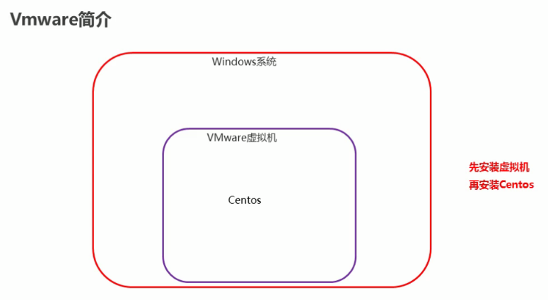 |

> - 安装Linux，我们需要一个虚拟机，可以装虚拟环境的软件：VMware或者Virtual Box
>
>   https://www.vmware.com/go/getworkstation-win
>
>   如果上面链接失效,可以用下面这个百度云链接去下载,或者百度搜索下载也行↓
>
>   链接：https://pan.baidu.com/s/11jlxfFk3VI9ZJGCQfP_0UQ 
>   提取码：ofah
>
>   下载成功软件的样子是
>
> - 为了安装Linux，我们需要一个Linux的镜像文件：CentOS7版本
>
>   http://mirrors.163.com/centos/7/isos/x86_64/CentOS-7-x86_64-Minimal-1908.iso
>
>   如果上面链接失效,可以用下面这个百度云链接去下载,或者百度搜索下载也行↓
>
>   链接：https://pan.baidu.com/s/1IX6_meGPDzusYdULPnjfLA 
>   提取码：pkat
>
>   下载成功软件的样子是

#### 3.1 安装VMware

> 傻瓜式安装，下一步下一步下一步
>
> 详情可以参考笔记文件夹里面的里面的vmware和Linux的安装详细文档

#### 3.2 安装Xterm

> 解压即可以使用

#### 3.3 在VMware中安装Linux

> 按照下图步骤，逐步安装Linux操作系统
>
> 详情可以参考笔记文件夹里面的里面的vmware和Linux的安装详细文档

打开wmware软件,点击创建新的虚拟机↓

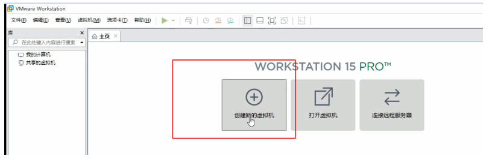

##### 3.3.1 选择安装方式

|                选择安装方式                |
| :----------------------------------------: |
| 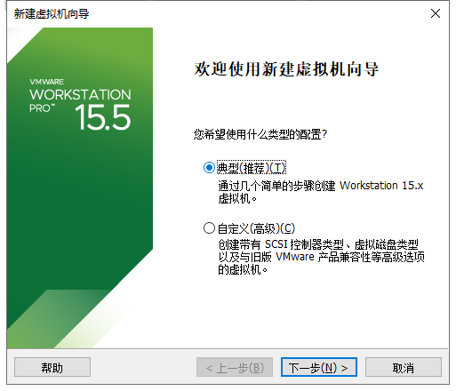 |

##### 3.3.2 指定镜像方式

|            选择稍后安装操作系统            |
| :----------------------------------------: |
| 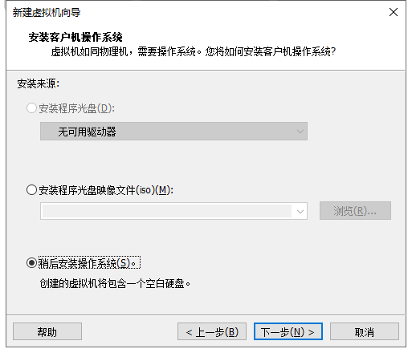 |

##### 3.3.3 选择操作系统类型

|              选择操作系统类型              |
| :----------------------------------------: |
| 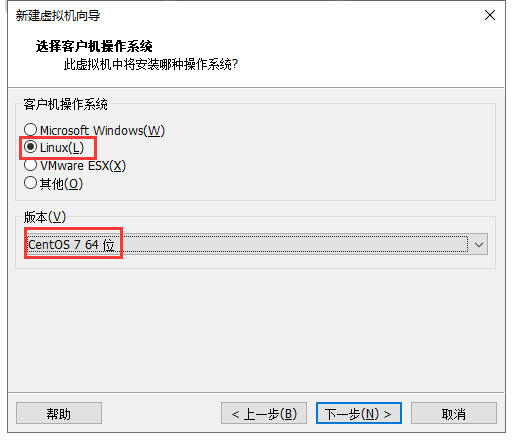 |

##### 3.3.4 指定虚拟机名称

|         指定虚拟机名称，和安装目录         |
| :----------------------------------------: |
| 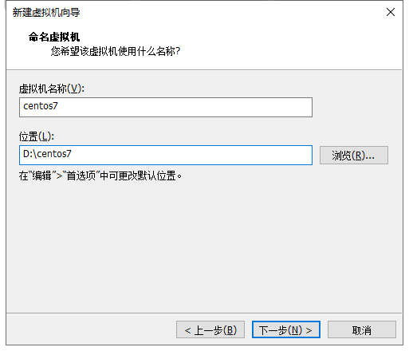 |

##### 3.3.5 磁盘存储方式

|             拆分成多个文件存储             |
| :----------------------------------------: |
| 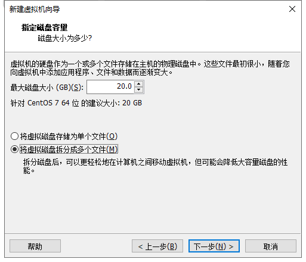 |

##### 3.3.6 指定虚拟机配置

|              指定虚拟机的设置              |
| :----------------------------------------: |
| 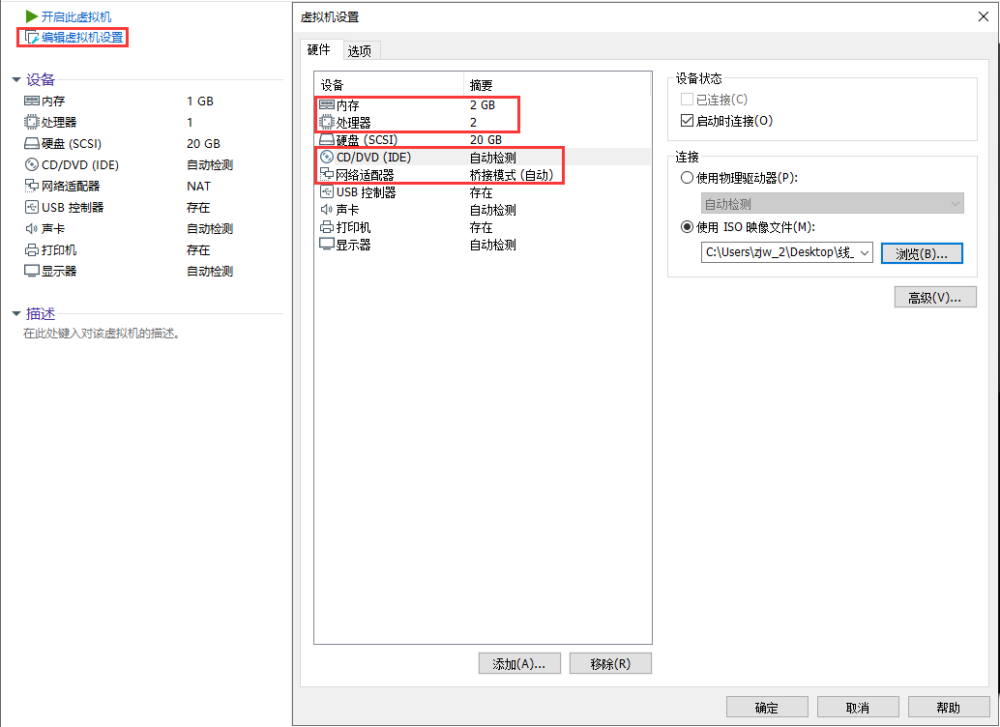 |

>桥接模式：和主机共享一个网段,局域网的电脑都可以访问
>
>NAT模式:主机和虚拟机形成一个独立的局域网，只能主机访问虚拟机
>
>仅主机模式：和NAT类似，区别是虚拟机不能上网

|        指定网络模式桥接或者NAT都行         |
| :----------------------------------------: |
| 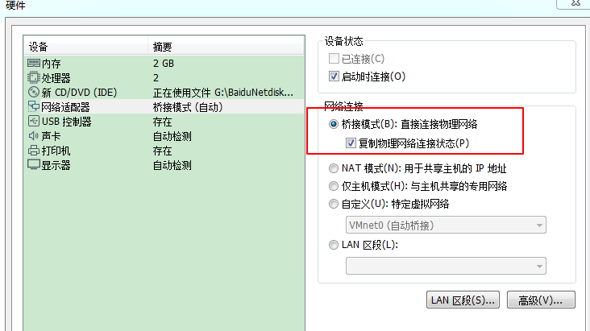 |

##### 3.3.7 点击开启此虚拟机,开始安装CentOS

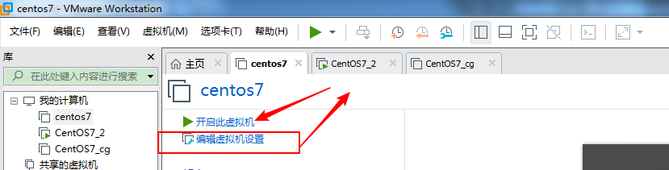

|              开始界面选择语言              |
| :----------------------------------------: |
| 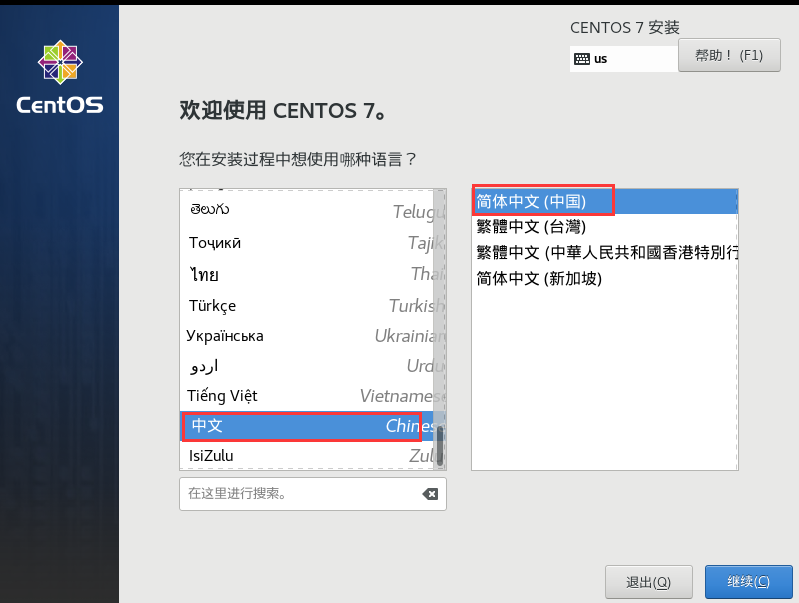 |

##### 3.3.8 配置安装位置和虚拟机网络连接

|                点击安装位置                |
| :----------------------------------------: |
| 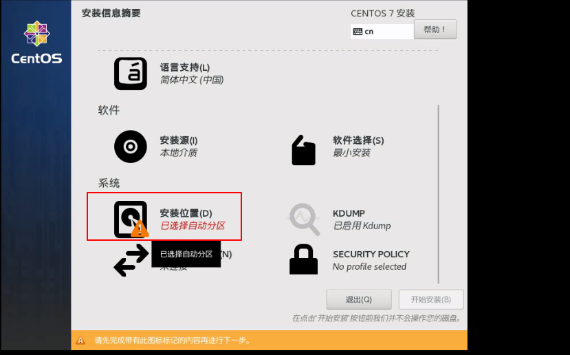 |

|                点击完成即可                |
| :----------------------------------------: |
| 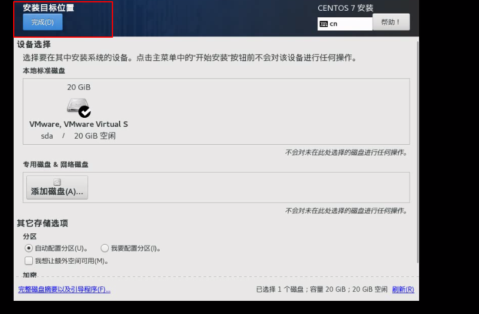 |

|              点击网络和主机名              |
| :----------------------------------------: |
| 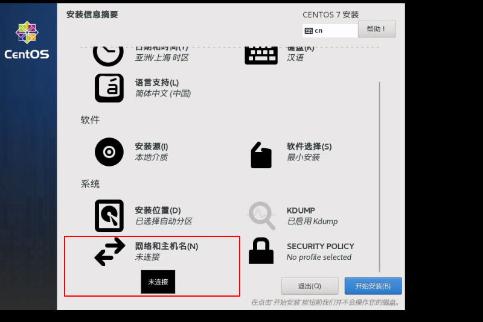 |

| 点击打开,稍等一会看到下面ip地址,再点击完成即可 |
| :--------------------------------------------: |
|   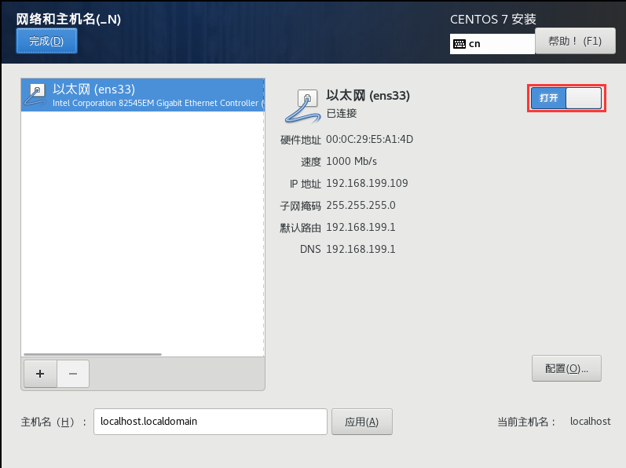   |

##### 3.3.9 开始安装

|     9、开始安装后，设置ROOT用户的密码      |
| :----------------------------------------: |
| 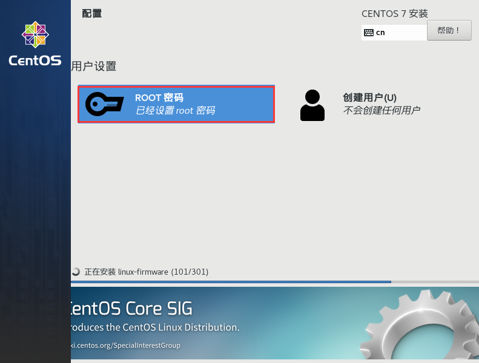 |

| 密码最好设置为root提示密码过短点击两次完成即可 |
| :--------------------------------------------: |
|   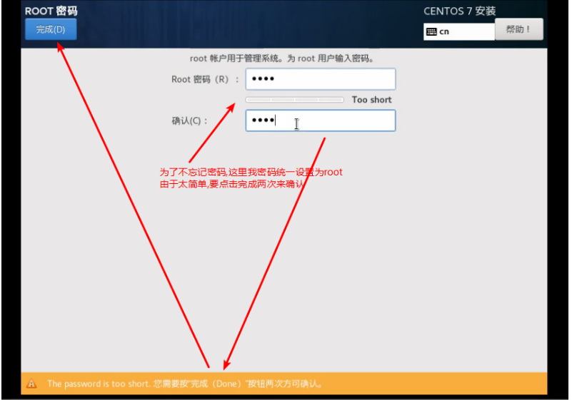   |

|         稍等进度条完成然后点击重启         |
| :----------------------------------------: |
| 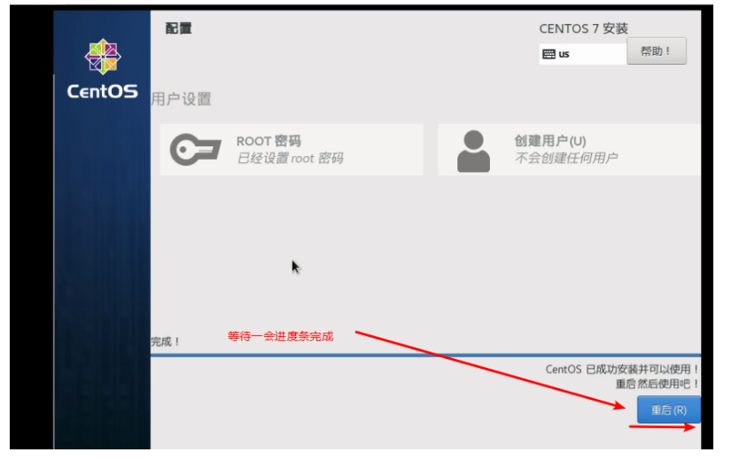 |

##### 3.3.10 安装成功

|   10、安装成功并用账户root密码root来登录   |
| :----------------------------------------: |
| 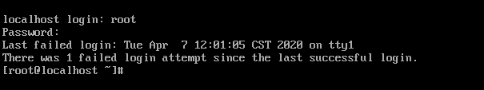 |

#### 3.4 使用Xterm连接Linux

> 直接在Vmware中操作Linux有很多限制，我们可以在图形化界面中操作Linux操作系统更加方便
>
> 还要安装一个连接Linux的图形化界面软件比如：Xterm，SSH，XShell,crt
>
> https://download.mobatek.net/2012020021813110/MobaXterm_Portable_v20.1.zip
>
> 如果上面链接失效,可以用下面这个百度云链接去下载,或者百度搜索下载也行↓
>
> 链接：https://pan.baidu.com/s/1iN8pAtAHnjwAEt7pcApe_g 
> 提取码：afym
>
> 下载成功软件的样子是

##### 3.4.1 查看ip地址,

|                 查看ip地址                 |
| :----------------------------------------: |
| 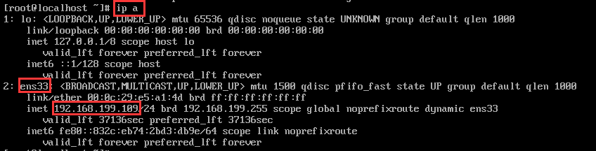 |

##### 3.4.2 通过Xterm连接

|                连接上Linux                 |
| :----------------------------------------: |
| 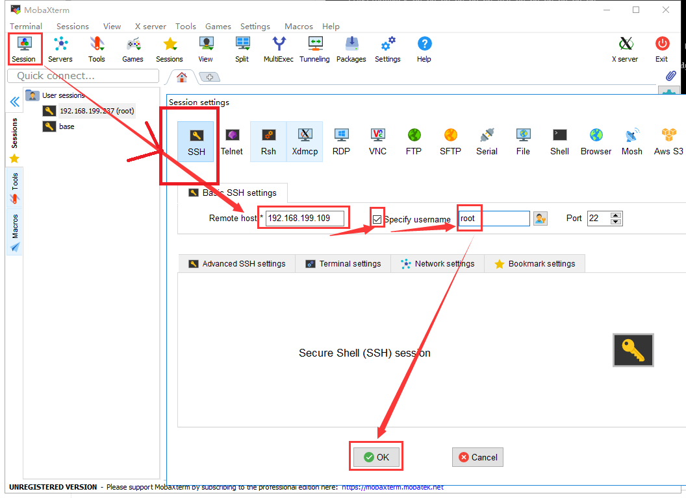 |

|                  连接成功                  |
| :----------------------------------------: |
| 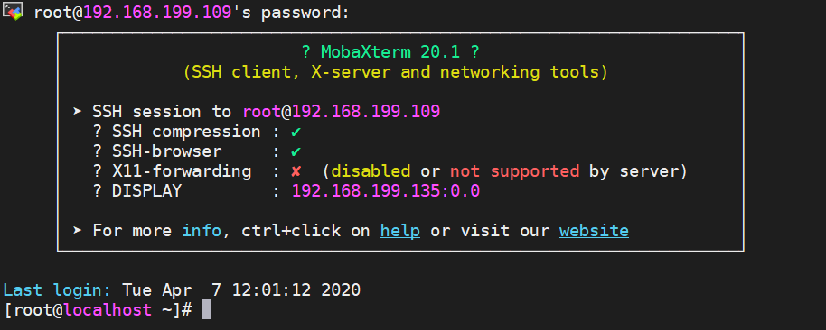 |

