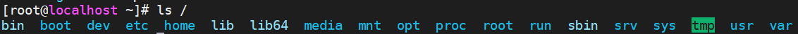
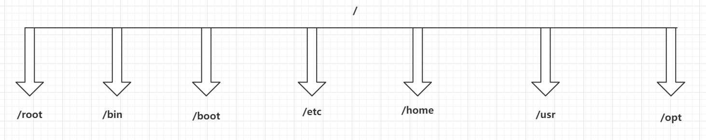

### 四、Linux的目录结构,了解一下

---

> Windows的目录结构是带有盘符的。D：  E： C：，而Linux中是没有盘符的
>
> 在Xterm中输入ls / 查看Linux的顶级目录/下面的东西

|                 ls /根目录                 |
| :----------------------------------------: |
|  |

> Linux的常用目录……

|              Linux目录树状图               |
| :----------------------------------------: |
|  |

> - root：该目录为系统管理员HOME目录
> - bin：这个目录下放着经常使用的命令
> - boot：这里存放的是启动Linux时的一些核心文件
> - etc：存放系统管理所需要的配置文件和子目录
> - home：普通用户的HOME目录
> - usr：默认安装软件的目录，类似Windows中的Program Files目录
> - opt：是主机额外安装软件拜访的目录


### 五、Linux的基本命令

----

```sh
# 1. 我是谁
who am i

# 2. 我在哪
pwd

# 3. 查看ip 地址,相对重要
ip a | ip address  或者ifconfig都是查看ip地址

# 4. 清屏
clear

# 5. ping域名www.baidu.com或者ip地址
ping 地址

# 6. 强制停止,巧记强制停车
Ctrl + C
```

