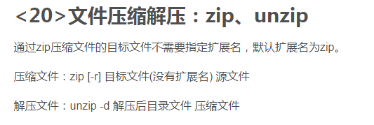
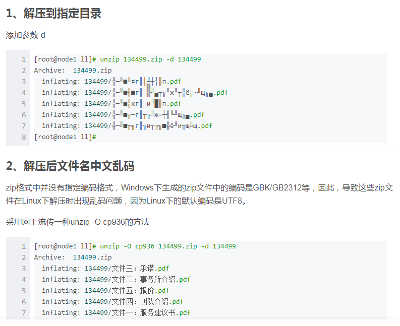

### ==八、Linux的压缩包命令【`重点`】↓==

----

#### 8.1 针对tar命令

> Linux中常用的压缩包，大多是.tar，.tar.gz，tgz的

##### 8.1.1 解压压缩包

> 针对压缩包后缀的情况，采用不同的参数，否则可能会损失文件

```sh
tar [-zxvf] 压缩包名称 [-C 路径]
# -z： 代表压缩包后缀是.gz的
# -x： 代表解压
# -v： 解压时，打印详细信息
# -f： -f选项必须放在所有选项的最后，代表指定文件名称
# -C 路径： 代表将压缩包内容解压到指定路径
```

##### 8.1.2 打包成压缩包

> 可以将多个文件以及目录打包成压缩包，根据选择的参数指定压缩包名

```sh
tar [-zcvf] 压缩包名称 文件1 文件2 目录1 目录2 ...
# -c： 代表打包
# 其他参数同上
```

巧记,注册微服,tar -zcvf 打包,-x剪刀解压↓

tar -zcvf bb.tar a a.txt打包

tar -zxvf bb.tar  -C ./b解压


#### 8.2 针对zip类型压缩包

> Linux不仅仅针对tar类型的压缩包，也支持zip，rar这种Windows下的压缩包。
>
> 不过需要额外安装软件,来针对各种类型压缩包的操作

##### 8.2.1 安装软件

```sh
yum -y install zip     # 打包程序
yum -y install unzip   # 解压程序
```

##### 8.2.2 解压以及打包

```sh
# 解压
unzip 压缩包名称
# 打包
zip 压缩包名称 文件1 文件2 目录1 目录2 ...

# 例如↓
zip bb.zip a a.txt打包
unzip bb.zip -d ./b解压
```

|                    图片                    |
| :----------------------------------------: |
|  |

https://blog.csdn.net/weixin_39776344/article/details/110514941


##### 8.2.3 CentOS 7.x unzip解压命令（文件名中文乱码+解压到指定目录）



https://blog.csdn.net/chengyuqiang/article/details/81478026

> unzip -O cp936 课表数据.zip -d kkk解压课表数据.zip文件到kkk文件夹里面去

