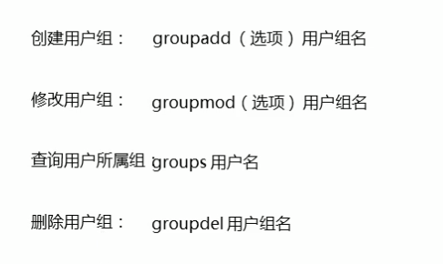

### 九、用户&用户组的操作

---

#### 9.1 用户的常用操作命令

> Linux是一个多用户的操作系统，任何一个用户想要操作Linux操作系统，必须向系统管理员申请一个账号才可以，并且以这个账号的身份去操作Linux。(跟之前学的mysql用户类似)
>
> 用户账号一方面可以帮助系统管理员追踪当前用户的操作。另一方面可以控制当前用户对系统资源的访问。

##### 9.1.1 用户添加

```sh
useradd [-cgd] [选项指定的具体内容] 用户名
# -c：代表comment，给用户添加一段注释
# -g：代表group，可以修改用户的所在组
# -d：代表指定用户的HOME目录
useradd fbb
```

##### 9.1.2 密码我的?谁的?哪个用户?

```sh
passwd 用户名
passwd fbb
```

##### 9.1.3 切换用户

```sh
su 用户名,理解select user
# [root@localhost ~]#   -> root用户在本地登录，并且当前在~目录下，#代表的是超级管理员
# [qf@localhost ~]$		-> qf用户在本地登录，并且当前在~目录下，$代表的是普通用户
# 注意超级管理员比如root切换到其他普通用户不用输密码,但是其他普通用户切换到其他用户,要输其他用户的密码
su fbb
```

##### 9.1.4 用户删除

```sh
userdel [-r] 用户名
# -r：代表删除用户的同时，删除该用户的HOME目录
# -f：强制删除用户
userdel -rf fbb
```

|                 用户增删改                 |
| :----------------------------------------: |
|  |

> 切换用户理解为选择用户select user缩写su,如 su root
>
> 退出当前用户用退出命令exit
>
> 浏览配置密码,查看所有用户用cat /etc/passwd
>
> 修改用户名用usermod -l newname oldname,忘了可以打usermod提示,usermod -l fbbnew fbb
>
> 更多查看命令https://blog.csdn.net/qq_19734597/article/details/90717604
>
> 如果提示当前用户被占用,可以用exit退出用户所占用进程,或者推荐关闭xterm的连接页面,重新连接即可↓
>
> 

测试顺序推荐:查看用户,用户添加,密码指定,选择用户,退出用户,用户修改,用户删除


#### 9.2 用户组的操作

> 如果用户没有指定组,自己自成一组,
>
> 用户的身份除了用户本身，还会分配到指定的用户组，可以通过用户组对设置一些文件的操作权限

##### 9.2.1 组添加,创建用户组

```sh
groupadd 用户组名
groupadd ceshi
```

##### 9.2.2 组修改,修改用户组

```sh
groupmod [-n] [选项指定的具体内容] 用户组名
# -n 修改用户组名称,-n参数忘了,可以打groupmod提示,跟用户修改操作类似
groupmod -n ceshinew ceshi
```

##### 9.2.3 组删除,删除用户组

```sh
groupdel 用户组名

groupdel -f 用户组名,强制删除用户组
groupdel ceshinew
```

##### 9.2.4 浏览配置组,查看所有组信息

~~~java
cat /etc/group
~~~

|                   用户组                   |
| :----------------------------------------: |
|  |

|               用户组增删改查               |
| :----------------------------------------: |
|  |

|              用户组内成员管理              |
| :----------------------------------------: |
|  |

|                  操作如下                  |
| :----------------------------------------: |
|  |

测试顺序推荐:查看用户组,组添加,组修改,组删除,和组口令,添加用户到用户组

