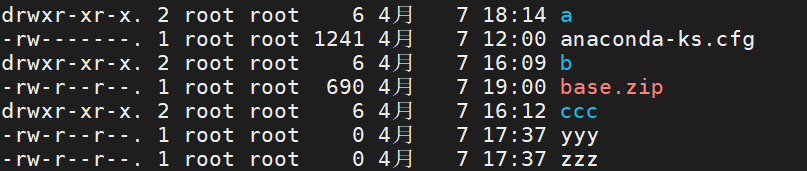

### 十、文件权限的修改【`重点`】

---

> 首先我们要清楚Linux文件的权限信息
>
> 在Linux中输入ls -l 或者 ll查看文件和目录的详细信息

|                  文件详情                  |
| :----------------------------------------: |
|  |

> 如上图所示，a目录的第一个属性用“d”标识这个a是一个目录。
>
> anaconda-ks.cfg第一个属性用“-”标识他是一个文件;另外补充一下l代表快捷方式
>
> 在Linux文件详情的后面属性需要分为三组查看
>
> - rwx： 代表文件拥有者的权限
> - rwx： 代表文件所属组的用户的权限
> - rwx： 代表其他用户对当前文件的操作权限
>   - r： 代表read，读的权限
>   - w： 代表write，写的权限
>   - x： 代表execute，代表执行权限
>
> 其余信息
>
> - 后续的第一个root：代表当前文件的拥有者
> - 后续的第二个root： 代表当前文件的所属组
> - 后续分别为：文件的大小(单位是字节)和最后**修改**时间等信息


#### 10.1 对文件的权限修改

> 使用chmod命令对文件的权限进行修改，一种使用数字，一种使用符号
>
> - 数字方式方便操作，不过要修改整体权限信息
> - 符号方式更细粒度，不过操作麻烦

##### 10.1.1 数字方式,推荐,巧记修改权限,从何修改啊,chmod

```sh
chmod [-R] 777 文件|目录 修改属主,属组,其他用户的权限为可写可读可执行
# rwx在这三个权限中r：4，w：2，x：1
# -R： 当修改一个目录权限时，可以添加-R，将目录下的全部内容，都修改权限。
chmod 777 a.txt
```

##### 10.1.2 符号方式,了解

```sh
chmod [-R] a=rw 文件|目录
# user：u，group：g，other：o，all：a,修改属主u,属组g,其他用户o的权限为可读可写
# read：r，write：w，execute：x
# 赋予权限的方式 , 添加：+，减掉：-，设定：=
# -R： 当修改一个目录权限时，可以添加-R，将目录下的全部内容，都修改权限。
chmod a=rw a.txt
```


#### 10.2 文件拥有者owner及所属组的修改

> chown可以直接修改拥有者和所属组，chgrp只能修改所属组

```sh
# 修改文件的拥有者和所属组
chown [-R] 拥有者：所属组 文件|目录
# 修改文件的拥有者
chown [-R] 拥有者 文件|目录

# 修改文件的所属组
chgrp [-R] 所属组 文件|目录

代码如下,其他用户和组以此类推↓
[root@localhost ~]# chown root:root a.txt
[root@localhost ~]# chown root a.txt
[root@localhost ~]# chgrp root a.txt
[root@localhost ~]# chgrp root:root a.txt
chgrp: 无效的组："root:root"
[root@localhost ~]#

# 搞一个用户,自成一组↓
[root@localhost ~]# useradd zs
[root@localhost ~]# passwd zs
更改用户 zs 的密码 。
新的 密码：
无效的密码： 密码少于 8 个字符
重新输入新的 密码：
passwd：所有的身份验证令牌已经成功更新。
[root@localhost ~]# chown zs:zs a.txt
[root@localhost ~]# ll
总用量 1316
drwxr-xr-x. 2 root root       6 7月   6 08:48 a
-rw-r--r--. 1 root root     133 7月   6 09:40 aa
-rw-rw-rw-. 1 root root       0 7月   6 11:32 aa.txt
-rw-------. 1 root root    1241 7月   5 11:11 anaconda-ks.cfg
-rw-r--r--. 1 zs   zs         0 7月   6 08:48 a.txt
```

