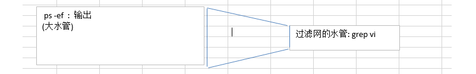

### 十一、Linux的其他操作命令【`重点`】

----

#### 11.1 进程的操作

> 需要用到类似Windows的结束进程时，在Linux下需要使用如下命令

```sh
ps -ef 
# 查看全部正在运行的进程
ps -ef | grep 搜索的内容

# 杀死进程!
kill -9 pid
```

管道|的理解↓




#### 11.2 服务的操作

> 和Windows下的服务操作一致，只需使用如下命令，默认为centos7版本

```sh
# 针对服务的启动，停止，重启，开机自动启动，禁止开机自动启动，查看服务状态。
systemctl start|stop|restart|enable|disable|status 服务名称比如网络服务network
```


#### 11.3 端口号查看

> 如发现端口号被占用，可以使用如下方式查找pid，并结束进程

```sh
# 想使用指定的命令需要事先下载netstat
yum -y install net-tools

# 查看所有的端口号占用情况里面含有进程id即pid
netstat -naop
# 从所有情况中用管道|过滤抓取8080端口的情况出来
netstat -naop | grep 8080
netstat -naop | grep 22047

# 杀死进程!
kill -9 pid
```


#### 11.4 访问地址

> 类似浏览器访问路径，无法图形化显示，一般用于测试虚拟机能否上网

```sh
curl 访问地址,比如curl www.baidu.com
```


#### 11.5 查找文件,查找什么路径下什么类型的东西

> 在Linux中查找指定文件，参数较多，如下为根据文件名称查询

```sh
find 路径 -type f | grep profile
find /etc -type f | grep profile查看/etc下面的所有带有名字叫profile的文件

find . -type f | grep a查看当前目录下面的所有带有名字叫a的文件,巧记查找路径,什么类型的,管道抓取文件
find /root -type f | grep a.txt
find /root -type d | grep aa查看当前/root目录下面的所有带有名字叫aa的文件夹
```


#### 11.6关机/重启

```shell
halt:关机(一般不用),我们用的是centos7关机命令推荐使用shutdown -h now
reboot:重启
```

