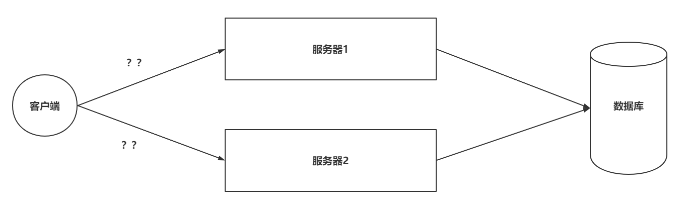
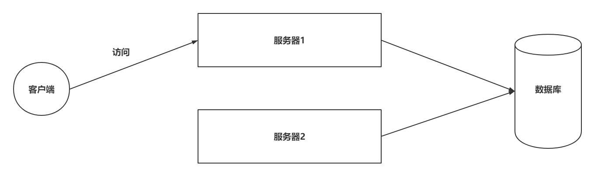
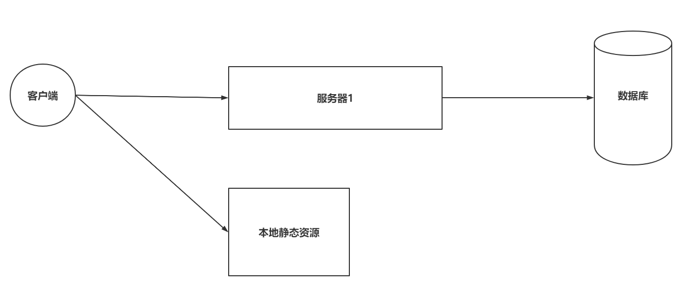

### 一、引言

----------

#### 1.1 代理问题

> 客户端到底要将请求发送给哪台服务器?

|          发送给服务器1还是服务器2          |
| :----------------------------------------: |
|  |

#### 1.2 负载均衡问题

> 如果所有客户端的请求都发送给了服务器1，那么服务器2将没有任何意义?

|                负载均衡问题                |
| :----------------------------------------: |
|  |

#### 1.3 资源优化

> 客户端发送的请求可能是申请动态资源的，也有申请静态资源，但都去Tomcat中获取?

|                静态资源访问                |
| :----------------------------------------: |
|  |

#### 1.4 Nginx处理,http服务器能够实现请求分发,反向代理,负载均衡,动静分离

|          在搭建集群后，使用Nginx           |
| :----------------------------------------: |
|  |

### 二、Nginx概述

-----

> Nginx是由俄罗斯人研发的，应对Rambler的网站，并且2004年发布的第一个版本。

|                 Nginx之父                  |
| :----------------------------------------: |
|  |

> Nginx的特点：
>
> - 稳定性极强。 7*24小时不间断运行
> - ==Nginx提供了非常丰富的配置实例==
> - 占用内存小，并发能力强（官方给的数据是5w)
> - 负载均衡策略
> - 动静态分离
> - 擅长处理静态资源，tomcat擅长处理动态资源