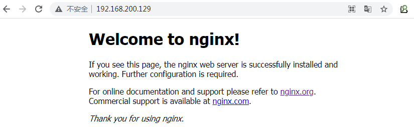
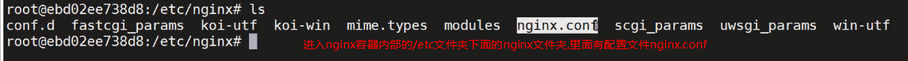
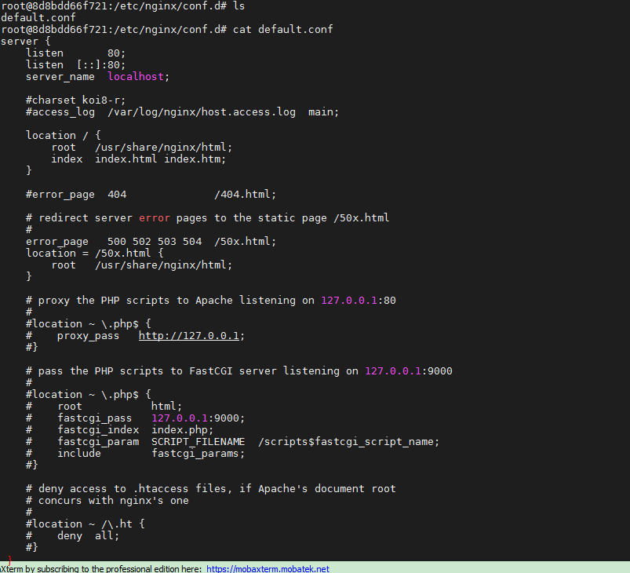
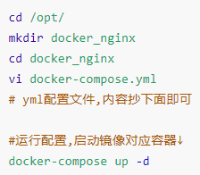
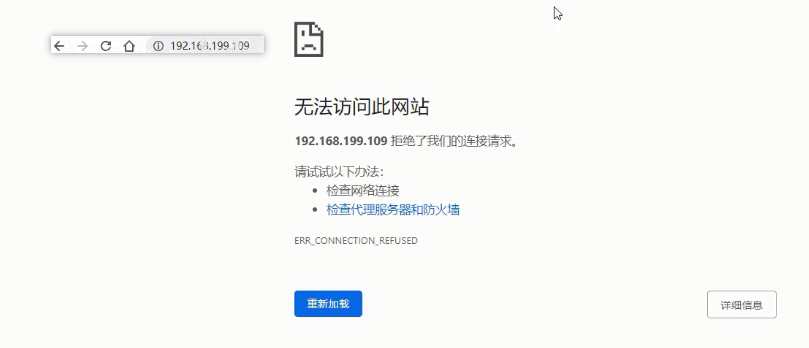
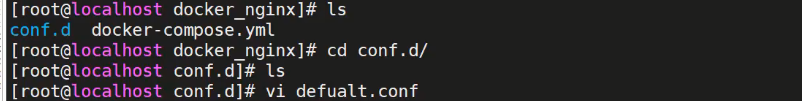

### 三、Nginx的安装

----

#### 3.1 安装Nginx

> 使用Docker-Compose安装nginx
>
> 编写docker-compose.yml文件
>
> 为方便管理创建一个目录里面编辑yml配置文件,内容抄下面即可,然后通过docker-compose up -d命令执行↓
>
> ```shell
> cd /opt/
> mkdir docker_nginx
> cd docker_nginx
> vi docker-compose.yml
> # yml配置文件,内容抄下面即可
> 
> #运行配置,启动镜像对应容器↓
> docker-compose up -d
> ```
>
> 浏览器输入地址http://192.168.200.129:80去访问nginx服务器,看到下面界面说明访问成功↓
>
> 

```yml
version: '3.1'
services:
  nginx:
    restart: always
    image: daocloud.io/library/nginx:latest
    container_name: nginx
    ports:
      - 80:80
```

如果上面这个daocloud中文网站下载不了镜像,可以用下面的配置去英文官方网站下载↓

```yml
version: '3.1'
services:
  nginx:
    restart: always
    image: nginx:latest
    container_name: nginx
    ports:
      - 80:80
```


#### 3.2 Nginx的配置文件

> nginx容器内部etc文件夹下面的nginx文件夹,里面有配置文件nginx.conf文件和conf.d文件夹里面默认配置↓
>
> ```shell
> docker ps
> # docker exec -it 容器id bash
> docker exec -it 8d8bdd66f721 bash
> 
> # 进入容器内部查看
> cd /etc/nginx
> ls
> ```
>
> 
>
> 
>
> ```shell
> # 进入nginx容器内部查看etc文件夹里面的nginx.conf配置文件内容流程↓
> [root@localhost ~]# docker ps
> CONTAINER ID   IMAGE                                    COMMAND                  CREATED        STATUS          PORTS                                       NAMES
> 8d8bdd66f721   daocloud.io/library/nginx:latest         "/docker-entrypoint.…"   9 hours ago    Up 13 minutes   0.0.0.0:80->80/tcp, :::80->80/tcp           nginx
> 18e306c4a1dd   ssm:1.0.1                                "catalina.sh run"        11 hours ago   Up 13 minutes   0.0.0.0:8081->8080/tcp, :::8081->8080/tcp   ssm
> 261968d3a65d   daocloud.io/library/tomcat:8.5.15-jre8   "catalina.sh run"        11 hours ago   Up 13 minutes   0.0.0.0:8080->8080/tcp, :::8080->8080/tcp   tomcat
> 6c1abdca6be9   daocloud.io/library/mysql:5.7.4          "/entrypoint.sh mysq…"   11 hours ago   Up 13 minutes   0.0.0.0:3306->3306/tcp, :::3306->3306/tcp   mysql
> [root@localhost ~]# docker exec -it 8d8bdd66f721 bash
> 
> root@8d8bdd66f721:/# ls
> bin  boot  dev  docker-entrypoint.d  docker-entrypoint.sh  etc  home  lib  lib64  media  mnt  opt  proc  root  run  sbin  srv  sys  tmp  usr  var
> root@8d8bdd66f721:/# cd etc
> root@8d8bdd66f721:/etc# ls
> adduser.conf            cron.daily      fonts     gss        issue.net      localtime    nginx          passwd-    rc4.d        security  subgid         xattr.conf
> alternatives            debconf.conf    fstab     host.conf  kernel         login.defs   nsswitch.conf  profile    rc5.d        selinux   subuid
> apt                     debian_version  gai.conf  hostname   ld.so.cache    logrotate.d  opt            profile.d  rc6.d        shadow    systemd
> bash.bashrc             default         group     hosts      ld.so.conf     machine-id   os-release     rc0.d      rcS.d        shadow-   terminfo
> bindresvport.blacklist  deluser.conf    group-    init.d     ld.so.conf.d   mke2fs.conf  pam.conf       rc1.d      resolv.conf  shells    timezone
> ca-certificates         dpkg            gshadow   inputrc    ldap           motd         pam.d          rc2.d      rmt          skel      ucf.conf
> ca-certificates.conf    environment     gshadow-  issue      libaudit.conf  mtab         passwd         rc3.d      securetty    ssl       update-motd.d
> 
> root@8d8bdd66f721:/etc# cd nginx/
> root@8d8bdd66f721:/etc/nginx# ls
> conf.d  fastcgi_params  koi-utf  koi-win  mime.types  modules  nginx.conf  scgi_params  uwsgi_params  win-utf
> root@8d8bdd66f721:/etc/nginx# cat nginx.conf
> 
> user  nginx;
> worker_processes  1;
> 
> error_log  /var/log/nginx/error.log warn;
> pid        /var/run/nginx.pid;
> 
> 
> events {
>  worker_connections  1024;
> }
> 
> 
> http {
>  include       /etc/nginx/mime.types;
>  default_type  application/octet-stream;
> 
>  log_format  main  '$remote_addr - $remote_user [$time_local] "$request" '
>                    '$status $body_bytes_sent "$http_referer" '
>                    '"$http_user_agent" "$http_x_forwarded_for"';
> 
>  access_log  /var/log/nginx/access.log  main;
> 
>  sendfile        on;
>  #tcp_nopush     on;
> 
>  keepalive_timeout  65;
> 
>  #gzip  on;
> 
>  include /etc/nginx/conf.d/*.conf;
> }
> root@8d8bdd66f721:/etc/nginx#
> 
> # 查看etc里面的文件夹conf.d里面的默认配置default.conf文件的内容,这个文件引入到了nginx.conf文件了
> root@8d8bdd66f721:/etc/nginx# ls
> conf.d  fastcgi_params  koi-utf  koi-win  mime.types  modules  nginx.conf  scgi_params  uwsgi_params  win-utf
> root@8d8bdd66f721:/etc/nginx# cat conf.d
> cat: conf.d: Is a directory
> root@8d8bdd66f721:/etc/nginx# cd conf.d/
> root@8d8bdd66f721:/etc/nginx/conf.d# ls
> default.conf
> root@8d8bdd66f721:/etc/nginx/conf.d# cat default.conf
> server {
>  listen       80;
>  listen  [::]:80;
>  server_name  localhost;
> 
>  #charset koi8-r;
>  #access_log  /var/log/nginx/host.access.log  main;
> 
>  location / {
>      root   /usr/share/nginx/html;
>      index  index.html index.htm;
>  }
> 
>  #error_page  404              /404.html;
> 
>  # redirect server error pages to the static page /50x.html
>  #
>  error_page   500 502 503 504  /50x.html;
>  location = /50x.html {
>      root   /usr/share/nginx/html;
>  }
> 
>  # proxy the PHP scripts to Apache listening on 127.0.0.1:80
>  #
>  #location ~ \.php$ {
>  #    proxy_pass   http://127.0.0.1;
>  #}
> 
>  # pass the PHP scripts to FastCGI server listening on 127.0.0.1:9000
>  #
>  #location ~ \.php$ {
>  #    root           html;
>  #    fastcgi_pass   127.0.0.1:9000;
>  #    fastcgi_index  index.php;
>  #    fastcgi_param  SCRIPT_FILENAME  /scripts$fastcgi_script_name;
>  #    include        fastcgi_params;
>  #}
> 
>  # deny access to .htaccess files, if Apache's document root
>  # concurs with nginx's one
>  #
>  #location ~ /\.ht {
>  #    deny  all;
>  #}
> }
> 
> root@8d8bdd66f721:/etc/nginx/conf.d#
> ```
>
> 
>
> nginx.conf配置文件里面的完整内容↓
>
> 
>
> 关于Nginx的核心配置文件nginx.conf的配置说明↓

```json
worker_processes  1;		
error_log  /var/log/nginx/error.log warn;
# 以上统称为全局块， 
# worker_processes他的数值越大，Nginx的并发能力就越强
# error_log 代表Nginx的错误日志存放的位置

events {
    worker_connections  1024;
}
# events块
# worker_connections他的数值越大，Nignx并发能力越强

http {
    include       /etc/nginx/mime.types;
    default_type  application/octet-stream;
    server {
        listen       80;
        server_name  localhost;

        location / {
            root   /usr/share/nginx/html;
            index  index.html index.htm;
        }
		# location块
		# root：将接收到的请求根据/usr/share/nginx/html去查找静态资源
		# index： 默认去上述的路径中找到index.html或者index.htm
    }
	# server块
	# listen： 代表Nginx监听的端口号
	# localhost：代表Nginx接收请求的ip
}
# http块
# include代表引入一个外部的文件 -> /mime.types中放着大量的媒体类型
# include /etc/nginx/conf.d/*.conf; -> 引入了conf.d目录下的以.conf为结尾的配置文件↓
```


conf.d文件夹里面默认配置文件default.conf文件里面完整内容↓




#### 3.3 修改docker-compose文件,实现外部配置文件夹和容器内部配置文件夹的目录映射

> 根据上面知道conf.d文件夹里面可以增加配置文件,为了方便修改Nginx配置,
>
> 那就要回到yml配置文件所在的目录,即安装nginx时的目录↓
>
>  
>
> 修改yml文件,增加数据卷进行conf.d文件夹目录的挂载同步↓
>
> 目录挂载不会写,抄↓

```yml
version: '3.1'
services:
  nginx:
    restart: always
    image: daocloud.io/library/nginx:latest
    container_name: nginx
    ports:
      - 80:80
    volumes:
      - /opt/docker_nginx/conf.d/:/etc/nginx/conf.d
```

上面由于进行了绝对路径的目录挂载,所以里面啥内容都没有,可以手动增加default.conf配置文件来进行路径导航↓

1


2



3



 

4


路径导航server块不会写,可以抄之前打开过的默认设置default.conf里面的,修改一下即可,注意不要少了分号;↓

```conf
server {
    listen       80;
    server_name  localhost;
    
    location / {
        root   /usr/share/nginx/html;
        index  index.html index.htm;
    }
}
```

==5总结,代码总流程如下,开干↓==

```shell
# 进入安装时docker-compose.yml所在的目录来修改文件,在端口后面增加目录挂载的内容
[root@localhost ~]# cd /opt/
[root@localhost opt]# ls
containerd  docker_mysql_tomcat  docker_nginx
[root@localhost opt]# cd docker_nginx/
[root@localhost docker_nginx]# ls
docker-compose.yml

# 要注意先,停止并且删除之前的容器,然后再进去修改docker-compose.yml文件内容
[root@localhost docker_nginx]# docker-compose down
Stopping nginx ... done
Removing nginx ... done
Removing network docker_nginx_default
[root@localhost docker_nginx]# vi docker-compose.yml

# 修改完docker-compose.yml文件,目录挂载不会写,抄↑,完了要重新构建镜像不然用之前镜像没有目录映射,然后启动
[root@localhost docker_nginx]# docker-compose build
nginx uses an image, skipping
[root@localhost docker_nginx]# docker-compose up -d
Creating network "docker_nginx_default" with the default driver
Creating nginx ... done

# 上面由于进行了绝对路径的目录挂载,所以里面啥内容都没有,可以手动增加default.conf配置文件来进行路径导航↓
# 路径导航server块不会写,可以抄之前打开过的默认设置default.conf里面的,修改一下即可↑
[root@localhost docker_nginx]# ls
conf.d  docker-compose.yml
[root@localhost docker_nginx]# cd conf.d/
[root@localhost conf.d]# ls
[root@localhost conf.d]# vi default.conf

# 目录挂载和路径导航都搞定了,之前,回退到上一级目录即docker-compose.yml所在文件目录,重新启动容器↕
[root@localhost conf.d]# cd ..
[root@localhost docker_nginx]# ls
conf.d  docker-compose.yml
[root@localhost docker_nginx]# docker-compose restart
Restarting nginx ... done
[root@localhost docker_nginx]#
```

6最后通过浏览器输入地址http://192.168.200.129:80来访问nginx服务器,能够导航到首页即表示修改成功↓


```
总结:
给nginx容器增加目录映射,要修改yml文件内容然后先down在up -d,最后在conf.d文件夹里面增加default.conf配置文件然后restart即可
```

