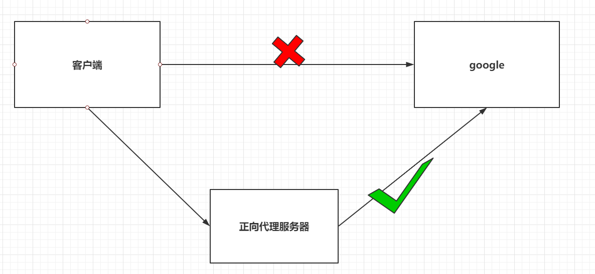
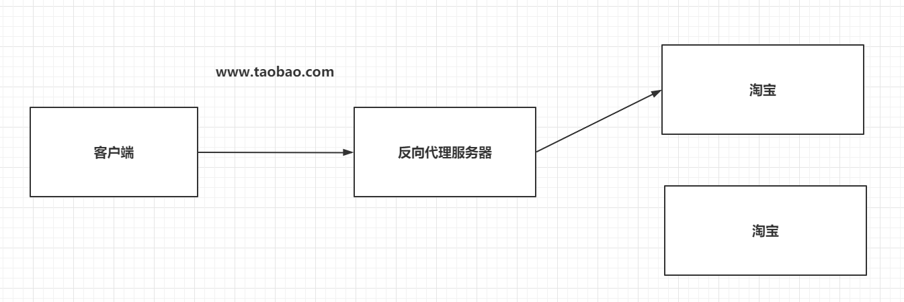
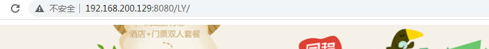
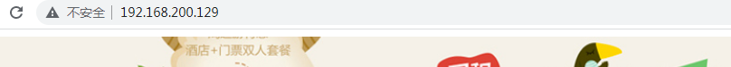

### 四、Nginx的反向代理【`重点`】

---

#### 4.1 正向代理和反向代理介绍

> 正向代理：
>
> - 正向代理服务是由客户端设立的。
> - 客户端了解代理服务器和目标服务器都是谁。
> - 帮助咱们实现突破访问权限，提高访问的速度，对目标服务器隐藏客户端的ip地址。

|                  正向代理                  |
| :----------------------------------------: |
|  |

> 反向代理：
>
> - 反向代理服务器是配置在服务端的。
> - 客户端是不知道访问的到底是哪一台服务器。
> - 达到负载均衡，并且可以隐藏服务器真正的ip地址。




#### 4.2 基于Nginx实现反向代理

> 准备一个目标服务器,即启动了之前的tomcat服务器。
>
> 编写default.conf配置文件，通过Nginx访问到tomcat服务器。

```json
server{
  listen 80;
  server_name localhost;
    # 基于反向代理访问到Tomcat服务器
  location / {
    proxy_pass http://192.168.200.129:8080/;
  }
}
```

首先准备好tomcat容器开启,然后进入容器内部webapps目录,拷贝LY项目过去,

然后配置好ngixn的默认配置,把之前的路径导航server块里面的location由root改为代理传递即proxy_pass,

不会写可以直接抄,之前打开过来的默认配置文件default.conf里面的过来修改一下即可,最后重启nginx即可↓

#### ==反向代理,开干↓==

```shell
# 注意下面的分号;不能省略掉,否则还是无法基于反向代理访问到Tomcat服务器↓
server {
    listen       80;
    server_name  localhost;

    location / {
        proxy_pass http://192.168.200.129:8080/LY/;
    }
}
```

```shell
# 先拷贝LY项目到Linux的/root目录下,
# 然后准备好tomcat容器开启,然后进入容器内部webapps目录,拷贝LY项目过去,但是要先知道容器id↓
[root@localhost docker_nginx]# docker ps
CONTAINER ID   IMAGE                                    COMMAND                  CREATED          STATUS              PORTS                                       NAMES
64fec35c7c01   daocloud.io/library/nginx:latest         "/docker-entrypoint.…"   56 minutes ago   Up About a minute   0.0.0.0:80->80/tcp, :::80->80/tcp           nginx
18e306c4a1dd   ssm:1.0.1                                "catalina.sh run"        12 hours ago     Up 2 hours          0.0.0.0:8081->8080/tcp, :::8081->8080/tcp   ssm
261968d3a65d   daocloud.io/library/tomcat:8.5.15-jre8   "catalina.sh run"        13 hours ago     Up 2 hours          0.0.0.0:8080->8080/tcp, :::8080->8080/tcp   tomcat
6c1abdca6be9   daocloud.io/library/mysql:5.7.4          "/entrypoint.sh mysq…"   13 hours ago     Up 2 hours          0.0.0.0:3306->3306/tcp, :::3306->3306/tcp   mysql

# 进入容器内部,pwd得到webapps文件夹的位置,拷贝,给下面拷贝LY项目到容器内部的地址位置用↓
[root@localhost docker_nginx]# docker exec -it 261968d3a65d bash
root@261968d3a65d:/usr/local/tomcat# ls
LICENSE  NOTICE  RELEASE-NOTES  RUNNING.txt  bin  conf  include  lib  logs  native-jni-lib  temp  webapps  work
root@261968d3a65d:/usr/local/tomcat# cd webapps/
root@261968d3a65d:/usr/local/tomcat/webapps# ls
root@261968d3a65d:/usr/local/tomcat/webapps# pwd
/usr/local/tomcat/webapps

# 根据上面得到的容器id和需要拷贝到容器的内部webapps的位置,拷贝LY项目到容器内部↓
[root@localhost ~]# docker cp LY 261968d3a65d:/usr/local/tomcat/webapps

# 因为之前进行了目录挂载,所以可以快速进入nginx的conf.d文件夹,修改默认配置文件,
# 把之前的路径导航server块里面的location由root改为代理传递即proxy_pass,
#不会写可以抄直接打开过来的默认配置文件default.conf里面的过来修改一下即可,最后重启nginx即可
[root@localhost ~]# cd /opt/
[root@localhost opt]# ls
containerd  docker_mysql_tomcat  docker_nginx
[root@localhost opt]# cd docker_nginx/
[root@localhost docker_nginx]# ls
conf.d  docker-compose.yml
[root@localhost docker_nginx]# cd conf.d/
[root@localhost conf.d]# ls
default.conf
[root@localhost conf.d]# vi default.conf

# 回退到上一步,重启nginx即可↓
[root@localhost conf.d]# cd ..
[root@localhost docker_nginx]# ls
conf.d  docker-compose.yml

[root@localhost docker_nginx]# docker-compose restart
Restarting nginx ... done
[root@localhost docker_nginx]#
```

直接地址栏输入地址http://192.168.200.129:8080/LY/访问tomcat服务器,tomcat之前已经开启,自然可以访问↓



最后输入地址http://192.168.200.129/,通过访问nginx服务器,间接访问到tomcat服务器,说明反向代理配置成功↓




#### 4.3 关于Nginx的location的路径映射规则如下,可自我练习测试一下,了解一下

> 优先级关系如下：
>
> (location=) > (location /aa/bb/cc) > (location ~) 

```json
# 1. 精确匹配
location = / {
  # 精准匹配，主机名后面不能带任何的字符串，等号决定匹配的内容，比如:http://baidu.com
}
# 案例
# 用户访问# http:192.168.193.88/abc nginx会自动代理到 http://192.168.193.88:8080/
location =/abc {  
  proxy_pass http://192.168.193.88:8080/;
}

# 2. 通用匹配
location /xxx {
  # 匹配所有以/xxx开头的路径,比如:http://baidu.com/xxx
}

# 3. 正则匹配
location ~ /xxx {
  # 匹配所有以/xxx开头的路径
}

# 4. 匹配开头路径
location ^~ /images/ {
  # 匹配所有以/images开头的路径
}

# 5. 匹配后缀
location ~* \.(gif|jpg|png)$ {
  # 匹配以gif或者jpg或者png为结尾的路径
}

# 6. 全部通配
location / {
  # 匹配全部路径  
}
```

