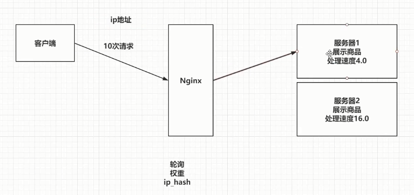

### 五、Nginx负载均衡【`重点`】

---

> 
>
> Nginx为我们默认提供了三种负载均衡的策略：
>
> - 轮询：将客户端发起的请求，**平均**的分配给每一台服务器
> - 权重：会将客户端的请求，根据服务器的权重值不同，分配不同的数量。
> - ip_hash：基于发起请求的客户端的ip地址不同，他始终会将请求发送到指定的服务器上。


#### 5.1 轮询

> 为演示通过nginx访问tomcat实现轮询效果,至少要开启两个不同端口映射的tomcat服务器,比如8080,8081,
>
> 然后实现Nginx轮询负载均衡机制只需要在配置文件中添加以下内容,然后重启nginx容器测试访问即可
>
> **只要会轮询,就会权重,就会ip_hash,套路都类似,如果忘了就拷贝即可**
>
> 

```json
upstream 名字 { # 给空格
  server ip:port; # 给分号  server 192.168.193.66:8080 注意是ip和端口,没有协议也没有其他东西!!!
  server ip:port;
}

server {
  listen 80;
  server_name localhost;
  
  location / {
    proxy_pass http://upstream的名字/; # 给分号
  }
}
```


#### ==负载均衡,开干↓==

```conf
# 开干,准备多一个tomcat容器启动,对外端口8082,修改LY项目首页index.html的标题title为tomcat8082好区分不同↓
docker run -d -p 8082:8080 --name tomcat2 daocloud.io/library/tomcat:8.5.15-jre8
docker cp LY 容器id:/usr/local/tomcat/webapps

# 负载均衡配置内容拷贝,注意只有ip和端口,没有其他,包括协议等,否则到时候找不到对应路径,会一直找,响应过长↓
upstream my-server {
  server 192.168.200.129:8080;
  server 192.168.200.129:8082;
}

server {
  listen 80;
  server_name localhost;
  
  location / {
     proxy_pass http://my-server/;
  }
}

# 进入安装nginx时的挂载目录,找到conf.d文件夹里面的默认配置default.conf文件,编辑拷贝上面的负载均衡配置↕
[root@localhost docker_nginx]# pwd
/opt/docker_nginx
[root@localhost docker_nginx]# ls
conf.d  docker-compose.yml
[root@localhost docker_nginx]# cd conf.d/
[root@localhost conf.d]# ls
default.conf
[root@localhost conf.d]# vi default.conf

# 回退一步用docker-compose来重启容器↓
[root@localhost conf.d]# ls
default.conf
[root@localhost conf.d]# cd ..
[root@localhost docker_nginx]# ls
conf.d  docker-compose.yml
[root@localhost docker_nginx]# docker-compose restart
Restarting nginx ... done
```

```
upstream my-server {
  server 192.168.200.129:8080;
  server 192.168.200.129:8082;
}

server {
  listen 80;
  server_name localhost;
  
  location / {
     proxy_pass http://my-server/;
  }
}

upstream my-server {
  server 192.168.200.129:8080 weight=10;
  server 192.168.200.129:8082 weight=1;
}

server {
  listen 80;
  server_name localhost;
  
  location / {
     proxy_pass http://my-server/;
  }
}

upstream my-server {
  ip_hash;
  server 192.168.200.129:8080 weight=10;
  server 192.168.200.129:8082 weight=1;
}

server {
  listen 80;
  server_name localhost;
  
  location / {
     proxy_pass http://my-server/;
  }
}
```

==我的新测试,测试首页没多大意思,应该通过nginx去访问LY网来看到负载均衡↓==

http://192.168.200.129:8080/LY/


http://192.168.200.129:8082/LY/


http://192.168.200.129/LY/通过nginx去访问LY网出现下面两个不同标题的页面,说明,实现真正的负载均衡↓


#### 5.2 权重

> 实现权重的方式

```json
upstream 名字 {
  server ip:port weight=权重比例; # server 192.168.193.66:8080 weight=10;
  server ip:port weight=权重比例; # server 192.168.193.66:8080 weight=2;
  ...
}
server {
  listen 80;
  server_name localhost;
  
  location / {
    proxy_pass http://upstream的名字/;
  }
}
```

```conf
# 负载均衡配置内容拷贝,注意只有ip和端口,没有其他,包括协议等,否则到时候找不到对应路径,会一直找,响应过长↓
# 注意在访问次数小的情况下,这个权重代表概率越大,并不是绝对的分配
upstream my-server {
  server 10.20.100.186:8080 weight=10;
  server 10.20.100.186:8082 weight=2;
}

server {
  listen 80;
  server_name localhost;
  
  location / {
     proxy_pass http://my-server/;
  }
}
```


#### 5.3 ip_hash

> ip_hash实现

```json
upstream 名字 {
  ip_hash;
  server ip:port;
  server ip:port;
  ...
}
server {
  listen 80;
  server_name localhost;
  
  location / {
    proxy_pass http://upstream的名字/;
  }
}
```

```conf
# 负载均衡配置内容拷贝,注意只有ip和端口,没有其他,包括协议等,否则到时候找不到对应路径,会一直找,响应过长↓
# 加上一个ip_hash;即可,就算有权重也没有,由于我的ip没变,所以第一次访问的是哪个服务器,以后一直都是同一个↓
upstream my-server {
  ip_hash;
  server 10.20.100.186:8080 weight=10;
  server 10.20.100.186:8082 weight=2;
}

server {
  listen 80;
  server_name localhost;
  
  location / {
     proxy_pass http://my-server/;
  }
}
```

ip_hash算法介绍https://www.jianshu.com/p/be5c7efd37d7

为什么需要ip_hash?https://blog.csdn.net/zjxbllg2008/article/details/95491850

为什么需要ip_hash?https://blog.csdn.net/xqhys/article/details/81788358
