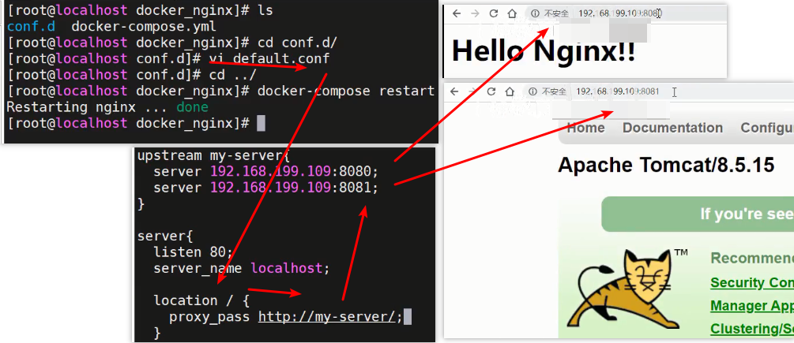

### 一、引言

----------

#### 1.1 代理问题

> 客户端到底要将请求发送给哪台服务器?

|           发送给服务器1还是服务器2           |
| :------------------------------------------: |
|  |


#### 1.2 负载均衡问题

> 如果所有客户端的请求都发送给了服务器1，那么服务器2将没有任何意义?

|                 负载均衡问题                 |
| :------------------------------------------: |
|  |


#### 1.3 资源优化

> 客户端发送的请求可能是申请动态资源的，也有申请静态资源，但都去Tomcat中获取?

|                 静态资源访问                 |
| :------------------------------------------: |
|  |


#### 1.4 Nginx处理,http服务器能够实现请求分发,反向代理,负载均衡,动静分离

|           在搭建集群后，使用Nginx            |
| :------------------------------------------: |
|  |


### 二、Nginx概述

-----

> Nginx是由俄罗斯人研发的，应对Rambler的网站，并且2004年发布的第一个版本。

|                  Nginx之父                   |
| :------------------------------------------: |
|  |

> Nginx的特点：
>
> - 稳定性极强。 7*24小时不间断运行
> - ==Nginx提供了非常丰富的配置实例==
> - 占用内存小，并发能力强（官方给的数据是5w)
> - 负载均衡策略
> - 动静态分离
> - 擅长处理静态资源，tomcat擅长处理动态资源


### 三、Nginx的安装

----

#### 3.1 安装Nginx

> 使用Docker-Compose安装nginx
>
> 编写docker-compose.yml文件
>
> 为方便管理创建一个目录里面编辑yml配置文件,内容抄下面即可,然后通过docker-compose up -d命令执行↓
>
> ```shell
> cd /opt/
> mkdir docker_nginx
> cd docker_nginx
> vi docker-compose.yml
> # yml配置文件,内容抄下面即可
> 
> #运行配置,启动镜像对应容器↓
> docker-compose up -d
> ```
>
> 浏览器输入地址http://192.168.200.129:80去访问nginx服务器,看到下面界面说明访问成功↓
>
> 

```yml
version: '3.1'
services:
  nginx:
    restart: always
    image: daocloud.io/library/nginx:latest
    container_name: nginx
    ports:
      - 80:80
```

如果上面这个daocloud中文网站下载不了镜像,可以用下面的配置去英文官方网站下载↓

```yml
version: '3.1'
services:
  nginx:
    restart: always
    image: nginx:latest
    container_name: nginx
    ports:
      - 80:80
```


#### 3.2 Nginx的配置文件

> nginx容器内部etc文件夹下面的nginx文件夹,里面有配置文件nginx.conf文件和conf.d文件夹里面默认配置↓
>
> ```shell
> docker ps
> # docker exec -it 容器id bash
> docker exec -it 8d8bdd66f721 bash
> 
> # 进入容器内部查看
> cd /etc/nginx
> ls
> ```
>
> 
>
> 
>
> ```shell
> # 进入nginx容器内部查看etc文件夹里面的nginx.conf配置文件内容流程↓
> [root@localhost ~]# docker ps
> CONTAINER ID   IMAGE                                    COMMAND                  CREATED        STATUS          PORTS                                       NAMES
> 8d8bdd66f721   daocloud.io/library/nginx:latest         "/docker-entrypoint.…"   9 hours ago    Up 13 minutes   0.0.0.0:80->80/tcp, :::80->80/tcp           nginx
> 18e306c4a1dd   ssm:1.0.1                                "catalina.sh run"        11 hours ago   Up 13 minutes   0.0.0.0:8081->8080/tcp, :::8081->8080/tcp   ssm
> 261968d3a65d   daocloud.io/library/tomcat:8.5.15-jre8   "catalina.sh run"        11 hours ago   Up 13 minutes   0.0.0.0:8080->8080/tcp, :::8080->8080/tcp   tomcat
> 6c1abdca6be9   daocloud.io/library/mysql:5.7.4          "/entrypoint.sh mysq…"   11 hours ago   Up 13 minutes   0.0.0.0:3306->3306/tcp, :::3306->3306/tcp   mysql
> [root@localhost ~]# docker exec -it 8d8bdd66f721 bash
> 
> root@8d8bdd66f721:/# ls
> bin  boot  dev  docker-entrypoint.d  docker-entrypoint.sh  etc  home  lib  lib64  media  mnt  opt  proc  root  run  sbin  srv  sys  tmp  usr  var
> root@8d8bdd66f721:/# cd etc
> root@8d8bdd66f721:/etc# ls
> adduser.conf            cron.daily      fonts     gss        issue.net      localtime    nginx          passwd-    rc4.d        security  subgid         xattr.conf
> alternatives            debconf.conf    fstab     host.conf  kernel         login.defs   nsswitch.conf  profile    rc5.d        selinux   subuid
> apt                     debian_version  gai.conf  hostname   ld.so.cache    logrotate.d  opt            profile.d  rc6.d        shadow    systemd
> bash.bashrc             default         group     hosts      ld.so.conf     machine-id   os-release     rc0.d      rcS.d        shadow-   terminfo
> bindresvport.blacklist  deluser.conf    group-    init.d     ld.so.conf.d   mke2fs.conf  pam.conf       rc1.d      resolv.conf  shells    timezone
> ca-certificates         dpkg            gshadow   inputrc    ldap           motd         pam.d          rc2.d      rmt          skel      ucf.conf
> ca-certificates.conf    environment     gshadow-  issue      libaudit.conf  mtab         passwd         rc3.d      securetty    ssl       update-motd.d
> 
> root@8d8bdd66f721:/etc# cd nginx/
> root@8d8bdd66f721:/etc/nginx# ls
> conf.d  fastcgi_params  koi-utf  koi-win  mime.types  modules  nginx.conf  scgi_params  uwsgi_params  win-utf
> root@8d8bdd66f721:/etc/nginx# cat nginx.conf
> 
> user  nginx;
> worker_processes  1;
> 
> error_log  /var/log/nginx/error.log warn;
> pid        /var/run/nginx.pid;
> 
> 
> events {
>     worker_connections  1024;
> }
> 
> 
> http {
>     include       /etc/nginx/mime.types;
>     default_type  application/octet-stream;
> 
>     log_format  main  '$remote_addr - $remote_user [$time_local] "$request" '
>                       '$status $body_bytes_sent "$http_referer" '
>                       '"$http_user_agent" "$http_x_forwarded_for"';
> 
>     access_log  /var/log/nginx/access.log  main;
> 
>     sendfile        on;
>     #tcp_nopush     on;
> 
>     keepalive_timeout  65;
> 
>     #gzip  on;
> 
>     include /etc/nginx/conf.d/*.conf;
> }
> root@8d8bdd66f721:/etc/nginx#
> 
> # 查看etc里面的文件夹conf.d里面的默认配置default.conf文件的内容,这个文件引入到了nginx.conf文件了
> root@8d8bdd66f721:/etc/nginx# ls
> conf.d  fastcgi_params  koi-utf  koi-win  mime.types  modules  nginx.conf  scgi_params  uwsgi_params  win-utf
> root@8d8bdd66f721:/etc/nginx# cat conf.d
> cat: conf.d: Is a directory
> root@8d8bdd66f721:/etc/nginx# cd conf.d/
> root@8d8bdd66f721:/etc/nginx/conf.d# ls
> default.conf
> root@8d8bdd66f721:/etc/nginx/conf.d# cat default.conf
> server {
>     listen       80;
>     listen  [::]:80;
>     server_name  localhost;
> 
>     #charset koi8-r;
>     #access_log  /var/log/nginx/host.access.log  main;
> 
>     location / {
>         root   /usr/share/nginx/html;
>         index  index.html index.htm;
>     }
> 
>     #error_page  404              /404.html;
> 
>     # redirect server error pages to the static page /50x.html
>     #
>     error_page   500 502 503 504  /50x.html;
>     location = /50x.html {
>         root   /usr/share/nginx/html;
>     }
> 
>     # proxy the PHP scripts to Apache listening on 127.0.0.1:80
>     #
>     #location ~ \.php$ {
>     #    proxy_pass   http://127.0.0.1;
>     #}
> 
>     # pass the PHP scripts to FastCGI server listening on 127.0.0.1:9000
>     #
>     #location ~ \.php$ {
>     #    root           html;
>     #    fastcgi_pass   127.0.0.1:9000;
>     #    fastcgi_index  index.php;
>     #    fastcgi_param  SCRIPT_FILENAME  /scripts$fastcgi_script_name;
>     #    include        fastcgi_params;
>     #}
> 
>     # deny access to .htaccess files, if Apache's document root
>     # concurs with nginx's one
>     #
>     #location ~ /\.ht {
>     #    deny  all;
>     #}
> }
> 
> root@8d8bdd66f721:/etc/nginx/conf.d#
> ```
>
> 
>
> nginx.conf配置文件里面的完整内容↓
>
> 
>
> 关于Nginx的核心配置文件nginx.conf的配置说明↓

```json
worker_processes  1;		
error_log  /var/log/nginx/error.log warn;
# 以上统称为全局块， 
# worker_processes他的数值越大，Nginx的并发能力就越强
# error_log 代表Nginx的错误日志存放的位置

events {
    worker_connections  1024;
}
# events块
# worker_connections他的数值越大，Nignx并发能力越强

http {
    include       /etc/nginx/mime.types;
    default_type  application/octet-stream;
    server {
        listen       80;
        server_name  localhost;

        location / {
            root   /usr/share/nginx/html;
            index  index.html index.htm;
        }
		# location块
		# root：将接收到的请求根据/usr/share/nginx/html去查找静态资源
		# index： 默认去上述的路径中找到index.html或者index.htm
    }
	# server块
	# listen： 代表Nginx监听的端口号
	# localhost：代表Nginx接收请求的ip
}
# http块
# include代表引入一个外部的文件 -> /mime.types中放着大量的媒体类型
# include /etc/nginx/conf.d/*.conf; -> 引入了conf.d目录下的以.conf为结尾的配置文件↓
```


conf.d文件夹里面默认配置文件default.conf文件里面完整内容↓


#### 3.3 修改docker-compose文件,实现外部配置文件夹和容器内部配置文件夹的目录映射

> 根据上面知道conf.d文件夹里面可以增加配置文件,为了方便修改Nginx配置,
>
> 那就要回到yml配置文件所在的目录,即安装nginx时的目录↓
>
>  
>
> 修改yml文件,增加数据卷进行conf.d文件夹目录的挂载同步↓
>
> 目录挂载不会写,抄↓

```yml
version: '3.1'
services:
  nginx:
    restart: always
    image: daocloud.io/library/nginx:latest
    container_name: nginx
    ports:
      - 80:80
    volumes:
      - /opt/docker_nginx/conf.d/:/etc/nginx/conf.d
```

上面由于进行了绝对路径的目录挂载,所以里面啥内容都没有,可以手动增加default.conf配置文件来进行路径导航↓

1


2


3


 

4


路径导航server块不会写,可以抄之前打开过的默认设置default.conf里面的,修改一下即可,注意不要少了分号;↓

```conf
server {
    listen       80;
    server_name  localhost;
    
    location / {
        root   /usr/share/nginx/html;
        index  index.html index.htm;
    }
}
```

==5总结,代码总流程如下,开干↓==

```shell
# 进入安装时docker-compose.yml所在的目录来修改文件,在端口后面增加目录挂载的内容
[root@localhost ~]# cd /opt/
[root@localhost opt]# ls
containerd  docker_mysql_tomcat  docker_nginx
[root@localhost opt]# cd docker_nginx/
[root@localhost docker_nginx]# ls
docker-compose.yml

# 要注意先,停止并且删除之前的容器,然后再进去修改docker-compose.yml文件内容
[root@localhost docker_nginx]# docker-compose down
Stopping nginx ... done
Removing nginx ... done
Removing network docker_nginx_default
[root@localhost docker_nginx]# vi docker-compose.yml

# 修改完docker-compose.yml文件,目录挂载不会写,抄↑,完了要重新构建镜像不然用之前镜像没有目录映射,然后启动
[root@localhost docker_nginx]# docker-compose build
nginx uses an image, skipping
[root@localhost docker_nginx]# docker-compose up -d
Creating network "docker_nginx_default" with the default driver
Creating nginx ... done

# 上面由于进行了绝对路径的目录挂载,所以里面啥内容都没有,可以手动增加default.conf配置文件来进行路径导航↓
# 路径导航server块不会写,可以抄之前打开过的默认设置default.conf里面的,修改一下即可↑
[root@localhost docker_nginx]# ls
conf.d  docker-compose.yml
[root@localhost docker_nginx]# cd conf.d/
[root@localhost conf.d]# ls
[root@localhost conf.d]# vi default.conf

# 目录挂载和路径导航都搞定了,之前,回退到上一级目录即docker-compose.yml所在文件目录,重新启动容器↕
[root@localhost conf.d]# cd ..
[root@localhost docker_nginx]# ls
conf.d  docker-compose.yml
[root@localhost docker_nginx]# docker-compose restart
Restarting nginx ... done
[root@localhost docker_nginx]#
```

6最后通过浏览器输入地址http://192.168.200.129:80来访问nginx服务器,能够导航到首页即表示修改成功↓


```
总结:
给nginx容器增加目录映射,要修改yml文件内容然后先down在up -d,最后在conf.d文件夹里面增加default.conf配置文件然后restart即可
```


### 四、Nginx的反向代理【`重点`】

---

#### 4.1 正向代理和反向代理介绍

> 正向代理：
>
> - 正向代理服务是由客户端设立的。
> - 客户端了解代理服务器和目标服务器都是谁。
> - 帮助咱们实现突破访问权限，提高访问的速度，对目标服务器隐藏客户端的ip地址。

|                   正向代理                   |
| :------------------------------------------: |
|  |

> 反向代理：
>
> - 反向代理服务器是配置在服务端的。
> - 客户端是不知道访问的到底是哪一台服务器。
> - 达到负载均衡，并且可以隐藏服务器真正的ip地址。


#### 4.2 基于Nginx实现反向代理

> 准备一个目标服务器,即启动了之前的tomcat服务器。
>
> 编写default.conf配置文件，通过Nginx访问到tomcat服务器。

```json
server{
  listen 80;
  server_name localhost;
    # 基于反向代理访问到Tomcat服务器
  location / {
    proxy_pass http://192.168.200.129:8080/;
  }
}
```

首先准备好tomcat容器开启,然后进入容器内部webapps目录,拷贝LY项目过去,

然后配置好ngixn的默认配置,把之前的路径导航server块里面的location由root改为代理传递即proxy_pass,

不会写可以直接抄,之前打开过来的默认配置文件default.conf里面的过来修改一下即可,最后重启nginx即可↓

#### ==反向代理,开干↓==

```shell
# 注意下面的分号;不能省略掉,否则还是无法基于反向代理访问到Tomcat服务器↓
server {
    listen       80;
    server_name  localhost;

    location / {
        proxy_pass http://192.168.200.129:8080/LY/;
    }
}
```

```shell
# 先拷贝LY项目到Linux的/root目录下,
# 然后准备好tomcat容器开启,然后进入容器内部webapps目录,拷贝LY项目过去,但是要先知道容器id↓
[root@localhost docker_nginx]# docker ps
CONTAINER ID   IMAGE                                    COMMAND                  CREATED          STATUS              PORTS                                       NAMES
64fec35c7c01   daocloud.io/library/nginx:latest         "/docker-entrypoint.…"   56 minutes ago   Up About a minute   0.0.0.0:80->80/tcp, :::80->80/tcp           nginx
18e306c4a1dd   ssm:1.0.1                                "catalina.sh run"        12 hours ago     Up 2 hours          0.0.0.0:8081->8080/tcp, :::8081->8080/tcp   ssm
261968d3a65d   daocloud.io/library/tomcat:8.5.15-jre8   "catalina.sh run"        13 hours ago     Up 2 hours          0.0.0.0:8080->8080/tcp, :::8080->8080/tcp   tomcat
6c1abdca6be9   daocloud.io/library/mysql:5.7.4          "/entrypoint.sh mysq…"   13 hours ago     Up 2 hours          0.0.0.0:3306->3306/tcp, :::3306->3306/tcp   mysql

# 进入容器内部,pwd得到webapps文件夹的位置,拷贝,给下面拷贝LY项目到容器内部的地址位置用↓
[root@localhost docker_nginx]# docker exec -it 261968d3a65d bash
root@261968d3a65d:/usr/local/tomcat# ls
LICENSE  NOTICE  RELEASE-NOTES  RUNNING.txt  bin  conf  include  lib  logs  native-jni-lib  temp  webapps  work
root@261968d3a65d:/usr/local/tomcat# cd webapps/
root@261968d3a65d:/usr/local/tomcat/webapps# ls
root@261968d3a65d:/usr/local/tomcat/webapps# pwd
/usr/local/tomcat/webapps

# 根据上面得到的容器id和需要拷贝到容器的内部webapps的位置,拷贝LY项目到容器内部↓
[root@localhost ~]# docker cp LY 261968d3a65d:/usr/local/tomcat/webapps

# 因为之前进行了目录挂载,所以可以快速进入nginx的conf.d文件夹,修改默认配置文件,
# 把之前的路径导航server块里面的location由root改为代理传递即proxy_pass,
#不会写可以抄直接打开过来的默认配置文件default.conf里面的过来修改一下即可,最后重启nginx即可
[root@localhost ~]# cd /opt/
[root@localhost opt]# ls
containerd  docker_mysql_tomcat  docker_nginx
[root@localhost opt]# cd docker_nginx/
[root@localhost docker_nginx]# ls
conf.d  docker-compose.yml
[root@localhost docker_nginx]# cd conf.d/
[root@localhost conf.d]# ls
default.conf
[root@localhost conf.d]# vi default.conf

# 回退到上一步,重启nginx即可↓
[root@localhost conf.d]# cd ..
[root@localhost docker_nginx]# ls
conf.d  docker-compose.yml

[root@localhost docker_nginx]# docker-compose restart
Restarting nginx ... done
[root@localhost docker_nginx]#
```

直接地址栏输入地址http://192.168.200.129:8080/LY/访问tomcat服务器,tomcat之前已经开启,自然可以访问↓


最后输入地址http://192.168.200.129/,通过访问nginx服务器,间接访问到tomcat服务器,说明反向代理配置成功↓


#### 4.3 关于Nginx的location的路径映射规则如下,学员课下可自我练习测试一下,了解一下

> 优先级关系如下：
>
> (location=) > (location /aa/bb/cc) > (location ~) 

```json
# 1. 精确匹配
location = / {
  # 精准匹配，主机名后面不能带任何的字符串，等号决定匹配的内容，比如:http://baidu.com
}
# 案例
# 用户访问# http:192.168.193.88/abc nginx会自动代理到 http://192.168.193.88:8080/
location =/abc {  
  proxy_pass http://192.168.193.88:8080/;
}

# 2. 通用匹配
location /xxx {
  # 匹配所有以/xxx开头的路径,比如:http://baidu.com/xxx
}

# 3. 正则匹配
location ~ /xxx {
  # 匹配所有以/xxx开头的路径
}

# 4. 匹配开头路径
location ^~ /images/ {
  # 匹配所有以/images开头的路径
}

# 5. 匹配后缀
location ~* \.(gif|jpg|png)$ {
  # 匹配以gif或者jpg或者png为结尾的路径
}

# 6. 全部通配
location / {
  # 匹配全部路径  
}
```


### 五、Nginx负载均衡【`重点`】

---

> 
>
> Nginx为我们默认提供了三种负载均衡的策略：
>
> - 轮询：将客户端发起的请求，**平均**的分配给每一台服务器
> - 权重：会将客户端的请求，根据服务器的权重值不同，分配不同的数量。
> - ip_hash：基于发起请求的客户端的ip地址不同，他始终会将请求发送到指定的服务器上。
>


#### 5.1 轮询

> 为演示通过nginx访问tomcat实现轮询效果,至少要开启两个不同端口映射的tomcat服务器,比如8080,8081,
>
> 然后实现Nginx轮询负载均衡机制只需要在配置文件中添加以下内容,然后重启nginx容器测试访问即可
>
> **只要会轮询,就会权重,就会ip_hash,套路都类似,如果忘了就拷贝即可**
>
> 

```json
upstream 名字 { # 给空格
  server ip:port; # 给分号  server 192.168.193.66:8080 注意是ip和端口,没有协议也没有其他东西!!!
  server ip:port;
}

server {
  listen 80;
  server_name localhost;
  
  location / {
    proxy_pass http://upstream的名字/; # 给分号
  }
}
```


#### ==负载均衡,开干↓==

```conf
# 开干,准备多一个tomcat容器启动,对外端口8082,修改LY项目首页index.html的标题title为tomcat8082好区分不同↓
docker run -d -p 8082:8080 --name tomcat2 daocloud.io/library/tomcat:8.5.15-jre8
docker cp LY 容器id:/usr/local/tomcat/webapps

# 负载均衡配置内容拷贝,注意只有ip和端口,没有其他,包括协议等,否则到时候找不到对应路径,会一直找,响应过长↓
upstream my-server {
  server 192.168.200.129:8080;
  server 192.168.200.129:8082;
}

server {
  listen 80;
  server_name localhost;
  
  location / {
     proxy_pass http://my-server/;
  }
}

# 进入安装nginx时的挂载目录,找到conf.d文件夹里面的默认配置default.conf文件,编辑拷贝上面的负载均衡配置↕
[root@localhost docker_nginx]# pwd
/opt/docker_nginx
[root@localhost docker_nginx]# ls
conf.d  docker-compose.yml
[root@localhost docker_nginx]# cd conf.d/
[root@localhost conf.d]# ls
default.conf
[root@localhost conf.d]# vi default.conf

# 回退一步用docker-compose来重启容器↓
[root@localhost conf.d]# ls
default.conf
[root@localhost conf.d]# cd ..
[root@localhost docker_nginx]# ls
conf.d  docker-compose.yml
[root@localhost docker_nginx]# docker-compose restart
Restarting nginx ... done
```

```
upstream my-server {
  server 192.168.200.129:8080;
  server 192.168.200.129:8082;
}

server {
  listen 80;
  server_name localhost;
  
  location / {
     proxy_pass http://my-server/;
  }
}

upstream my-server {
  server 192.168.200.129:8080 weight=10;
  server 192.168.200.129:8082 weight=1;
}

server {
  listen 80;
  server_name localhost;
  
  location / {
     proxy_pass http://my-server/;
  }
}

upstream my-server {
  ip_hash;
  server 192.168.200.129:8080 weight=10;
  server 192.168.200.129:8082 weight=1;
}

server {
  listen 80;
  server_name localhost;
  
  location / {
     proxy_pass http://my-server/;
  }
}
```

==我的新测试,测试首页没多大意思,应该通过nginx去访问LY网来看到负载均衡↓==

http://192.168.200.129:8080/LY/


http://192.168.200.129:8082/LY/


http://192.168.200.129/LY/通过nginx去访问LY网出现下面两个不同标题的页面,说明,实现真正的负载均衡↓


#### 5.2 权重

> 实现权重的方式

```json
upstream 名字 {
  server ip:port weight=权重比例; # server 192.168.193.66:8080 weight=10;
  server ip:port weight=权重比例; # server 192.168.193.66:8080 weight=2;
  ...
}
server {
  listen 80;
  server_name localhost;
  
  location / {
    proxy_pass http://upstream的名字/;
  }
}
```

```conf
# 负载均衡配置内容拷贝,注意只有ip和端口,没有其他,包括协议等,否则到时候找不到对应路径,会一直找,响应过长↓
# 注意在访问次数小的情况下,这个权重代表概率越大,并不是绝对的分配
upstream my-server {
  server 10.20.100.186:8080 weight=10;
  server 10.20.100.186:8082 weight=2;
}

server {
  listen 80;
  server_name localhost;
  
  location / {
     proxy_pass http://my-server/;
  }
}
```


#### 5.3 ip_hash

> ip_hash实现

```json
upstream 名字 {
  ip_hash;
  server ip:port;
  server ip:port;
  ...
}
server {
  listen 80;
  server_name localhost;
  
  location / {
    proxy_pass http://upstream的名字/;
  }
}
```

```conf
# 负载均衡配置内容拷贝,注意只有ip和端口,没有其他,包括协议等,否则到时候找不到对应路径,会一直找,响应过长↓
# 加上一个ip_hash;即可,就算有权重也没有,由于我的ip没变,所以第一次访问的是哪个服务器,以后一直都是同一个↓
upstream my-server {
  ip_hash;
  server 10.20.100.186:8080 weight=10;
  server 10.20.100.186:8082 weight=2;
}

server {
  listen 80;
  server_name localhost;
  
  location / {
     proxy_pass http://my-server/;
  }
}
```

ip_hash算法介绍https://www.jianshu.com/p/be5c7efd37d7

为什么需要ip_hash?https://blog.csdn.net/zjxbllg2008/article/details/95491850

为什么需要ip_hash?https://blog.csdn.net/xqhys/article/details/81788358


### 六、Nginx动静分离【`重点`】

---

> 之前说过,nginx并发能力受下面两个配置参数的影响↓
>
> 
>
> 并且Nginx的并发能力有官方给出的公式(工作进程*工作连接,静态资源不走后端,并发能力除以2,动态翻倍)：
>
> ​	worker_processes * worker_connections / 4 | 2 = Nginx最终的并发能力
>
> 动态资源需要/4(除以4)，静态资源需要/2(除以2),为啥呢,看下图连接就明白了↓
>
> 访问动态资源连接流程↓
>
> 
>
> 访问静态资源连接流程↓
>
> 
>
> 
>
> Nginx通过动静分离，来提升Nginx的并发能力，给用户更快地响应,
>
> 所以,接下来,我们要学习如何用nginx实现动静分离↓


#### 6.1 动态资源代理

> 使用proxy_pass动态代理,这个之前已经讲过,这里不再累赘,下面关注一下静态资源怎么配置↓

```json
# 配置如下
location / {
  proxy_pass 服务器的路径;
}
```


#### 6.2 静态资源代理

> 使用root静态代理

```json
# 配置如下
location / {
  root 静态资源路径;
  index 默认访问路径下的什么资源;
  autoindex on; # 代表展示静态资源的全部内容,以列表的形式展开,下面测试访问的时候有说明↓
}
```

>修改nginx安装时的docker-compose.yml,添加两个数据卷映射到Nginx服务器data文件夹下面的img和html↓
>
>
>
>docker-compose.yml文件,增加数据卷目录挂载,修改如下↓
>
>```
>version: '3.1'
>services:
>  nginx:
>    restart: always
>    image: daocloud.io/library/nginx:latest
>    container_name: nginx
>    ports:
>      - 80:80
>    volumes:
>      - /opt/docker_nginx/conf.d/:/etc/nginx/conf.d
>      - /opt/docker_nginx/img/:/data/img
>      - /opt/docker_nginx/html/:/data/html
>```
>
>
>
>编辑完yml完文件,为了生成没有的文件夹,需要停止并删除容器,然后重新启动↓
>
>
>
>接下来往/opt挂载目录的img和html文件夹里面,分别添加1.jpg和index.html这些静态资源,
>
>最后修改默认配置文件default.conf,然后重启nginx容器,测试访问静态资源
>
>
>
>
>
>

~~~json
# 默认配置文件default.conf,访问静态资源配置,修改如下↓
server{
        listen 80;
        server_name localhost;

        location /html {
                root /data; # 不要少写一个/,是/data,而不是data,当你访问/html就去/data/html下找资源
                index index.html; # 如果配置index可以少输index.html
        }

        location /img {
                root /data; # 不要少写一个/,是/data,而不是data,当你访问/img就去/data/img下找资源
                autoindex on; # 扩展开,效果如下面的测试图示
        }
}
~~~

静态资源访问结果如下↓


配置了autoindex on; # 代表展示静态资源的全部内容，以列表的形式展开。的意思如下↓


总的代码流程如下↓

```shell
# 修改nginx安装时的docker-compose.yml,添加两个数据卷映射到Nginx服务器data文件夹下面的img和html↓
[root@localhost docker_nginx]# ls
conf.d  docker-compose.yml
[root@localhost docker_nginx]# vi docker-compose.yml

# docker-compose.yml内容拷贝下面即可↓
version: '3.1'
services:
  nginx:
    restart: always
    image: daocloud.io/library/nginx:latest
    container_name: nginx
    ports:
      - 80:80
    volumes:
      - /opt/docker_nginx/conf.d/:/etc/nginx/conf.d
      - /opt/docker_nginx/img/:/data/img
      - /opt/docker_nginx/html/:/data/html
 
# 编辑完yml文件,为了生成没有的文件夹,需要停止并删除容器,然后重新启动↓
[root@localhost docker_nginx]# docker-compose down
Stopping nginx ... done
Removing nginx ... done
Removing network docker_nginx_default
[root@localhost docker_nginx]# docker-compose up -d
Creating network "docker_nginx_default" with the default driver
Creating nginx ... done

# 查看ngixn的对外挂载目录,用来知道下面要拷贝html和图片到哪个位置↓
[root@localhost docker_nginx]# ls
conf.d  docker-compose.yml  html  img
[root@localhost docker_nginx]# pwd
/opt/docker_nginx
[root@localhost docker_nginx]# cd html
[root@localhost html]# pwd
/opt/docker_nginx/html

# 拷贝静态资源html和图片到Linux服务器的/root目录,然后把他们分别移动到ngixn的对外挂载目录,实现内部同步
[root@localhost docker_nginx]# cd /root
[root@localhost ~]# pwd
/root
[root@localhost ~]# mv index.html /opt/docker_nginx/html
[root@localhost ~]# mv 1.jpg /opt/docker_nginx/img

# 查看html和图片是否拷贝到对外挂载目录,如果时间紧,这一步可以略过
[root@localhost html]# ls
index.html
[root@localhost html]# cd ..
[root@localhost docker_nginx]# cd img
[root@localhost img]# ls
1.jpg

# 然后修改默认配置文件default.conf,配置静态资源访问规则↓
[root@localhost img]# cd ..
[root@localhost docker_nginx]# ls
conf.d  docker-compose.yml  html  img
[root@localhost docker_nginx]# cd conf.d/
[root@localhost conf.d]# ls
default.conf
[root@localhost conf.d]# vi default.conf

#静态资料访问规则拷贝下面即可,要注意不要少写一个/,是/data,而不是data↓
server{
        listen 80;
        server_name localhost;

        location /html {
                root /data; # 不要少写一个/,是/data,而不是data,当你访问/html就去/data/html下找资源
                index index.html; # 如果配置index可以少输index.html
        }

        location /img {
                root /data; # 不要少写一个/,是/data,而不是data,当你访问/img就去/data/img下找资源
                autoindex on; # 扩展开,效果如下面的测试图示
        }
}

# 最后重启nginx容器,测试访问静态资源
[root@localhost conf.d]# cd ..
[root@localhost docker_nginx]# ls
conf.d  docker-compose.yml  html  img
[root@localhost docker_nginx]# docker-compose restart
Restarting nginx ... done
```


#### ==6.3 动静分离,配置开干↓==

docker-compose.yml文件,增加数据卷目录挂载,修改如下↓

```yml
version: '3.1'
services:
  nginx:
    restart: always
    image: daocloud.io/library/nginx:latest
    container_name: nginx
    ports:
      - 80:80
    volumes:
      - /opt/docker_nginx/conf.d/:/etc/nginx/conf.d
      - /opt/docker_nginx/img/:/data/img
      - /opt/docker_nginx/html/:/data/html
```

default.conf文件配置动静分离如下↓

```
server{
        listen 80;
        server_name localhost;

        location /html {
                root /data;
                index index.html;
        }

        location /img {
                root /data;
                autoindex on;
        }
        
        location / {
              proxy_pass http://192.168.200.129:8080/;
        }
}
```

down然后up容器↓

```shell
[root@localhost docker_nginx_cluster]# docker-compose down
[root@localhost docker_nginx_cluster]# docker-compose up -d
```

最后补上缺少目录映射对应的的html文件夹里面的html和img文件夹里面的图片,访问测试即可↓


### 七、Nginx集群,高可用

------

#### 7.1 集群结构

> 单点故障，避免nginx的宕机，导致整个程序的崩溃不可用。
>
> 准备多台Nginx。
>
> 准备keepalived，监听nginx的健康情况。
>
> 准备haproxy，提供一个虚拟的路径，统一的去接收用户的请求。

|                  Nginx集群                   |
| :------------------------------------------: |
|  |


#### 7.2 搭建Nginx集群

> 查看资料中的内容，直接通过运行docker-compose即可

==开干,实现步骤↓==

把资料里面的所有文件拷贝到Linux服务器里面创建的文件夹,然后确保关闭并且停止并且删除所有容器,


接着用docker-compose up -d启动nginx,然后测试访问,


 

最后故意停止master容器,来测试访问能否切换到slave↓


代码流程如下↓

```shell
# 为了避免其他容器干扰我们的视线,先停止所有容器,并且移除所有容器↓
[root@localhost docker_nginx]# docker stop $(docker ps -qa)
[root@localhost docker_nginx]# docker rm $(docker ps -qa)
[root@localhost docker_nginx]# docker ps -a
CONTAINER ID   IMAGE     COMMAND   CREATED   STATUS    PORTS     NAMES
[root@localhost docker_nginx]#

# 然后再Linux里面创建文件夹,并且把资料里面的所有东西通过软件拖到刚创建的文件夹↓
[root@localhost ~]# cd /opt/
[root@localhost ~]# mkdir docker_nginx_cluster

[root@localhost opt]# ls
containerd  docker_mysql_tomcat  docker_nginx  docker_nginx_cluster

# 接着进入docker-compose.yml所在文件夹即刚刚创建的文件夹,用docker-compose启动nginx,然后测试访问即可↓
[root@localhost opt]# cd docker_nginx_cluster
[root@localhost docker_nginx_cluster]# ls
docker-compose.yml  Dockerfile  entrypoint.sh  favicon.ico  haproxy.cfg  index-master.html  index-slave.html  keepalived-master.conf  keepalived-slave.conf

# 拷贝好进入,开干↓
[root@localhost docker_nginx_cluster]# docker-compose up -d
Creating network "docker_nginx_cluster_static-network" with the default driver
Creating docker_nginx_cluster_nginx_master_1 ... done
Creating docker_nginx_cluster_proxy_1        ... done
Creating docker_nginx_cluster_nginx_slave_1  ... done

[root@localhost docker_nginx_cluster]# docker ps
CONTAINER ID   IMAGE                               COMMAND                  CREATED         STATUS         PORTS                                   NAMES
1e3b340d80e6   docker_nginx_cluster_nginx_master   "/entrypoint.sh"         9 seconds ago   Up 7 seconds   0.0.0.0:8081->80/tcp, :::8081->80/tcp   docker_nginx_cluster_nginx_master_1
f2dfcdfc48d7   docker_nginx_cluster_nginx_slave    "/entrypoint.sh"         9 seconds ago   Up 7 seconds   0.0.0.0:8082->80/tcp, :::8082->80/tcp   docker_nginx_cluster_nginx_slave_1
a846cf7b1034   haproxy:1.7-alpine                  "docker-entrypoint.s…"   9 seconds ago   Up 7 seconds   0.0.0.0:80->6301/tcp, :::80->6301/tcp   docker_nginx_cluster_proxy_1
[root@localhost docker_nginx_cluster]#

# 最后故意停止master容器,来测试访问能否切换到slave↓
[root@localhost docker_nginx_cluster]# docker stop 1e3b340d80e6
1e3b340d80e6
[root@localhost docker_nginx_cluster]# docker ps
CONTAINER ID   IMAGE                              COMMAND                  CREATED         STATUS         PORTS                                   NAMES
f2dfcdfc48d7   docker_nginx_cluster_nginx_slave   "/entrypoint.sh"         9 minutes ago   Up 9 minutes   0.0.0.0:8082->80/tcp, :::8082->80/tcp   docker_nginx_cluster_nginx_slave_1
a846cf7b1034   haproxy:1.7-alpine                 "docker-entrypoint.s…"   9 minutes ago   Up 9 minutes   0.0.0.0:80->6301/tcp, :::80->6301/tcp   docker_nginx_cluster_proxy_1
[root@localhost docker_nginx_cluster]#

# 最后的最后,reboot重启一次虚拟机加载所有相关文件,然后docker-compose up -d 启动即可↓
```

如果在上面执行的过程中,出现错误,如网络问题↓


可以用下面的方法来解决↓

```shell
systemctl stop docker  #停止docker

rm /var/lib/docker/network/files/local-kv.db #删除文件,遇到循问打y表示要删除

systemctl start docker #启动docker

#网址在线https://my.oschina.net/u/4308169/blog/3371101
```

```
[root@localhost docker_nginx_cluster]# docker-compose up -d
Creating network "docker_nginx_cluster_static-network" with the default driver
Building nginx_master
Step 1/6 : FROM daocloud.io/library/nginx:latest
 ---> 298ec0e28760
Step 2/6 : RUN apk update && apk upgrade
 ---> Running in e2fd53e11865
/bin/sh: 1: apk: not found
ERROR: Service 'nginx_master' failed to build: The command '/bin/sh -c apk update && apk upgrade' returned a non-zero code: 127
[root@localhost docker_nginx_cluster]#
这个问题是ngixn最新版引发的,换另一个版本就好了↓
```


上面的这个问题是ngixn最新版引发的,换另一个版本就好了↓


#### ==7.3 最后,reboot重启一次虚拟机加载开机自启文件,然后docker-compose up -d 启动即可==


