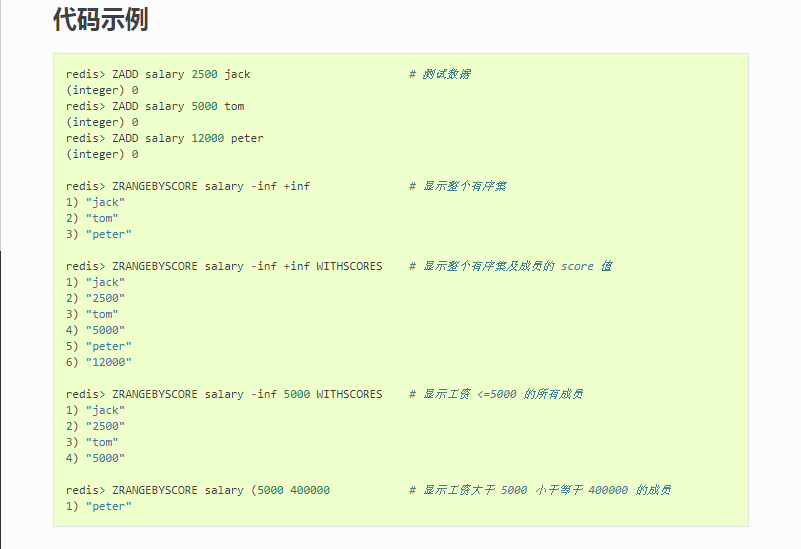
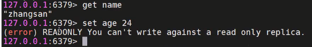
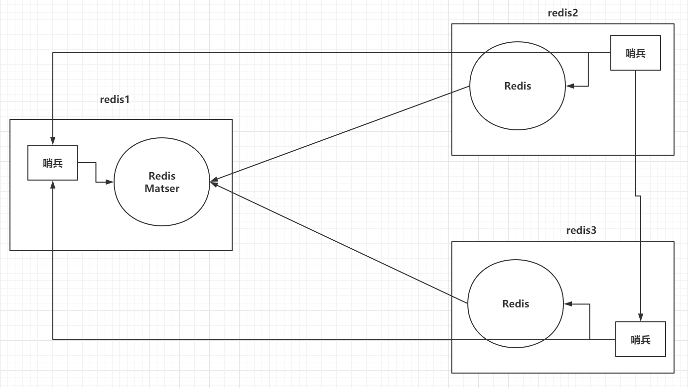
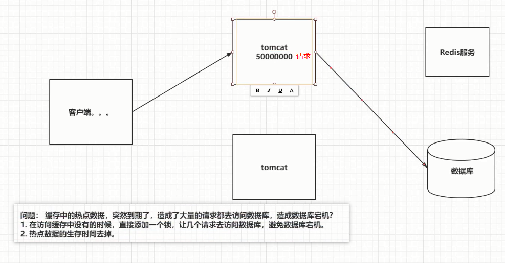

### 一、引言

----

为啥需要redis?没有reids有啥问题?↓


#### 1.1 数据库压力过大

> 由于用户量增大，请求数量也随之增大，数据压力过大

#### 1.2 数据不同步

> 多台服务器之间，数据不同步

#### 1.3 传统锁失效

> 多台服务器之间的锁，已经不存在互斥性了

redis如何解决这些问题?↓


### 二、Redis介绍

-----

#### 2.1 NoSQL介绍

> - Redis就是一款NoSQL。
>
> - NoSQL -> 非关系型数据库 -> Not Only SQL。
>
>  - Key-Value：Redis。。。
>
>   - 文档型：ElasticSearch，Solr，Mongodb。。。
>
>   - 面向列：Hbase，Cassandra。。。
>
>   - 图形化：Neo4j。。。
>
>     
>
> - 除了关系型数据库都是非关系型数据库。
>
> - NoSQL只是一种概念，泛指非关系型数据库，为了和关系型数据库做一个区分而已。


#### 2.2 Redis介绍

> - 有一位意大利人Salvatore，在开发一款LLOOGG的统计页面，因为MySQL的性能不好，自己研发了一款非关系型数据库，并命名为Redis。
> - Redis（Remote Dictionary Server）即远程字典服务，Redis是由C语言去编写，Redis是一款基于Key-Value的NoSQL，而且Redis是基于内存存储数据的，Redis还提供了多种持久化机制，性能可以达到110000/s读取数据以及81000/s写入数据，Redis还提供了主从，哨兵以及集群的搭建方式，可以更方便的横向扩展以及垂直扩展。

|                  Redis之父                   |
| :------------------------------------------: |
|  |


### 三、Redis安装

----

#### 3.1 安装Redis

> Docker-Compose安装

```yml
version: '3.1'
services:
  redis:
    image: daocloud.io/library/redis:5.0.7
    restart: always
    container_name: redis
    environment:
      - TZ=Asia/Shanghai
    ports:
      - 6379:6379
```


代码流程如下↓

```shell
# 在/opt里面创建用来存放docker-compose.yml文件的文件夹,然后拷贝docker-compose.yml内容到文件里↓
[root@localhost ~]# cd /opt/
[root@localhost opt]# ls
containerd  docker_mysql_tomcat  docker_nginx  docker_nginx_cluster
[root@localhost opt]# mkdir docker_redis
[root@localhost opt]# cd docker_redis/
[root@localhost docker_redis]# vi docker-compose.yml

# docker-compose.yml文件拷贝下面的即可↓
version: '3.1'
services:
  redis:
    image: daocloud.io/library/redis:5.0.7
    restart: always
    container_name: redis
    environment:
      - TZ=Asia/Shanghai
    ports:
      - 6379:6379

# 用docker-compose up -d 启动redis容器↓
[root@localhost docker_redis]# ls
docker-compose.yml
[root@localhost docker_redis]# docker-compose up -d
Creating network "docker_redis_default" with the default driver
Pulling redis (daocloud.io/library/redis:5.0.7)...
5.0.7: Pulling from library/redis
68ced04f60ab: Pull complete
7ecc253967df: Pull complete
765957bf98d4: Pull complete
52f16772e1ca: Pull complete
2e43ba99c3f3: Pull complete
d95576c71392: Pull complete
Digest: sha256:ee1d00c5250b5a886b09be2d5f9506add35dfb557f1ef37a7e4b8f0138f32956
Status: Downloaded newer image for daocloud.io/library/redis:5.0.7
Creating redis ... done

#查看进程得到redis容器id,根据容器id进入redis容器内部↓
[root@localhost docker_redis]# docker ps
CONTAINER ID   IMAGE                             COMMAND                  CREATED          STATUS          PORTS                                       NAMES
1dee860f31d2   daocloud.io/library/redis:5.0.7   "docker-entrypoint.s…"   18 seconds ago   Up 16 seconds   0.0.0.0:6379->6379/tcp, :::6379->6379/tcp   redis
[root@localhost docker_redis]# docker exec -it 1dee860f31d2 bash
root@1dee860f31d2:/data# ls

#使用容器内置的redis客户端命令redis-cli来设置键和值,然后根据键得到值,表明redis服务器安装成功↓
root@1dee860f31d2:/data# redis-cli
127.0.0.1:6379> set name zhangsan
OK
127.0.0.1:6379> get name
"zhangsan"
```


#### 3.2 使用redis-cli连接Redis

> 进去Redis容器的内部
>
> docker exec -it 容器id bash
>
> 在容器内部，使用redis-cli连接

|                   链接效果                   |
| :------------------------------------------: |
|  |


#### 3.3 使用图形化界面连接Redis 

> 下载地址：https://github.com/lework/RedisDesktopManager-Windows/releases/download/2019.5/redis-desktop-manager-2019.5.zip
>
> 傻瓜式安装
>
> 

|             RedisDesktopManager              |
| :------------------------------------------: |
|  |


### 四、Redis常用命令【`重点`】

---

#### 4.1 Redis存储数据的结构

> 常用的5种数据结构：
>
> - key-string：一个key对应一个值。
> - key-hash：一个key对应一个Map。
> - key-list：一个key对应一个列表。
> - key-set：一个key对应一个集合。
> - key-zset：一个key对应一个有序的集合。
>
> 另外三种数据结构,课下学员自己去扩展和了解：
>
> - HyperLogLog：计算近似值的。
> - GEO：地理位置。
> - BIT：一般存储的也是一个字符串，存储的是一个byte[]。

|           五种常用的存储数据结构图           |
| :------------------------------------------: |
|  |

> - key-string：最常用的，一般用于存储一个值。
>
> - key-hash：存储一个对象数据的(对象理解为map也行)。
>
> - key-list：使用list结构实现栈和队列结构。
>
> - key-set：交集，差集和并集的操作。
>
> - key-zset：排行榜，积分存储等操作。


#### 4.2 string常用命令,在redis-cli或者图形化界面操作皆可

> string常用操作命令

```sh
#1.  添加值
set key value

#2. 取值
get key

#3. 批量操作more更多
mset key value [key value...]
mget key [key...]

#4. 自增命令（自增1）
incr key 

#5. 自减命令（自减1）
decr key

#6. 自增或自减指定数量
incrby key increment
decrby key increment

#7. 设置值的同时，指定生存时间（每次向Redis中添加数据时，尽量都设置上生存时间）
setex key second value

#8. 设置值，如果当前key不存在的话（如果这个key存在，什么事都不做，如果这个key不存在，和set命令一样）
setnx key value

#9. 在key对应的value后，追加内容
append key value

#10. 查看value字符串的长度
strlen key
```

更多命令,可以百度redis文档来查看官方或者其他网站的说明,比如下面↓http://redisdoc.com/


#### 4.3 hash常用命令

> hash常用命令

```sh
#1. 存储数据!
hset key field value

#2. 获取数据
hget key field

#3. 批量操作
hmset key field value [field value ...]
hmget key field [field ...]

#4. 自增（指定自增的值）
hincrby key field increment

#5. 设置值（如果key-field不存在，那么就正常添加，如果存在，什么事都不做）
hsetnx key field value

#6. 检查field是否存在
hexists key field 

#7. 删除key对应的field，可以删除多个
hdel key field [field ...]

#8. 获取当前hash结构中的全部field和value
hgetall key

#9. 获取当前hash结构中的全部field
hkeys key

#10. 获取当前hash结构中的全部value
hvals key

#11. 获取当前hash结构中field的数量
hlen key
```


#### 4.4 list常用命令

> list常用命令

```sh
#1. 存储数据（从左侧插入数据，从右侧插入数据）,l,left,r,right
lpush key value [value ...]
rpush key value [value ...]

#2. 存储数据（如果key不存在，什么事都不做，如果key存在，但不是list结构，什么都不做）,l,left,r,right
lpushx key value
rpushx key value

#3. 修改数据（在存储数据时，指定好你的索引位置,覆盖之前索引位置的数据，index超出整个列表的长度，也会失败）,l,list
lset key index value

#4. 弹栈方式获取数据（左侧弹出数据，从右侧弹出数据）,l,left,r,right
lpop key
rpop key

#5. 获取指定索引范围的数据（start从0开始，stop输入-1，代表最后一个，-2代表倒数第二个）,l,list
lrange key start stop

#6. 获取指定索引位置的数据,l,list
lindex key index

#7. 获取整个列表的长度,l,list
llen key

#8. 删除列表中的数据（他是删除当前列表中的count个value值，count > 0从左侧向右侧删除，count < 0从右侧向左侧删除，count == 0删除列表中全部的value）,l,list
lrem key count value

#9. 保留列表中的数据（保留你指定索引范围内的数据，超过整个索引范围被移除掉）
ltrim key start stop

#10. 将一个列表中最后的一个数据，插入到另外一个列表的头部位置
rpoplpush list1 list2
```


#### 4.5 set常用命令

> set常用命令

```sh
#1. 存储数据
sadd key member [member ...]

#2. 获取数据（获取全部数据）
smembers key

#3. 随机获取一个数据（获取的同时，移除数据，count默认为1，代表弹出数据的数量）
spop key [count]

#4. 交集（取多个set集合交集）
sinter set1 set2 ...

#5. 并集（获取全部集合中的数据）
sunion set1 set2 ...

#6. 差集（获取多个集合中不一样的数据）
sdiff set1 set2 ...

# 7. 删除数据
srem key member [member ...]

# 8. 查看当前的set集合中是否包含这个值
sismember key member
```


#### 4.6 zset的常用命令

> zset常用命令

```sh
#1. 添加数据(score必须是数值。member不允许重复的。)
zadd key score member [score member ...]

#2. 修改member的分数（如果member是存在于key中的，正常增加分数，如果memeber不存在，这个命令就相当于zadd）
zincrby key increment member

#3. 查看指定的member的分数
zscore key member

#4. 获取zset中数据的数量
zcard key

#5. 根据score的范围查询member数量
zcount key min max

#6. 删除zset中的成员
zrem key member [member...]

#7. 根据索引遍历,分数从小到大排序，获取指定范围内的数据（withscores如果添加这个参数，那么会返回member对应的分数,start从0开始，stop输入-1，代表最后一个，-2代表倒数第二个）
zrange key start stop [withscores]

#8. 根据索引遍历,分数从大到小排序，获取指定范围内的数据（withscores如果添加这个参数，那么会返回member对应的分数）
zrevrange key start stop [withscores]

#9. 根据分数的返回去获取member(withscores代表同时返回score，添加limit，就和MySQL中一样，如果不希望等于min或者max的值被查询出来可以采用 (分数相当于 < 但是不等于的方式，最大值和最小值使用+inf和-inf来标识,
zrangebyscore key min max [withscores] [limit offset count]

#10. 根据分数的返回去获取member(withscores代表同时返回score，添加limit，就和MySQL中一样)
zrevrangebyscore key max min [withscores] [limit offset count]
```




http://redisdoc.com/sorted_set/zrangebyscore.html


#### 4.7 key常用命令

> key常用命令

```sh
#1. 查看Redis中的全部的key（pattern：* ，xxx*，*xxx）
keys *

#2. 查看某一个key是否存在（1 - key存在，0 - key不存在）
exists key

#3. 删除key
del key [key ...]

#4. 设置key的生存时间，单位为秒，单位为毫秒,设置还能活多久
expire key second
pexpire key milliseconds

#5. 设置key的生存时间，单位为秒，单位为毫秒,设置能活到什么时间点
expireat key timestamp
pexpireat key milliseconds

#6. 查看key的剩余生存时间,单位为秒，单位为毫秒（-2 - 当前key不存在，-1 - 当前key没有设置生存时间，具体剩余的生存时间）tell time left
ttl key
pttl key

#7. 移除key的生存时间（1 - 移除成功，0 - key不存在生存时间，key不存在）
persist key

#8. 选择操作的库,切换库
select 0~15

#9. 移动key到另外一个库中,1代表数据库db1↓
move key 1
```

是1不是db1↓


过期时间↓


unix时间戳↓

 https://baike.baidu.com/item/unix%E6%97%B6%E9%97%B4%E6%88%B3/2078227?fr=aladdin

https://www.cnblogs.com/yangqi/archive/2010/07/16/1778675.html

转换工具↓

https://tool.lu/timestamp/


#### 4.8 库的常用命令

> db常用命令

```sh
#1. 清空当前所在的数据库
flushdb

#2. 清空全部数据库
flushall

#3. 查看当前数据库中有多少个key
dbsize

#4. 查看最后一次操作的时间
lastsave

#5. 实时监控Redis服务接收到的命令
monitor
```

一个窗口监控,新开另一个窗口登录客户端执行命令↓


课下扩展阅读,redis配置多个数据库↓

https://blog.csdn.net/Milogenius/article/details/80357824

注意,如果Linux时间不对,reboot重启一下或者用其他命令设置也可↓


### ==五、Java连接Redis,明天讲【`重点`】==

-----------

#### 5.1 Jedis连接Redis

##### 5.1.1 创建Maven工程Java基础工程redis-connect

> idea创建

##### 5.1.2 导入需要的依赖

```xml
<dependencies>
    <!--    1、 Jedis-->
    <dependency>
        <groupId>redis.clients</groupId>
        <artifactId>jedis</artifactId>
        <version>2.9.0</version>
    </dependency>
    <!--    2、 Junit测试-->
    <dependency>
        <groupId>junit</groupId>
        <artifactId>junit</artifactId>
        <version>4.12</version>
    </dependency>
    <!--    3、 Lombok-->
    <dependency>
        <groupId>org.projectlombok</groupId>
        <artifactId>lombok</artifactId>
        <version>1.16.20</version>
    </dependency>
</dependencies>
```

##### 5.1.3 测试

```java
package com.qf.test;

import org.junit.Test;
import redis.clients.jedis.Jedis;

public class Test01 {
    @Test
    public void test01() {
        Jedis jedis = new Jedis("192.168.200.129", 6379);//作为java版的redis客户端去连接redis服务器

        jedis.set("name", "zs");//为啥选择jedis而不用其他的?因为redis的命令是啥,jedis的方法名就是啥
        String value = jedis.get("name");
        System.out.println(value);//zs

        jedis.close();//释放资源
    }
}

```


#### 5.2 Jedis存储一个对象到Redis以byte[]的形式(对象序列化转字节数组存储)

##### 5.2.1 准备一个User实体类,这里为了不用写就有setget方法等,涉及到了[IDEA中Lombok的使用](https://www.cnblogs.com/gaomanito/p/10761534.html)

```java
package com.qf.bean;

import lombok.AllArgsConstructor;
import lombok.Data;
import lombok.NoArgsConstructor;

import java.io.Serializable;
import java.util.Date;

@Data
@NoArgsConstructor
@AllArgsConstructor
public class User implements Serializable {
    private Integer id;
    private String name;
    private Date birthday;
}
```

##### 5.2.2 导入spring-context依赖,是为了使用spring里面的一个序列号和反序列化工具类SerializationUtils

```xml
<!-- 4.这里导入spring-context,是为了使用spring里面的一个序列号和反序列化工具类SerializationUtils -->
<dependency>
    <groupId>org.springframework</groupId>
    <artifactId>spring-context</artifactId>
    <version>4.3.18.RELEASE</version>
</dependency>
```

##### 5.2.3 创建测试类,存储键和值的字节数组到redis中,然后取出字节数组,还原为原来的东西

```java
package com.qf.test;

import com.qf.bean.User;
import org.junit.Test;
import org.springframework.util.SerializationUtils;
import redis.clients.jedis.Jedis;

import java.util.Date;

public class Test02 {
    @Test
    public void test01() {
        Jedis jedis = new Jedis("192.168.200.129", 6379);

        //通过序列化工具类方法把键和值变成字节数组,然后通过jedis把字节数组存到到redis中,缺啥补啥
        jedis.set(SerializationUtils.serialize("user"),
                SerializationUtils.serialize(new User(1, "fbb", new Date())));

        jedis.close();
    }

    @Test
    public void test02() {
        Jedis jedis = new Jedis("192.168.200.129", 6379);

        //通过序列化工具类方法得到键的字节数组,然后通过jedis根据键的字节数组查询值的字节数组,把值的字节数组通过序列化工具类方法反序列化还原为之前的对象,缺啥补啥
        byte[] valueBytes = jedis.get(SerializationUtils.serialize("user"));
        User user = (User) SerializationUtils.deserialize(valueBytes);
        System.out.println(user);//User(id=1, name=fbb, birthday=Fri Jul 09 17:29:51 CST 2021)

        jedis.close();
    }
}
```

字节数组存到redis中的表示形式如下↓


#### 5.3 Jedis存储一个对象到Redis以String的形式(对象转json字符串存储)

##### 5.3.1 导入依赖

```xml
<!-- 5.先导入fastJSON,做对象序列化为json字符串等操作 -->
<dependency>
    <groupId>com.alibaba</groupId>
    <artifactId>fastjson</artifactId>
    <version>1.2.47</version>
</dependency>
```

##### 5.3.2 测试

```java
package com.qf.test;

import com.alibaba.fastjson.JSON;
import com.qf.bean.User;
import org.junit.Test;
import redis.clients.jedis.Jedis;

import java.util.Date;

public class Test03 {
    @Test
    public void test01() {
        Jedis jedis = new Jedis("192.168.200.129", 6379);

        //存储字符串键和json字符串值到redis,对象和json字符串之间的转换这里先用阿里的fastjson
        jedis.set("user2", JSON.toJSONString(new User(2, "lbb", new Date())));

        jedis.close();
    }

    @Test
    public void test02() {
        Jedis jedis = new Jedis("192.168.200.129", 6379);

        //根据字符串键得到json字符串值,对象和json字符串之间的转换这里先用阿里的fastjson
        String json = jedis.get("user2");
        System.out.println(json);//{"birthday":1625823989727,"id":2,"name":"lbb"}
        User user = JSON.parseObject(json, User.class);
        System.out.println(user);//User(id=2, name=lbb, birthday=Fri Jul 09 17:46:29 CST 2021)

        jedis.close();
    }
}
```

对象转json字符串存到redis中的表示形式如下↓


#### 5.4 Jedis连接池的操作

> 使用连接池操作Redis,避免频繁创建和销毁连接对象,减少资源的消耗

```java
package com.qf.test;

import org.apache.commons.pool2.impl.GenericObjectPoolConfig;
import org.junit.Test;
import redis.clients.jedis.Jedis;
import redis.clients.jedis.JedisPool;
import redis.clients.jedis.JedisPoolConfig;

public class Test04 {
    @Test
    public void test01() {
        GenericObjectPoolConfig config = new GenericObjectPoolConfig();
        config.setMaxTotal(100);//连接池中最大的活跃数
        config.setMaxIdle(10);//最大空闲数
        config.setMinIdle(5);//最小空闲数
        config.setMaxWaitMillis(3000);//当连接池空了之后,多久没获取到Jedis对象,就超时

        //从连接池里面得到的连接,用完之后不会关闭,而是可以回到连接池反复使用,提高效率
        JedisPool jedisPool = new JedisPool(config, "192.168.200.129", 6379);//关键代码,缺啥补啥
        
        Jedis jedis = jedisPool.getResource();
        String value = jedis.get("name");
        System.out.println(value);//zs

        jedis.close();//用完之后不会关闭,而是可以回到连接池反复使用
    }
}
```


#### 5.5 Redis的管道操作,管道相当于一辆小卡车的效果

> 
>
> 因为在操作Redis的时候，执行一个命令需要先发送请求到Redis服务器，这个过程需要经历网络的延迟，Redis还需要给客户端一个响应。
>
> 如果我需要**一次性执行很多个命令**，上述的方式效率很低，可以通过Redis的管道，先将命令放到客户端的一个Pipeline中，之后一次性的将全部命令都发送到Redis服务，Redis服务一次性的将全部的返回结果响应给客户端。

```java
package com.qf.test;

import org.apache.commons.pool2.impl.GenericObjectPoolConfig;
import org.junit.Test;
import redis.clients.jedis.Jedis;
import redis.clients.jedis.JedisPool;
import redis.clients.jedis.Pipeline;

public class Test05 {
    @Test
    public void testNoPipeLine() {
        long start = System.currentTimeMillis();

        GenericObjectPoolConfig poolConfig = new GenericObjectPoolConfig();
        poolConfig.setMaxTotal(100);
        poolConfig.setMaxIdle(10);
        poolConfig.setMinIdle(5);
        poolConfig.setMaxWaitMillis(3000);//3秒拿不到连接就超时

        JedisPool jedisPool = new JedisPool(poolConfig,"192.168.200.129",6379);

        Jedis jedis = jedisPool.getResource();//.var

        //无管道,键自增十万次
        for (int i = 0; i < 100000; i++) {
            jedis.incr("key1");
        }

        jedis.close();//back to pool

        long end = System.currentTimeMillis();
        System.out.println(end-start);//45997
    }

    @Test
    public void testPipeLine() {
        long start = System.currentTimeMillis();

        GenericObjectPoolConfig poolConfig = new GenericObjectPoolConfig();
        poolConfig.setMaxTotal(100);
        poolConfig.setMaxIdle(10);
        poolConfig.setMinIdle(5);
        poolConfig.setMaxWaitMillis(3000);//3秒拿不到连接就超时

        JedisPool jedisPool = new JedisPool(poolConfig,"192.168.200.129",6379);

        Jedis jedis = jedisPool.getResource();//.var

        //有管道,命令交给管道来管理,键自增十万次
        Pipeline pipelined = jedis.pipelined();

        for (int i = 0; i < 100000; i++) {
            pipelined.incr("key2");
        }

        List<Object> objectList = pipelined.syncAndReturnAll();//拿到返回值,巧记ps
        System.out.println(objectList);//[1, 2, 3, 4, ..., 100000]

        jedis.close();//back to pool

        long end = System.currentTimeMillis();
        System.out.println(end-start);//569
    }
}
```


### 六、Redis其他配置及集群【`重点`】

------------

> 找到redis的docker-compose.yml文件增加配置文件的目录挂载,方便后期修改Redis配置↓

```yml
version: '3.1'
services:
  redis:
    image: daocloud.io/library/redis:5.0.7
    restart: always
    container_name: redis
    environment:
      - TZ=Asia/Shanghai
    ports:
      - 6379:6379
    volumes:
      - ./conf/redis.conf:/usr/local/redis/redis.conf
    command: ["redis-server","/usr/local/redis/redis.conf"]
```

这个 command: ["redis-server","/usr/local/redis/redis.conf"]意思是redis服务器启动执行命令去读取配置文件↑

**要先准备好conf文件夹和里面的redis.conf文件,否则默认生成的是文件夹**,先down再up即可,流程如下↓


代码流程↓

```shell
# 找到redis的docker-compose.yml所在目录↓
[root@localhost ~]# cd /opt/
[root@localhost opt]# ls
containerd  docker_mysql_tomcat  docker_nginx  docker_nginx_cluster  docker_redis
[root@localhost opt]# cd docker_redis/

# 创建没有的目录挂载文件夹conf和里面的文件redis.conf↓
[root@localhost docker_redis]# ls
docker-compose.yml
[root@localhost docker_redis]# mkdir conf
[root@localhost docker_redis]# cd conf/
[root@localhost conf]# touch redis.conf
[root@localhost conf]# ls
redis.conf
[root@localhost conf]# cd ..
[root@localhost docker_redis]# ls
conf  docker-compose.yml

# 编辑docker-compose.yml文件,增加目录挂载↓
[root@localhost docker_redis]# vi docker-compose.yml

# 目录挂载内容直接拷贝下面即可↓
version: '3.1'
services:
  redis:
    image: daocloud.io/library/redis:5.0.7
    restart: always
    container_name: redis
    environment:
      - TZ=Asia/Shanghai
    ports:
      - 6379:6379
    volumes:
      - ./conf/redis.conf:/usr/local/redis/redis.conf
    command: ["redis-server","/usr/local/redis/redis.conf"]

# 最后停止并移除容器,然后重新开启容器,最后用java客户端代码测试一下设置键和得到值正常,说明配置没问题↓
[root@localhost docker_redis]# docker-compose down
Stopping redis ... done
Removing redis ... done
Removing network docker_redis_default
[root@localhost docker_redis]# docker-compose up -d
Creating network "docker_redis_default" with the default driver
Creating redis ... done
```


#### 6.1 Redis的AUTH(认证密码,课下了解一下或者看明天的预习视频里面有讲解)

> 方式一：通过修改Redis的配置文件，实现Redis的密码校验↓

```conf
# redis.conf
requirepass 密码
```


> 三种客户端的连接方式
>
> - redis-cli：在输入正常命令之前，先输入auth 密码即可↓
>
>      
>
>      
>
> - 图形化界面：在连接Redis的信息中添加上验证的密码↓
>
>      
>
>      
>
> - Jedis客户端代码↓
>
> - jedis.auth(password);
>
>  - 使用JedisPool的方式
>
>      ```
>      // 使用带有密码的有参构造方法
>      public JedisPool(final GenericObjectPoolConfig poolConfig, final String host, int port,int timeout, final String password)
>      ```
>
>      


> 方式二：不修改redis.conf文件，在第一次连接Redis时输入命令,配置设置：Config set requirepass 密码
>
> 后续向再次操作Redis时，需要先AUTH做一下校验。
>
> 


#### 6.2 Redis的事务,了解一下

> 进入redis容器内部,执行客户端命令,redis-cli,才能执行下面的操作↓
>
> Redis的事务：一次事务操作，该成功的成功，该失败的失败↓
>
> 先开启事务，执行一些列的命令，但是命令不会立即执行，会被放在一个队列中，如果你执行事务，那么这个队列中的命令全部执行，如果取消了事务，这个队列中的命令全部作废。
>
> - 开启事务：multi
>
> - 输入要执行的命令：被放入到一个队列中
>
> - 执行事务：exec
>
> - 取消事务：discard
>
>   
>
>   
>
> Redis的事务要发挥功能，需要配置watch监听机制↓
>
> 在开启事务之前，先通过watch命令去监听一个或多个key，在开启事务之后，
>
> 
>
> 如果有其他客户端修改了我监听的key，事务会自动取消,来保证事务这个整体的安全↓
>
> 比如新开一个客户端页面输入↓
>
> 
>
> 再回到一开始监听的客户端页面输入执行事务↓
>
> 
>
> 如果执行了事务，或者取消了事务，watch监听自动消除，一般不需要去手动执行unwatch。
>
> 流程如下↓
>
> 


#### 6.3 Redis持久化机制

##### 6.3.1 RDB

> RDB是Redis默认的持久化机制
>
>  - RDB持久化文件，速度比较快，而且存储的是一个**二进制文件**，传输起来很方便。
>
>  - RDB持久化的时机：
>
>     save 900 1：在900秒内，有1个key改变了，就执行RDB持久化。
>
>     save 300 10：在300秒内，有10个key改变了，就执行RDB持久化。
>
>     save 60 10000：在60秒内，有10000个key改变了，就执行RDB持久化。
>
> - RDB无法保证数据的绝对安全。
>
> - 流程如下↓
>
>     1进入redis的配置文件redis.conf增加右边的rdb配置↓
>
>     
>
>     ```conf
>     save 900 1
>     save 300 10
>     save 60 10000
>     rdbcompression yes
>     dbfilename redis.rdb
>     ```
>
>     2接着来到docker-compose.yml文件,增加redis数据文件夹的目录挂载↓
>
>     
>
>     ```yml
>     version: '3.1'
>     services:
>       redis:
>         image: daocloud.io/library/redis:5.0.7
>         restart: always
>         container_name: redis
>         environment:
>           - TZ=Asia/Shanghai
>         ports:
>           - 6379:6379
>         volumes:
>           - ./conf/redis.conf:/usr/local/redis/redis.conf
>           - ./data:/data
>         command: ["redis-server","/usr/local/redis/redis.conf"]
>     ```
>
>     3先彻底停止然后重启redis容器,接着进入redis容器内部,准备操作↓
>
>     
>
>     ```shell
>     [root@localhost docker_redis]# docker-compose down
>     [root@localhost docker_redis]# docker-compose up -d
>                     
>     docker ps
>     docker exec -it 容器id bash
>                     
>     root@969abe9430f8:/data# redis-cli
>     127.0.0.1:6379> set name zs
>     OK
>     127.0.0.1:6379> shutdown save
>                     
>     [root@localhost docker_redis]# docker-compose restart
>     ```
>
>     4执行redis-cli客户端命令,然后通过shutdown save关闭保存命令来快速触发数据持久化保存数据到rdb文件,最后restart重启redis容器,发现数据还在,证明持久化成功↓
>
>     


##### 6.3.2 AOF

> AOF持久化机制默认是关闭的，Redis官方推荐同时开启RDB和AOF持久化，更安全，避免数据丢失。
>
> - AOF持久化的速度，相对RDB较慢的，存储的是一个**文本文件**，到了后期文件会比较大，传输困难。
>
> - AOF持久化时机。
>
>    appendfsync always：每执行一个写操作，立即持久化到AOF文件中，性能比较低。
>    appendfsync everysec：每秒执行一次持久化。
>    appendfsync no：会根据你的操作系统不同，环境的不同，在一定时间内执行一次持久化。
>
> - AOF相对RDB更安全，推荐同时开启AOF和RDB。
>
> - 流程如下↓
>
>    1进入redis配置文件增加aof配置,修改了配置文件,用docker-compose restart重启redis容器让其生效↓
>
>    
>
>    ```conf
>    appendonly yes
>    appendfilename "redis.aof"
>    # appendfsync always
>    appendfsync everysec
>    # appendfsync no
>    ```
>
>    ```shell
>    [root@localhost docker_redis]# docker-compose restart
>                
>    docker ps
>    docker exec -it 容器id bash
>                
>    root@969abe9430f8:/data# redis-cli
>    127.0.0.1:6379> set name2 ls
>    OK
>    127.0.0.1:6379> shutdown nosave
>    docker-compose restart
>    ```
>
>    2进入redis容器内部,关闭但不保存,发现我们的数据lisi持久化到了aop文件,可以打开文件看看↓
>
>    
>
>    

##### 6.3.3 注意事项

> 同时开启RDB和AOF的注意事项：
>
> 同时开启了AOF和RDB持久化,那么在Redis宕机重启之后,会加载一个持久化文件,官方默认选择AOF文件.
>
> 先开启了RDB,再次开启AOF,如果RDB执行了持久化,那么RDB文件中的内容会被AOF覆盖掉,建议同时开启.

另外,如果配置忘了,可以随便打开一个redis服务器软件安装包,解压找到里面的conf配置文件,拷贝即可↓


总结如下↓


关于shutdown命令,课下扩展阅读↓

http://redisdoc.com/client_and_server/shutdown.html


#### 6.4 Redis的主从架构(主从复制,读写分离)

> 单机版 Redis存在读写瓶颈的问题↓
>
> 所以用下面的主从架构来解决问题↓

|                   主从架构                   |
| :------------------------------------------: |
|  |

> 创建docker_redis_master_slave文件夹,里面编辑指定yml文件内容,缺啥补啥,最后启动测试读写分离即可↓
>

```yml
version: "3.1"
services:
  redis1:
    image: daocloud.io/library/redis:5.0.7
    restart: always
    container_name: redis1
    environment:
      - TZ=Asia/Shanghai
    ports:
      - 7001:6379
    volumes:
      - ./conf/redis1.conf:/usr/local/redis/redis.conf
    command: ["redis-server","/usr/local/redis/redis.conf"]
  redis2:
    image: daocloud.io/library/redis:5.0.7
    restart: always
    container_name: redis2
    environment:
      - TZ=Asia/Shanghai
    ports:
      - 7002:6379
    volumes:
      - ./conf/redis2.conf:/usr/local/redis/redis.conf
    links:
      - redis1:master
    command: ["redis-server","/usr/local/redis/redis.conf"]
  redis3:
    image: daocloud.io/library/redis:5.0.7
    restart: always
    container_name: redis3
    environment:
      - TZ=Asia/Shanghai
    ports:
      - 7003:6379
    volumes:
      - ./conf/redis3.conf:/usr/local/redis/redis.conf
    links:
      - redis1:master
    command: ["redis-server","/usr/local/redis/redis.conf"]
```

```sh
# redis2.conf和redis3.conf从节点配置,为了避免中文乱码问题,推荐复制下面的英文即可↓
replicaof master 6379
```

>流程如下↓
>
>1创建文件夹编辑yml文件拷贝配置,然后创建配置文件夹conf和里面的三个redis.conf配置文件,
>
>编辑配置文件2和配置文件3,写上复制的主节点是谁的配置,
>
>最后通过yml文件所在路径文件夹通过docker-compose up -d启动三个redis容器,来测试接下来的读写分离↓
>
>
>
>2图形化客户端开启两个选择卡界面,第一个进入主节点容器用redis-cli命令连接执行info命令查看主节点信息,
>
>
>
>第二个进入从节点容器也用redis-cli命令连接执行info命令查看从节点信息,
>
>
>
>3最后测试读写分离,主节点界面能够设置值写和得到值读,
>
>
>
>而从节点界面只能得到值读,而不能设置写,从而验证了主从复制,读写分离↓
>
>


#### 6.5 哨兵(能够实现主挂从上,保证高可用)

> 上面的主从架构读写分离,有一个问题,如果主服务器挂了就无法写了↓
>
> 
>
> 而哨兵可以帮助我们解决主从架构中的单点故障问题↓

|                   添加哨兵                   |
| :------------------------------------------: |
|  |


哨兵课下扩展阅读↓

https://blog.51cto.com/u_13887323/2543993

https://zhuanlan.zhihu.com/p/95678924

http://www.redis.cn/topics/sentinel.html


> 修改了以下docker-compose.yml,增加哨兵配置文件的目录挂载↓

```yml
version: "3.1"
services:
  redis1:
    image: daocloud.io/library/redis:5.0.7
    restart: always
    container_name: redis1
    environment:
      - TZ=Asia/Shanghai
    ports:
      - 7001:6379
    volumes:
      - ./conf/redis1.conf:/usr/local/redis/redis.conf
      - ./conf/sentinel1.conf:/data/sentinel.conf        
    command: ["redis-server","/usr/local/redis/redis.conf"]
  redis2:
    image: daocloud.io/library/redis:5.0.7
    restart: always
    container_name: redis2
    environment:
      - TZ=Asia/Shanghai
    ports:
      - 7002:6379
    volumes:
      - ./conf/redis2.conf:/usr/local/redis/redis.conf
      - ./conf/sentinel2.conf:/data/sentinel.conf        
    links:
      - redis1:master
    command: ["redis-server","/usr/local/redis/redis.conf"]
  redis3:
    image: daocloud.io/library/redis:5.0.7
    restart: always
    container_name: redis3
    environment:
      - TZ=Asia/Shanghai
    ports:
      - 7003:6379
    volumes:
      - ./conf/redis3.conf:/usr/local/redis/redis.conf
      - ./conf/sentinel3.conf:/data/sentinel.conf        
    links:
      - redis1:master
    command: ["redis-server","/usr/local/redis/redis.conf"]
```

> 哨兵配置文件汇总↓


> 主节点哨兵配置文件↓

```
daemonize yes
sentinel monitor master localhost 6379 2
sentinel down-after-milliseconds master 10000
```

> 从节点哨兵配置文件↓

```
daemonize yes
sentinel monitor master master 6379 2
sentinel down-after-milliseconds master 10000
```

> 在Redis容器内部所在的/data目录启动哨兵sentinel即可,最后stop停止主节点,然后测试查看,是否有从变主↓
>
> ==**注意在停止主界面的选项卡**,哪里停止,哪里复制新开重新进入另外两个从节点容器的内部,用命令info查询信息==

```sh
[root@localhost docker_redis_master_slave]# docker-compose down
[root@localhost docker_redis_master_slave]# docker-compose up -d

#分别进入三个容器内部所在的/data目录启动,启动三个哨兵配置↓
[root@localhost docker_redis_master_slave]# docker ps
[root@localhost docker_redis_master_slave]# docker exec -it 容器id bash
root@6088e8b630a2:/data# redis-sentinel sentinel.conf

#最后回到开启三个容器窗体的界面,停止主节点,然后哪里停止,哪里复制新窗体,重新进入容器,测试查看,是否有从变主↓
[root@localhost docker_redis_master_slave]# docker ps
[root@localhost docker_redis_master_slave]# docker stop 开始的主节点容器id
```

> 流程如下↓
>
> 1创建三个哨兵配置,指定一主双从,把上面配置标注的主从对应内容注释掉即可↓
>
> 
>
> 2编辑yml文件,增加三个哨兵配置的目录挂载,然后通过docker-compose彻底停止并重启三个redis容器↓
>
> 
>
> 3分别进入三个容器内部所在的/data目录启动,启动三个哨兵配置↓
>
> 
>
> 4分别开辟三个图形化界面选项卡,然后停止第一个主节点容器,
>
> **注意在停止主界面的选项卡**,哪里停止,哪里复制新开重新进入另外两个从节点容器的内部,用命令info查询信息,
>
> 看看是否其中一个变成了主节点,或者**通过测试读写来找到主节点**也行↓
>
> 

另外哨兵配置忘了,这个参考redis服务器软件里面下面的sentinel.conf哨兵配置文件↓


哨兵课外扩展阅读↓

https://segmentfault.com/a/1190000018278099

https://my.oschina.net/u/172871/blog/596976

https://www.jianshu.com/p/06ab9daf921d

http://www.361way.com/redis-sentinel/6042.html

https://cloud.tencent.com/developer/news/639186


#### 6.6 Redis的集群

> 
>
> 现在的主从加哨兵能够解决读写分离和单点故障高可用,但是如果数据量过大,
>
> ==特别是写数据量过大,这个时候一个主节点是不够的,需要进行集群搭建↓==
>
> 
>
> Redis集群在保证主从加哨兵的基本功能之外，还能够提升Redis存储数据的能力↓
>
> 

| Redis集群架构图                              |
| -------------------------------------------- |
|  |

> 停止并删除所有容器,创建docker_redis_cluster文件夹,里面编辑docker-compose.yml文件,缺啥补啥后启动↓
>
> docker stop $(docker ps -qa)
>
> docker rm $(docker ps -qa)

```yml
version: "3.1"
services:
  redis1:
    image: daocloud.io/library/redis:5.0.7
    restart: always
    container_name: redis1
    environment:
      - TZ=Asia/Shanghai
    ports:
      - 7001:7001
      - 17001:17001
    volumes:
      - ./conf/redis1.conf:/usr/local/redis/redis.conf
    command: ["redis-server","/usr/local/redis/redis.conf"]
  redis2:
    image: daocloud.io/library/redis:5.0.7
    restart: always
    container_name: redis2
    environment:
      - TZ=Asia/Shanghai
    ports:
      - 7002:7002
      - 17002:17002
    volumes:
      - ./conf/redis2.conf:/usr/local/redis/redis.conf
    command: ["redis-server","/usr/local/redis/redis.conf"]  
  redis3:
    image: daocloud.io/library/redis:5.0.7
    restart: always
    container_name: redis3
    environment:
      - TZ=Asia/Shanghai
    ports:
      - 7003:7003
      - 17003:17003
    volumes:
      - ./conf/redis3.conf:/usr/local/redis/redis.conf
    command: ["redis-server","/usr/local/redis/redis.conf"]  
  redis4:
    image: daocloud.io/library/redis:5.0.7
    restart: always
    container_name: redis4
    environment:
      - TZ=Asia/Shanghai
    ports:
      - 7004:7004
      - 17004:17004
    volumes:
      - ./conf/redis4.conf:/usr/local/redis/redis.conf
    command: ["redis-server","/usr/local/redis/redis.conf"]  
  redis5:
    image: daocloud.io/library/redis:5.0.7
    restart: always
    container_name: redis5
    environment:
      - TZ=Asia/Shanghai
    ports:
      - 7005:7005
      - 17005:17005
    volumes:
      - ./conf/redis5.conf:/usr/local/redis/redis.conf
    command: ["redis-server","/usr/local/redis/redis.conf"]  
  redis6:
    image: daocloud.io/library/redis:5.0.7
    restart: always
    container_name: redis6
    environment:
      - TZ=Asia/Shanghai
    ports:
      - 7006:7006
      - 17006:17006
    volumes:
      - ./conf/redis6.conf:/usr/local/redis/redis.conf
    command: ["redis-server","/usr/local/redis/redis.conf"]  
```

> 配置文件↓

```sh
# redis.conf
# 指定redis的端口号
port 7001
# 开启Redis集群
cluster-enabled yes
# 集群信息的文件
cluster-config-file nodes-7001.conf
# 集群的对外ip地址
cluster-announce-ip 192.168.200.129
# 集群的对外port
cluster-announce-port 7001
# 集群的总线端口
cluster-announce-bus-port 17001
```

> 启动了6个Redis的节点
>
> 由于redis集群是无中心的,随便跳转到一个容器内部,使用redis-cli命令增加--cluster参数来进行集群命令,yes↓

```sh
redis-cli --cluster create 192.168.200.129:7001 192.168.200.129:7002 192.168.200.129:7003 192.168.200.129:7004 192.168.200.129:7005 192.168.200.129:7006 --cluster-replicas 1
```

> --cluster-replicas 1表示每个主节点后面的备份节点数是1,即有一个备份节点↑
>
> 
>
> 流程如下↓
>
> 1为了避免其他干扰,先停止所有容器,并且删除容器↓
>
> 
>
> ```shell
> [root@localhost docker_redis_master_slave]# docker stop $(docker ps -qa)
> 
> [root@localhost docker_redis_master_slave]# docker rm $(docker ps -qa)
> 
> [root@localhost docker_redis_master_slave]# docker ps -a
> CONTAINER ID   IMAGE     COMMAND   CREATED   STATUS    PORTS     NAMES
> ```
>
> 2创建yml文件所在文件夹,和拷贝笔记配置内容到yml文件↓
>
> 
>
> ```shell
> mkdir docker_redis_cluster
> cd docker_redis_cluster
> vi docker-compose.yml
> ```
>
> 3创建配置文件所在文件夹,并拷贝笔记6个配置文件内容到对应的文件,注意进行对应ip和端口的修改↓
>
> 
>
> ```shell
> mkdir conf
> cd conf
> vi redis1.conf
> ```
>
> 4启动所有redis容器,然后随便进入一个容器内部,来开启集群命令↓
>
> 
>
> ```shell
> [root@localhost opt]# cd docker_redis_cluster
> [root@localhost docker_redis_cluster]# ls
> docker-compose.yml
> [root@localhost docker_redis_cluster]# docker-compose up -d
> 
> [root@localhost docker_redis_cluster]# docker ps
> 574065e72dd3   daocloud.io/library/redis:5.0.7   "docker-entrypoint.s…"   25 seconds ago   Up 22 seconds   0.0.0.0:7006->7006/tcp, :::7006->7006/tcp, 6379/tcp, 0.0.0.0:17006->17006/tcp, :::17006->17006/tcp   redis6
> [root@localhost docker_redis_cluster]# docker exec -it 57 bash
> 
> redis-cli --cluster create 192.168.200.129:7001 192.168.200.129:7002 192.168.200.129:7003 192.168.200.129:7004 192.168.200.129:7005 192.168.200.129:7006 --cluster-replicas 1
> ```
>
> 5开启集群命令↓
>
> 
>
> ```shell
> redis-cli --cluster create 192.168.200.129:7001 192.168.200.129:7002 192.168.200.129:7003 192.168.200.129:7004 192.168.200.129:7005 192.168.200.129:7006 --cluster-replicas 1
> ```
>
> 6yes确认开启集群配置↓
>
> 
>
> 7客户端连接并且增加-c实现重定向,然后设置键和值,并且通过键得到值,来测试集群的效果↓
>
> 
>
> 
>
> 最后测试↓
>
> ```shell
> redis-cli -h 192.168.200.129 -p 7001 -c
> set a a
> set b b
> set c c
> get a
> ```


另外关于更多的命令可以用help帮助提示↓

1


2


3redis集群课外扩展阅读↓

https://blog.csdn.net/weixin_39712016/article/details/111553187

https://www.php.cn/redis/434214.html

https://zhuanlan.zhihu.com/p/99037321

https://www.zhihu.com/question/354518943


#### 6.7 Java连接Redis集群

> 使用JedisCluster对象连接Redis集群

```java
package com.qf.test;

import org.junit.Test;
import redis.clients.jedis.HostAndPort;
import redis.clients.jedis.JedisCluster;

import java.util.HashSet;
import java.util.Set;

public class Test06 {
    @Test
    public void testCluster(){
        Set<HostAndPort> nodes = new HashSet<HostAndPort>();//搞一个集合存储主机和端口对象
        nodes.add(new HostAndPort("192.168.200.129",7001));
        nodes.add(new HostAndPort("192.168.200.129",7002));
        nodes.add(new HostAndPort("192.168.200.129",7003));
        nodes.add(new HostAndPort("192.168.200.129",7004));
        nodes.add(new HostAndPort("192.168.200.129",7005));
        nodes.add(new HostAndPort("192.168.200.129",7006));

        //主要创建JedisCluster集群对象,然后查看有参构造,缺啥补啥即可
        JedisCluster jedisCluster = new JedisCluster(nodes);

        String value = jedisCluster.get("a");//用集群对象来操作命令
        System.out.println(value);//a
    }
}
```


### 七、Redis常见问题【`重点`】

-----------

#### 7.1 key的生存时间到了,Redis会立即删除吗?

> 不会立即删除
>
> - 定期删除:Redis每隔一段时间就去会去查看,Redis设置了过期时间的key,会在100ms的间隔中默认查看3个key
>
> - 惰性删除:如果当你去查询一个已经过了生存时间的key时,Redis会先查看当前key的生存时间,是否已经到了,直接删除当前key,并且给用户返回一个空值
>


#### 7.2 Redis的淘汰机制

> 在Redis内存已经满的时候,添加了一个新的数据时,执行淘汰机制
>
> 可以通过查看redis服务器软件的配置文件redis.conf来搜索知道↓
>
> 
>
> - volatile-**lru**:在内存不足时,Redis会在设置过了生存时间的key中,干掉一个**最近最少使用**的key
>
> - allkeys-lru:在内存不足时,Redis会在全部的key中,干掉一个最近最少使用的key
>
>   
>
> - volatile-**lfu**:在内存不足时,Redis会在设置过了生存时间的key中,干掉一个最近最少**频次**使用的key
>
> - allkeys-lfu:在内存不足时,Redis会在全部的key中干掉一个最近最少频次使用的key
>
>   
>
> - volatile-**random**:在内存不足时,Redis会在设置过了生存时间的key中,**随机**干掉一个
>
> - allkeys-random:在内存不足时,Redis会在全部的key中,随机干掉一个
>
>   
>
> - volatile-**ttl**：在内存不足时,Redis会再设置过了生存时间的key中,干掉一个**剩余生存时间最少**的key
>
> - noeviction:（默认）在内存不足时,直接报错
>
> 在redis.conf配置文件中可以看到,指定淘汰机制的方式用maxmemory-policy 加上具体策略↓
>
> 
>
> 另外,在配置文件中,还可以看到设置Redis的最大内存用maxmemory 加上字节大小↓
>
> 


#### 7.3 缓存的常问题

##### 7.3.1 缓存穿透问题

> 缓存穿透

|                  缓存穿透                  |
| :----------------------------------------: |
|  |


##### 7.3.2 缓存击穿问题

> 缓存击穿

|                  缓存击穿                  |
| :----------------------------------------: |
|  |


##### 7.3.3 缓存雪崩问题

> 缓存雪崩

|                   缓存雪崩                   |
| :------------------------------------------: |
|  |


##### 7.3.4 缓存倾斜问题

> 缓存倾斜

|                   缓存倾斜                   |
| :------------------------------------------: |
|  |

缓存穿透,击穿,雪崩,课外扩展阅读↓

https://cloud.tencent.com/developer/article/1760689

https://blog.csdn.net/qq_44813090/article/details/104776774

https://segmentfault.com/a/1190000023746093

https://zhuanlan.zhihu.com/p/359118610


